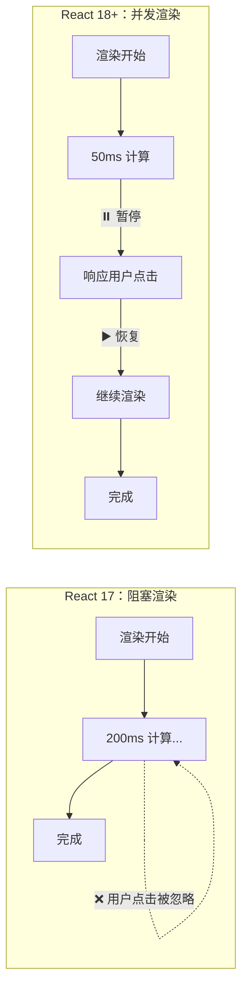

# 19. 并发特性：时间切片与流畅度

React 18 最重大的更新不是某个 API，而是底层的渲染引擎重构。这赋予了 React **“并发 (Concurrency)”** 的能力。

## 什么是并发？



在 React 18 之前（React 17 及以下），渲染是**同步且不可中断**的。

就像排队买票：
1.  用户点击按钮。
2.  React 开始渲染组件树。
3.  如果树很大，计算耗时 200ms。
4.  在这 200ms 内，浏览器完全卡死。用户点击输入框没反应，动画也暂停。
5.  渲染完成，浏览器恢复响应。

这就是所谓的**阻塞渲染 (Blocking Rendering)**。

**React 18 的并发渲染** 使得渲染变得**可中断 (Interruptible)**。

就像现代操作系统：
CPU 可以一会儿处理这个任务，一会儿处理那个任务。如果用户点击了鼠标（高优先级），React 可以**暂停**当前正在进行的后台渲染（低优先级），先去响应鼠标点击，处理完后再回来继续渲染。

## 核心 API：Start Transition

React 没办法自动猜出哪些更新重要，哪些不重要。需要显式标记。

`startTransition` 就是用来标记“慢速更新”的。

```javascript
import { startTransition } from 'react';

// 1. 紧急更新：用户的每一次按键都需要立即回显
setInputValue(input);

// 2. 过渡更新：根据输入过滤大数据列表（即使慢一点也无所谓）
startTransition(() => {
  setSearchQuery(input);
});
```

*   **Urgent (紧急)**: 直接调用 setState。比如打字、点击、拖拽。
*   **Transition (过渡)**: 包裹在 `startTransition` 中。比如切换 Tab、搜索过滤、大数据渲染。

### useTransition Hook

在组件内部，通常使用 `useTransition` hook，因为它还能提供一个 `isPending` 状态，用来展示加载指示器。

```javascript
const [isPending, startTransition] = useTransition();

function selectTab(nextTab) {
  startTransition(() => {
    setTab(nextTab);
  });
}

return (
  <div>
    {/* 当切换 Tab 很慢时，旧 Tab 依然显示，但可能会变灰提示用户 */}
    <div style={{ opacity: isPending ? 0.7 : 1 }}>
      <TabContent />
    </div>
  </div>
);
```

**并发的好处**：
传统 Loading 模式是：点击 -> Loading 转圈 -> 新内容。
并发模式是：点击 -> 旧内容保留（可交互） -> 新内容准备好后瞬间切换。

这让应用感觉始终“在线”，而不是一直在“加载中”。

## Suspense：声明式加载

并发特性的另一个体现是 `Suspense`。它允许组件在**等待数据**时“暂停”渲染，并由 React 自动展示 fallback。

以前，必须手动处理 `isLoading`：

```javascript
// Old Way
if (isLoading) return <Spinner />;
if (error) return <Error />;
return <Data />;
```

现在，可以像通过 `try/catch` 捕获错误一样，通过 `Suspense` 捕获“等待”：

```javascript
// New Way
<Suspense fallback={<Spinner />}>
  <UserProfile />
</Suspense>
```

当 `UserProfile` 组件发起数据请求（支持 Suspense 的请求库，如 Relay, SWR, TanStack Query）时，它会“挂起 (Suspend)”。React 捕获到这个挂起信号，就会渲染外层的 `fallback`。

## 自动批处理 (Automatic Batching)

在 React 18 之前，只有事件处理函数里的 setState 会被合并。
在 `setTimeout` 或 `fetch` 回调里的 setState 会导致多次渲染。

React 18 实现了**全自动批处理**。无论在哪里调用 setState，只要在同一个微任务中，React 都会把它们合并成一次渲染。

```javascript
// React 18: 无论在哪里，都会合并
setTimeout(() => {
  setCount(c => c + 1);
  setFlag(f => !f);
  // 只会触发一次重新渲染！
}, 1000);
```

## React 19：并发基础上的全面进化

React 19 在 18 的并发基础上做了大量改进，几个值得关注的变化：

### ref 不再需要 forwardRef

以前，函数组件如果要接收 `ref`，必须包一层 `forwardRef`。这是一个纯粹的模板代码。React 19 允许直接把 `ref` 作为普通 prop 传入：

```javascript
// React 18: 必须用 forwardRef
const Input = forwardRef((props, ref) => <input ref={ref} />);

// React 19: ref 就是一个普通 prop
function Input({ ref, ...props }) {
  return <input ref={ref} {...props} />;
}
```

### useActionState：服务端表单的标准方案

`useActionState` 是 React 19 新提供的 Hook，专门配合 Server Actions 使用。它取代了之前需要手动管理的 loading / error 状态：

```javascript
import { useActionState } from 'react';
import { submitForm } from './actions';

function Form() {
  const [state, formAction, isPending] = useActionState(submitForm, {
    message: '',
  });
  
  return (
    <form action={formAction}>
      <input name="email" />
      <button disabled={isPending}>
        {isPending ? '提交中...' : '提交'}
      </button>
      {state.message && <p>{state.message}</p>}
    </form>
  );
}
```

### 文档 Metadata 组件

React 19 可以在组件中直接渲染 `<title>`、`<meta>`、`<link>` 等标签，React 会自动将它们提升到 `<head>` 中：

```javascript
function BlogPost({ post }) {
  return (
    <>
      <title>{post.title}</title>
      <meta name="description" content={post.summary} />
      <article>{post.content}</article>
    </>
  );
}
```

不再需要 `react-helmet` 这类第三方库来管理文档头信息。

### 其他值得关注的变化

*   **useOptimistic**：内置的乐观更新 Hook，配合 Server Actions 实现"即时反馈"。
*   **use Hook**：可以在条件语句和循环中使用的特殊 Hook（详见第 17 篇）。
*   **改进的错误处理**：不再在控制台打印重复的错误日志，错误信息更清晰。
*   **Cleanup function for ref**：ref 回调可以返回一个清理函数，替代以前用 `null` 判断的模式。

## 总结

1.  **并发渲染**：React 不再是一条路走到黑，它可以暂停、中止、恢复渲染任务。
2.  **startTransition**：将耗时更新标记为"低优先级"，保证 UI 永不卡顿。
3.  **Suspense**：让"加载状态"成为架构的一部分，而不是组件内部的布尔值。
4.  **Batching**：更智能的更新合并，减少无意义渲染。
5.  **React 19**：在并发基础上进一步简化 API（去掉 forwardRef、内置 useActionState），让开发体验更接近"写普通函数"。

并发特性是 React 能够与原生应用媲美流畅度的关键基石。
