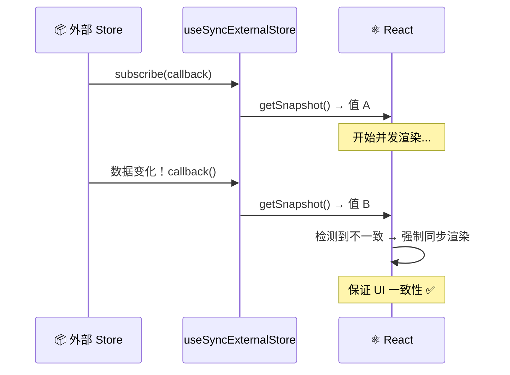

# 20. 外部存储：React 之外的数据

前面几章讨论了 React 内部的状态管理：`useState`、`useReducer` 和 `useContext`。

但在大型应用里，常常需要**把状态移出 React组件树**。比如：
*   复杂的全局状态（Redux, Zustand, MobX）。
*   浏览器 API（ResizeObserver, window.innerWidth）。
*   WebSocket 连接或者数据库订阅。

如果直接在 `useEffect` 里手动订阅，在 React 18 的并发模式下，可能会遇到一个很诡异的 Bug：**撕裂 (Tearing)**。

## 什么是撕裂 (Tearing)？

想象屏幕被切成了两半。
*   左半边渲染了组件 A，显示 `count: 1`。
*   这时，外部 store 的 `count` 突然变成了 `2`。
*   React 继续渲染右半边组件 B，读取到 `count: 2`。

结果就是：同一个页面，同一个时刻，展示了两个不同的状态版本（1 和 2）。这就是 UI 撕裂。

在 React 18 之前，渲染是同步的，一口气完成，所以不可能发生撕裂。
但在 React 18 引入并发渲染（Time Slicing）后，渲染过程可能被中断（yield to main thread）。如果在中断期间外部状态变了， React 恢复渲染时就会读到新值，导致前后不一致。

## 救星：useSyncExternalStore



React 18 提供了一个专门的 Hook 来解决这个问题。

它的名字有点长，但其实很好理解：**它是 React 组件订阅外部数据源的标准接口**。

```javascript
/*
 * useSyncExternalStore(subscribe, getSnapshot, getServerSnapshot?)
 */
const state = useSyncExternalStore(store.subscribe, store.getSnapshot);
```

### 它是如何工作的？

1.  **subscribe**: 一个函数，接收一个 `callback`。当外部数据变化时，调用这个 `callback` 通知 React。
2.  **getSnapshot**: 一个函数，返回当前外部数据的快照。React 用它来检查数据是否变了。

如果 React 在并发渲染过程中发现 `getSnapshot` 返回的值变了，它会**强制重新开始一次同步渲染**，从而保证 UI 的一致性（虽然牺牲了一点点并发性能，但保证了正确性）。

### 例子：订阅浏览器大小

这是一个经典的外部数据源。

```javascript
function useWindowWidth() {
  return useSyncExternalStore(
    (callback) => {
      window.addEventListener('resize', callback);
      return () => window.removeEventListener('resize', callback);
    },
    () => window.innerWidth // getSnapshot
  );
}
```

### 例子：极简版 Zustand

可以用它手写一个极简的状态管理库：

```javascript
function createStore(initialState) {
  let state = initialState;
  const listeners = new Set();
  
  return {
    getState: () => state,
    setState: (fn) => {
      state = fn(state);
      listeners.forEach(l => l());
    },
    subscribe: (listener) => {
      listeners.add(listener);
      return () => listeners.delete(listener);
    }
  };
}

const store = createStore({ count: 0 });

// custom hook
function useStore() {
  return useSyncExternalStore(store.subscribe, store.getState);
}
```

## 为什么普通用户需要关心这个？

确实，大多数时候不需要直接写 `useSyncExternalStore`。应该使用成熟的库（Redux, Zustand, Recoil）提供的 hook。

但理解它有助于：
1.  **调试诡异的 UI 问题**：如果自定义 hook 依赖 `window` 或 `localStorage` 且出现闪烁，可能是因为没用 `useSyncExternalStore`。
2.  **选库**：任何声称支持 React 18 并发的库，底层都必须使用这个 hook。如果没有，它可能是不安全的。
3.  **写工具库**：如果在写一个需要暴露状态给 React 的库，这是必修课。

## 总结

1.  **并发引入了撕裂风险**。由于渲染可中断，外部状态可能在渲染中途变化。
2.  **`useSyncExternalStore` 是官方解决方案**。它保证了即使在并发模式下，组件读取到的外部状态也是一致的。
3.  **它是库作者的工具，也是高级应用架构的基石**。
