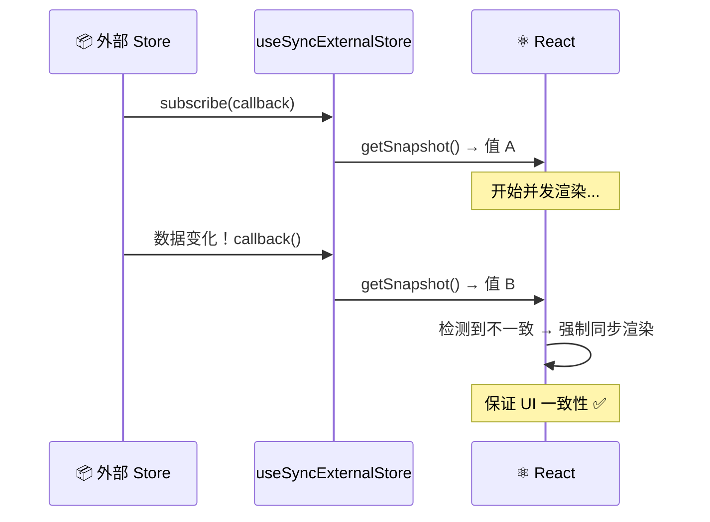

# 20. 外部存储：React 之外的数据

如果把用户的窗口宽度存进 `useState`，会发生什么？

```javascript
function Component() {
  const [width, setWidth] = useState(window.innerWidth);

  useEffect(() => {
    const handleResize = () => setWidth(window.innerWidth);
    window.addEventListener('resize', handleResize);
    return () => window.removeEventListener('resize', handleResize);
  }, []);

  return <div>窗口宽度: {width}</div>;
}
```

这段代码能跑。但如果有另一个组件也订阅了 resize 事件，或者在并发渲染时窗口大小突然变化，就会出现"同一时刻，不同组件显示不同宽度"的问题——这就是 **撕裂 (Tearing)**。

React 18 之前这个问题不明显，因为渲染是同步的。18 之后需要 `useSyncExternalStore` 来兜底。

## 什么是撕裂 (Tearing)？

想象屏幕被切成了两半。
*   左半边渲染了组件 A，显示 `count: 1`。
*   这时，外部 store 的 `count` 突然变成了 `2`。
*   React 继续渲染右半边组件 B，读取到 `count: 2`。

结果就是：同一个页面，同一个时刻，展示了两个不同的状态版本（1 和 2）。这就是 UI 撕裂。

在 React 18 之前，渲染是同步的，一口气完成，所以不可能发生撕裂。
但在 React 18 引入并发渲染（Time Slicing）后，渲染过程可能被中断（yield to main thread）。如果在中断期间外部状态变了， React 恢复渲染时就会读到新值，导致前后不一致。

## 救星：useSyncExternalStore



React 18 提供了一个专门的 Hook 来解决这个问题。

它的名字有点长，但其实很好理解：**它是 React 组件订阅外部数据源的标准接口**。

```javascript
/*
 * useSyncExternalStore(subscribe, getSnapshot, getServerSnapshot?)
 */
const state = useSyncExternalStore(store.subscribe, store.getSnapshot);
```

### 它是如何工作的？

1.  **subscribe**: 一个函数，接收一个 `callback`。当外部数据变化时，调用这个 `callback` 通知 React。
2.  **getSnapshot**: 一个函数，返回当前外部数据的快照。React 用它来检查数据是否变了。

如果 React 在并发渲染过程中发现 `getSnapshot` 返回的值变了，它会**强制重新开始一次同步渲染**，从而保证 UI 的一致性（虽然牺牲了一点点并发性能，但保证了正确性）。

### 例子：订阅浏览器大小

这是一个经典的外部数据源。

```javascript
function useWindowWidth() {
  return useSyncExternalStore(
    (callback) => {
      window.addEventListener('resize', callback);
      return () => window.removeEventListener('resize', callback);
    },
    () => window.innerWidth // getSnapshot
  );
}
```

### 例子：极简版 Zustand

可以用它手写一个极简的状态管理库：

```javascript
function createStore(initialState) {
  let state = initialState;
  const listeners = new Set();
  
  return {
    getState: () => state,
    setState: (fn) => {
      state = fn(state);
      listeners.forEach(l => l());
    },
    subscribe: (listener) => {
      listeners.add(listener);
      return () => listeners.delete(listener);
    }
  };
}

const store = createStore({ count: 0 });

// custom hook
function useStore() {
  return useSyncExternalStore(store.subscribe, store.getState);
}
```

## Trade-offs

**getSnapshot 必须返回稳定引用：同一个对象**

`getSnapshot` 每次被调用时，如果返回的是新对象（哪怕内容相同），React 就会认为状态变了，触发重新渲染。

```javascript
// ❌ 错误：每次都返回新数组
function getSnapshot() {
  return [...store.items]; // 新数组引用！
}

// ✅ 正确：返回同一个引用（需要自己实现 immutable 更新）
function getSnapshot() {
  return store.items; // 同一个引用
}
```

这意味着外部 store 必须自己实现 immutable 更新模式。所有"变异"操作实际上是创建新对象。这增加了 store 的实现复杂度。

**外部 store 增加了间接层：调试成本上升**

当组件里的值"不对"时，问题可能出在三个地方：
- 组件本身
- React 的协调逻辑
- 外部 store 的更新逻辑

多了一层意味着定位问题需要多走一步。而且 store 可能在 React 之外被修改（比如其他标签页、服务器推送），增加了认知负担。

**SSR 兼容性问题**

`useSyncExternalStore` 接收第三个参数：`getServerSnapshot`。如果没有提供，在服务端渲染时，外部 store 可能无法获取正确数据。

比如 localStorage 在服务端根本不存在，直接调用会报错。必须显式处理这个边界情况。

## 为什么普通用户需要关心这个？

确实，大多数时候不需要直接写 `useSyncExternalStore`。应该使用成熟的库（Redux, Zustand, Recoil）提供的 hook。

但理解它有助于：
1. **调试诡异的 UI 问题**：如果自定义 hook 依赖 `window` 或 `localStorage` 且出现闪烁，可能是因为没用 `useSyncExternalStore`。
2. **选库**：任何声称支持 React 18 并发的库，底层都必须使用这个 hook。如果没有，它可能是不安全的。
3. **写工具库**：如果在写一个需要暴露状态给 React 的库，这是必修课。

## 常见坑点

### 1. getSnapshot 返回了新对象引用导致无限渲染

```javascript
function useStore() {
  return useSyncExternalStore(
    store.subscribe,
    () => ({ ...store.data }) // ❌ 每次都是新对象
  );
}
```

**后果**：组件会无限重新渲染。因为 React 比较引用发现"变了"，然后继续渲染，然后又发现"变了"。

**解法**：确保 getSnapshot 返回同一个引用，或者在 store 层面保证 immutability。

### 2. 忘了在 subscribe 里返回 unsubscribe 函数

```javascript
function useWindowWidth() {
  return useSyncExternalStore(
    (callback) => {
      window.addEventListener('resize', callback);
      // ❌ 没返回取消订阅的函数！
    },
    () => window.innerWidth
  );
}
```

**后果**：组件卸载后，resize 事件监听器还在。如果访问已卸载组件的引用，可能崩溃（虽然 React 会做清理）。

**解法**：始终返回一个函数用于清理。

```javascript
(callback) => {
  window.addEventListener('resize', callback);
  return () => window.removeEventListener('resize', callback);
}
```

### 3. SSR 时缺少 getServerSnapshot

```javascript
// 在 SSR 环境里，这会报错
const width = useSyncExternalStore(
  subscribe,
  () => window.innerWidth // ❌ window 在服务端不存在
);
```

**后果**：Next.js 或 Remix 等 SSR 框架构建时会崩溃。

**解法**：提供第三个参数作为服务端快照。

```javascript
const width = useSyncExternalStore(
  subscribe,
  () => window.innerWidth,
  () => 0 // ✅ 服务端返回默认值
);
```

## 总结

1.  **并发引入了撕裂风险**。由于渲染可中断，外部状态可能在渲染中途变化。
2.  **`useSyncExternalStore` 是官方解决方案**。它保证了即使在并发模式下，组件读取到的外部状态也是一致的。
3.  **它是库作者的工具，也是高级应用架构的基石**。
