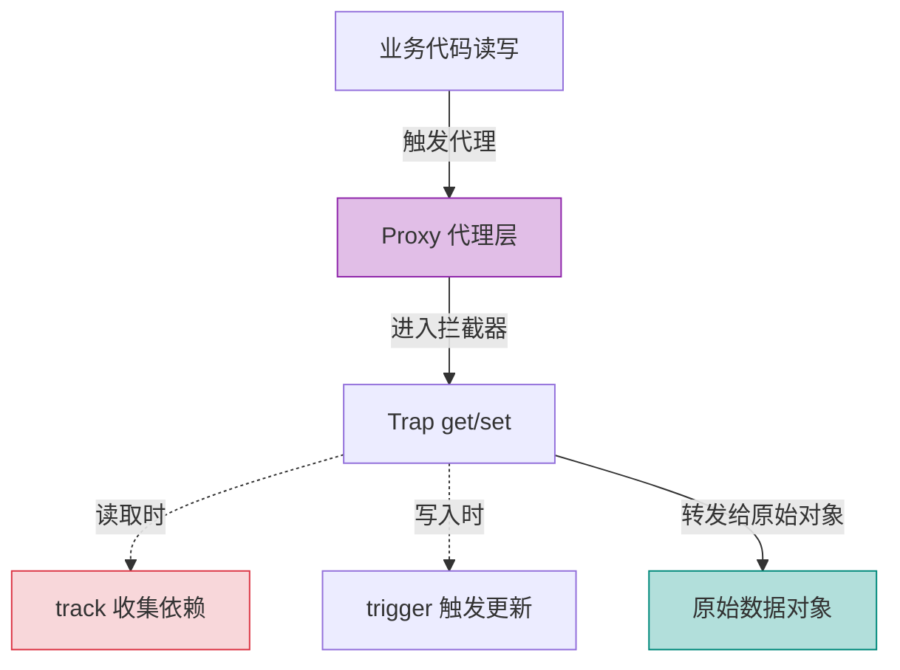

# Vue 3 核心原理（二）—— 响应式深水区：Proxy 陷阱与高阶 Ref

> **环境：** Vue 3.4+ 响应式底层剖析，ES6 Proxy & Reflect 机制

用 `reactive` 解构后数据不响应、把 ECharts 实例放进 `reactive` 导致页面卡死——这类问题的根源都在对响应式边界的误判。这篇梳理 `toRefs`、`shallowRef`、`markRaw` 这几个边界控制工具的实际用法。

---

## 1. `reactive` 的底层机制：Proxy

Vue 2 用 `Object.defineProperty` 拦截属性访问，天生无法感知数组 `length` 的直接修改（如 `arr.length = 0`），需要用 `$set` 打补丁。

Vue 3 切换到 ES6 的 `Proxy`，可以拦截对象上的所有操作——属性读写、`in` 运算符、`delete`、枚举等。`reactive()` 本质上是用 Proxy 包裹原始对象，读取时收集依赖（track），写入时触发更新（trigger）。



## 2. `toRefs`：保持解构后的响应性

从 `reactive` 对象直接解构会断开响应式连接：

```javascript
import { reactive } from 'vue'
const stateBase = reactive({ visitCount: 0 })

// 解构后 visitCount 是普通值，失去响应性
const { visitCount } = stateBase
```

`toRefs` 把 `reactive` 对象的每个属性转换成独立的 `ref`，解构后仍然保持与源对象的双向绑定：

```javascript
import { toRefs } from 'vue'
const stateRefs = toRefs(stateBase)
const { visitCount } = stateRefs // visitCount 是 Ref，修改会同步回 stateBase
```

## 3. 控制响应式深度

### `shallowRef`：避免深层递归代理

`ref` 对对象值会递归代理所有嵌套属性。如果数据量很大（例如上万条员工记录）且不需要侦测内部字段变化，只需要替换整个值时，深层代理会造成不必要的初始化开销。

**Trade-offs**：`shallowRef` 只侦测 `.value` 本身的替换，内部深层属性变化不会触发更新。如果确实需要触发，调用 `triggerRef()` 手动通知。

```javascript
import { shallowRef, triggerRef } from 'vue'

const hugeStaffList = shallowRef([])

// 整体替换会触发更新
hugeStaffList.value = await fetchMassiveData()

// 修改内部属性后手动触发
hugeStaffList.value[0].name = '张三'
triggerRef(hugeStaffList)
```

### `markRaw`：阻止对象被代理

将 ECharts、Three.js 等第三方实例放入 `reactive` 会导致 Vue 递归代理其所有属性，通常会触发这些库内部的异常行为或造成严重性能问题。

`markRaw` 标记的对象不会被 Vue 的响应式系统代理：

```javascript
import { markRaw, ref } from 'vue'
import * as echarts from 'echarts'

const rawChart = markRaw(echarts.init(domRef))

// 存入 ref 后，Vue 不会尝试代理 rawChart 内部
const chartRef = ref(rawChart)
```

## 4. 常见坑点

**`customRef` 中漏写 `track()`**

实现 `useDebouncedRef` 等自定义 ref 时，`get()` 里必须调用 `track()`，否则模板无法建立依赖关系。数据更新后视图不会重新渲染，且不会有任何报错提示。调试时先检查 `get()` 中 `track()` 的调用位置是否在返回值之前。

## 5. 延伸

Vue 的调度器（scheduler）会将同一个 tick 内的多次状态变更合并，只触发一次重新渲染——这是高频修改（如拖拽进度条）不会导致页面抖动的原因。底层机制是 `Promise.then` 微任务队列，与 `nextTick` 共用同一队列。

## 6. 总结

- Proxy 替换 `Object.defineProperty`，解决了数组 `length` 截断、属性动态增删等无法侦测的问题。
- `toRefs` 解决 `reactive` 对象解构后失去响应性的问题。
- `shallowRef` 和 `markRaw` 用于大型数据列表和第三方实例，避免不必要的深层代理开销。

## 7. 参考

- [Vue 响应式核心探秘 (Reactivity in Depth)](https://cn.vuejs.org/guide/extras/reactivity-in-depth.html)
- [Metaprogramming with Proxies (MDN Web Docs)](https://developer.mozilla.org/en-US/docs/Web/JavaScript/Guide/Meta_programming)
