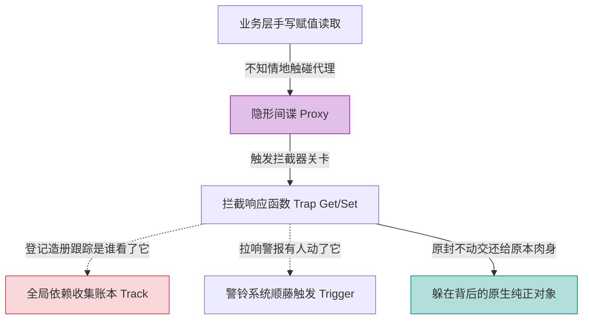

# Vue 3 核心原理（二）—— 响应式深水区：Proxy 陷阱与高阶 Ref

> **环境：** Vue 3.4+ 响应式底层剖析，ES6 Proxy & Reflect 机制

响应式系统毫无疑问是跳动在 Vue 3 核心的最强心脏。
如果日常开发你只局限于闭着眼睛用 `reactive` 往里存 JSON 对象、用 `ref` 存单独的字符串数字。不用多久，你就会在异步请求数据的疯狂解构，以及向页面插入三维 WebGL 和 ECharts 图表超大型实例时，直接引爆浏览器隐性堆栈导致直接溢出卡死。对响应边界拿捏的粗糙度，就是菜鸟和高手的分割线。

---

## 1. 原理剥析：`reactive` 身后的多重间谍

在 Vue 2 的老旧时代中，底层受阻于 `Object.defineProperty` 先天上残疾拦截。如果你想要监听一个数组的长度被强行 `arr.length = 0` 截断，系统就形同瞎子，逼出了一堆不得不拿 `$set` 去做打补丁弥补的可悲历史烂摊子。

Vue 3 果断切断了老兵，全面拥抱了 ES6 的全量劫持武器：**Proxy**。
`reactive` 本质上就是为你原本那个毫无波澜的数据对象，请来了一个极其变态严厉的双面间谍。任何试图读取或者强行修改这个对象里细枝末节的操作行为，全都会被无情半路拦截拷问。



## 2. 工具进阶：响应式状态逃逸拦截

### `toRefs`：保全尸首的最后手段

这是导致数据在组件间各种来回交接时凭空失效死掉的最惨案发现场。

当你为了少写几个前缀从一个复杂的被代理间谍包裹的大本营对象里强行用花括号剥离数据。

```javascript
import { reactive } from 'vue'
const stateBase = reactive({ visitCount: 0 })

// <--- 核心败雷：解构赋值等同于拔掉电源强行搬迁肉身死肉
const { visitCount } = stateBase 
```

**解法原理**：你必须拿一个救生囊再给它包上一层壳并挂接回母体身上去维系连接。这时候就需要挂靠上 `toRefs` 强心针，把大对象下属所有的分支脉络全部再额外套起一层薄薄的单独的 `ref` 壳保护罩交接出去。

```javascript
import { toRefs } from 'vue'
const stateRefs = toRefs(stateBase)
const { visitCount } = stateRefs // 这家伙此时是个独立存活并且连通总部的 Ref 体了
```

## 3. 高阶核武器：控制代理深度的极限操作

有些数据它天然就不应该被拿去监视侦测变动，对它挂载间谍只会拖死系统的响应时效拉扯崩溃整个网页帧率。

### `shallowRef`：表面功夫的极致性能爆发

如果你从后台接口一枪拽下来了整整包含了上万名员工姓名工资履历信息的巨细名录海量 JSON。你的表单压根也不关心哪一个倒霉职员的小名被单独按下了某个字母大小写改动，你只做直接全员整体表格轮换。

**显式权衡（Trade-offs）**：
若傻傻使用重武器 `ref` 兜住这几万条数据，Vue 初始化时会在后台派几万个底层间谍通过无限递归代理下挖把你每一条小字段全监控住。这会让你首次刷出表格直接白屏几秒停顿！
换用浅层隔离罩 `shallowRef`，以**牺牲对象深处单点突变侦测感知的代价**，换来了避开天文数字级递归劫持时间耗费瞬间直接让渲染引擎飞跃直达终点的神级首屏指标释放。

```javascript
import { shallowRef, triggerRef } from 'vue'

const hugeStaffList = shallowRef([])

// 正中下怀引发页面全刷：整体覆盖直接触动最外层警铃
hugeStaffList.value = await fetchMassiveData()

// 如果非要深处破例修改，强拽引线炸弹通知更新：
triggerRef(hugeList)
```

### `markRaw`：免检的尚方宝剑金牌

假设你在此引入了 ECharts 图表底层实例或者更为夸张包含了满屏幕光追节点模型的 Three.js 万亿面绘制世界巨型对象引擎。
这种自带一堆生命周期的神仙第三方怪物级大类对象你一旦作死往 `reactive` 阵法里一放，Vue 当场就会在内部循环爆炸撑爆自身内存直接报废页面。

你必须利用 `markRaw` 开具的一张免检金牌将它原封不动包起来：这就等于告诉底下的遍历循环器，这东西是一团深不见底的铁板不要对它白费丝毫力气进行哪怕一毫秒的间谍代理挂载操作渗透工作。

```javascript
import { markRaw, ref } from 'vue'
import * as echarts from 'echarts'

const rawHeroChart = markRaw(echarts.init(domRef))

// 等同于只存了个内存物理地址空壳进去而已，绝对安全
const chartBoxContainer = ref(rawHeroChart) 
```

## 4. 常见坑点

**自定义组件包装防抖 `customRef` 的毒圈滥用**
很多团队喜欢秀技术深度在封装包含有自己状态记录等待时间的 `useDebouncedRef` 用来防抖控制网络拉取重负倒灌。
**解法解释**：如果在构建自己自定义依赖追踪返回对象的包袱时。在 `get()` 方法里错误将 `track()` 上报追踪依赖写在了实际值的计算产生分支结构后或者根本忘记写。这会直接导致引用这玩意的模板页面元素，甚至拿不到这跟线头去登记挂载在渲染总线上！数据变出天际页面也绝不会产生丝毫重绘响应倒灌流淌。

## 5. 延伸思考

如果 Vue 这套借助 Proxy 并配套全副武装的副作用手机监听 `effect` 模型，能够完美捕捉多层嵌套对象的修改并自动调用触发相关订阅的重绘制计算函数。
那么如果在复杂的拥有十余层组件互相传递树结构的场景里，多处不同的子组件几乎同零点几秒内连续疯狂向源头对象发出上千次极其微小但是密集的修改攻击炮火（比如拖动重力引擎条进度）。这套代理中心中枢引擎难道不会像发疯的抽搐一样一秒钟重绘触发网页几千次数引起着火坍塌？它是利用什么宏微任务设计闸门抵挡住海啸的呢？期待评论区高手剖解调度器原理。

## 6. 总结

- 抛弃 Object.defineProperty 老旧沉疴换来的 Proxy 全面无遗漏防线截获侦听掌控。
- `toRefs` 防止了由 ES6 快捷拔出解构引发的关键绑定神经线头齐根暴毙折断大面血崩。
- 对于极端负荷怪兽与海量惰性数组列表采用 `shallow` 浅测与 `markRaw` 免检，挽救了宝贵的递归劫持性能算力黑洞。

## 7. 参考

- [Vue 响应式核心探秘 (Reactivity in Depth)](https://cn.vuejs.org/guide/extras/reactivity-in-depth.html)
- [Metaprogramming with Proxies (MDN Web Docs)](https://developer.mozilla.org/en-US/docs/Web/JavaScript/Guide/Meta_programming)
