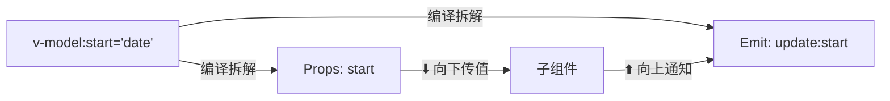
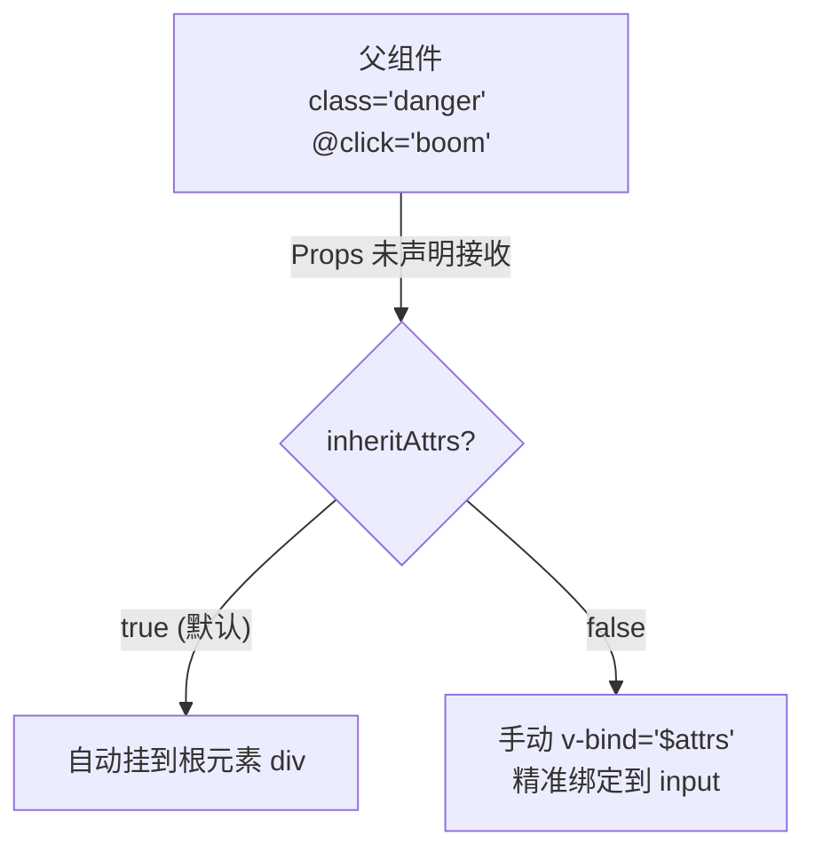

# Vue 3 核心原理（三）—— 组件进阶：v-model 劫持与透传黑魔法

> **环境：** Vue 3.4+ 语法糖进阶机制

新手写 Vue 组件就像砌砖，老手写 Vue 组件就像造变形金刚。
如果你的组件库里充斥着上百行的 `props` 和为了改个外层边距而被迫强行穿透的 `::v-deep` 烂代码，那说明你根本没有掌握组件之间的高阶数据和属性液态流动机制。

---

## 1. 拆解 `v-model` 的语法糖遮羞布



在 Vue 中，`v-model` 简直是被滥用得最为彻底的黑盒。很多开发者以为它只配插在 `<input>` 标签里用来收集用户的键盘输入。

实际上，当你在自定义组件上写下 `<MyDateRange v-model="time" />` 时。
Vue 在后台编译时期把它粗暴地暴力拆解成了两路插管：
1. 向下灌入名为 `modelValue` 的数据 Prop。
2. 向上接听名为 `update:modelValue` 的通信广播抛出。

### 多路并发：组件不仅只有一个阀门

既然知道底牌是编译糖。如果你在写一个包含了“起止时间”的高级双拼日历组件。你绝对不应该傻傻地把起始时间封装成一个巨大臃肿的 Object 通过一个 `v-model` 往外传，这会引发外部严重的深度侦听痛点。

你可以直接在同一个组件上开辟多条独立传输专属高速公路：

```html
<!-- 父组件调用方 -->
<DateRangePicker
  v-model:start="startDate"
  v-model:end="endDate"
/>
```

```javascript
/* DateRangePicker.vue 内部接线板 */
<script setup>
const props = defineProps(['start', 'end'])
// <--- 核心：通过严格约定的广播频道名 `update:属性名` 向外拨号
const emit = defineEmits(['update:start', 'update:end'])

function updateStart(val) {
  emit('update:start', val) // 父亲的 startDate 随之发生静默重写
}
</script>
```

## 2. 潜规则：透传 (Fallthrough) 的属性寄生



这是打造像 Element Plus 这种工业级重型无头组件（Headless UI）的最核心武器。

当你用 `<MyButton class="danger" @click="boom" />` 的时候如果 `MyButton` 内部并没有用 `defineProps` 显式宣告接收这两个值。
它们并不会凭空消失！Vue 默认拥有一套极具侵略性的“自动寄生”法则：**它们会像寄生虫一样，强行依附并绑定在子组件模板的最外层那个唯一的物理 HTML 根节点身上。**

### 禁用自动物理寄生：`inheritAttrs: false`

设想你的自定义输入框组件外面还包了一层神圣不可侵犯的 `div.wrapper`。如果外部传入的 `class="red-text"` 被强行挂在这层无辜的包装纸上，而没有穿透到底部的真 `input` 上，样式瞬间全盘崩溃。

**解法原理**：你必须掐断这股默认暗流，手动接过交接棒进行定点引产。

```javascript
<script setup>
import { useAttrs } from 'vue'

// 1. 关闭自动物理外层挂载
defineOptions({
  inheritAttrs: false
})

const attrs = useAttrs()
// 此刻 attrs 内包含了所有没被 defineProps 没收的“野属性”（包含事件和 class）
</script>

<template>
  <div class="wrapper">
    <!-- 2. 将 $attrs 中的所有属性绑定到内部 input 元素 -->
    <input v-bind="$attrs" />
  </div>
</template>
```

## 3. 动态画板：`<component :is>` 的运行时路由

当你拥有一个包含 10 个子频道的后台仪表盘 Tab。你如果写十个 `v-if` 在那里排排坐堆成山，编译器连连摇头。

利用内部骨架 `<component>` 可以做到运行时的极简插拔：

```html
<script setup>
import TabA from './TabA.vue'
import TabB from './TabB.vue'

// currentView 里只要存着上面的变量引用，下方底座瞬间变身
const currentView = shallowRef(TabA)
</script>

<!-- 这个插槽骨架会根据变量内容，被原地摧毁并重组为目标形态 -->
<component :is="currentView" />
```

> **观测验证**：使用 `:is` 切换组件时，打开 Vue Devtools。你会发现旧的组件连带它的生命周期一并从树状图里被连根拔起销毁了（Unmounted），新的被重新执行 Setup 挂载（Mounted）。如果你希望频繁切换的 Tab 保留页面上个表单打字的草稿状态不被销毁，必须在外面裹上一根名为 `<KeepAlive>` 的防腐罩管。

## 4. 常见坑点

**用 `useAttrs()` 去挂载依赖观测触发计算属性**
老有人觉得 `useAttrs()` 拉出来的大杂烩属性集就像 `defineProps` 一样，试图把它写进 `computed` 里面去观测变化做计算。
**原理解释**：`useAttrs()` 返回的虽然在开发环境下是一个有着 Proxy 长相的对象用来做浅劫持报警。但在真正的生产黑盒里它**并不提供完整的响应式深度牵引雷达系统支持**！强行依赖它的值去推导页面内容渲染，只会收获莫名奇妙偶尔刷新偶尔死机的鬼畜页面变现。但凡要走内部逻辑驱动的参量，老老实实写进 `defineProps`。

## 5. 延伸思考

如果把 Vue 的组件视作一个个携带子级后代的黑匣子。
在高度复杂无限极菜单套娃的“递归组件”里，子组件如果不停地内部引用自己的文件名呼叫自己，当树干猛增到两千个枝桠时。除了显存层面的 DOM 原材料爆炸堆积，这每一次组件的 Setup 再生执行对主线程的阻塞算力损耗会不会形成一次无形的单线程堵车死锁？如何才能像虚拟列表那样裁剪这种隐藏的树节点？

## 6. 总结

- `v-model` 只是一对传值与发射拦截组合拳披上的虚伪代名词外衣。
- 透传机制让组件摆脱了繁文缛节的 Props 枚举地狱，实现了外壳样式与底层内核的直通车打通。
- 动态组件的 `:is` 装填让运行时页面骨架拥有了液态金属般的自我适应变化力。

## 7. 参考

- [Vue 3 透传 Attributes 文档](https://cn.vuejs.org/guide/components/attrs.html)
- [Component v-model 深度解析](https://cn.vuejs.org/guide/components/v-model.html)
