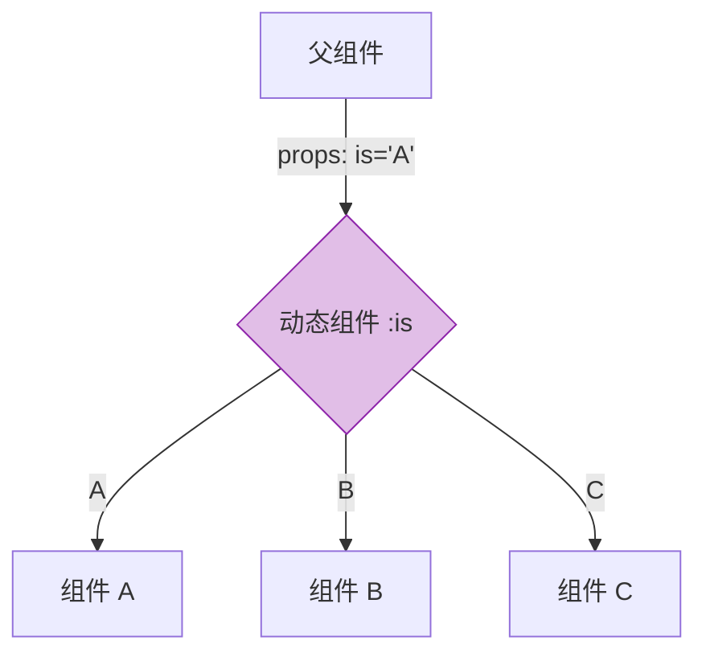

# Vue 3 深度精通 (三) —— 组件化高阶技巧

掌握基础组件通信只是入门。要构建可维护的大型应用或 UI 库，需深入理解 Vue 3 的组件化机制，特别是 `v-model` 的定制、属性透传以及动态组件的妙用。

## `v-model` 的进阶定制

Vue 3 的 `v-model` 是双向绑定的语法糖，本质上是 `:modelValue` + `@update:modelValue` 的组合。

### 多个 `v-model` 绑定

在 Vue 3 中，一个组件可以拥有多个 `v-model`。这有助于处理复杂表单组件（如时间范围选择器）。

```html
<DateRangePicker
  v-model:start="startDate"
  v-model:end="endDate"
/>
```

组件内部：

```javascript
/* DateRangePicker.vue */
const props = defineProps(['start', 'end'])
const emit = defineEmits(['update:start', 'update:end'])

function updateStart(val) {
  emit('update:start', val)
}
```

### 自定义修饰符

Vue 内置了 `.trim`, `.number` 等修饰符，亦可自定义修饰符。

```html
<MyInput v-model.capitalize="myText" />
```

组件内部，修饰符会作为一个 prop 传入（默认名为 `modelModifiers`）：

```javascript
const props = defineProps({
  modelValue: String,
  modelModifiers: { default: () => ({}) }
})

const emit = defineEmits(['update:modelValue'])

function onInput(e) {
  let value = e.target.value
  // 处理修饰符逻辑
  if (props.modelModifiers.capitalize) {
    value = value.charAt(0).toUpperCase() + value.slice(1)
  }
  emit('update:modelValue', value)
}
```

## 透传 Attributes (Fallthrough Attributes)

这是构建高阶组件（HOC）或 Headless 组件的关键。

### `inheritAttrs: false`

默认情况下，父组件传递给子组件的类名、样式和事件监听器会自动绑定到子组件的根元素上。但在某些场景（如多根节点组件，或者想把属性绑定到特定的内部元素上），需禁用这个行为。

```javascript
<script setup>
defineOptions({
  inheritAttrs: false
})
</script>

<template>
  <div class="wrapper">
    <!-- 将所有透传属性绑定到 input 上 -->
    <input v-bind="$attrs" />
  </div>
</template>
```

### JS 中访问 Attributes

在 `<script setup>` 中，可使用 `useAttrs()` 访问所有透传属性。

```javascript
import { useAttrs } from 'vue'

const attrs = useAttrs()
console.log(attrs.class) // 父组件传来的 class
console.log(attrs.onClick) // 父组件绑定的点击事件
```

**注意**：`attrs` 不是响应式的（虽然在开发环境下可能是 Proxy，但不应依赖它的响应性）。若需要响应式，请使用 props。

## 动态组件与递归组件

### 动态组件 `<component :is>`

这是实现 Tab 切换、动态路由视图的基础。

```html
<component :is="currentComponent" />
```

`is` 可以是：
1.  已注册的组件名（字符串）。
2.  导入的组件对象。



### 递归组件

### 递归组件

组件可以在自己的模板中调用自己。这适用于树形结构（Tree View）、多级菜单。

只需要给组件定义一个 `name`（在使用 `defineOptions` 或 `<script>` 时），或者在文件名推导下直接使用文件名。

```html
<!-- TreeItem.vue -->
<template>
  <li>
    <div>{{ item.name }}</div>
    <ul v-if="item.children">
      <TreeItem 
        v-for="child in item.children" 
        :item="child" 
      />
    </ul>
  </li>
</template>
```

## 结语

组件化是 Vue 的核心。通过灵活运用 `v-model` 修饰符、Attributes 透传和动态组件，可以构建出极其强大且灵活的 UI 系统。

下一篇，将探讨逻辑复用的终极形态——**Composition API 最佳实践**，解析如何像专家一样编写 Composables。
