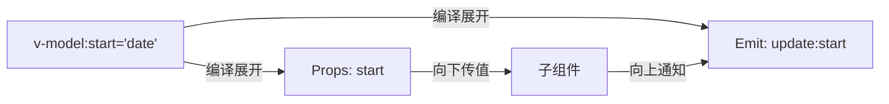
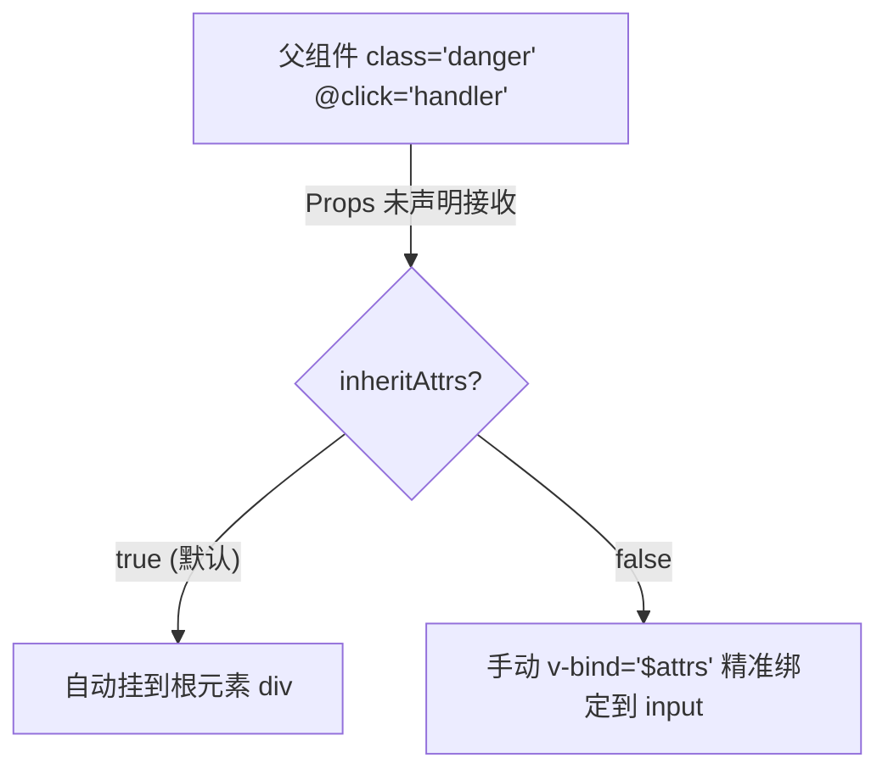

# Vue 3 核心原理（三）—— 组件进阶：v-model 劫持与透传黑魔法

> **环境：** Vue 3.4+ 语法糖进阶机制

`v-model` 在自定义组件上的工作方式、透传属性的自动挂载规则、动态组件的生命周期——这些机制理解清楚后，大量依赖 `props` 手动传递和 `::v-deep` 强制穿透的写法可以直接简化。

---

## 1. `v-model` 在自定义组件上的工作原理



在自定义组件上写 `<MyDateRange v-model="time" />` 时，编译器将它展开为：
1. 向子组件传入名为 `modelValue` 的 prop。
2. 监听子组件 emit 的 `update:modelValue` 事件，收到后更新父组件的绑定值。

### 多个 v-model

日期范围选择器需要同时绑定起始和结束时间。把两者合并成一个对象通过单个 `v-model` 传递会增加深层侦听的复杂度，更直接的方式是多个具名 `v-model`：

```html
<!-- 父组件 -->
<DateRangePicker
  v-model:start="startDate"
  v-model:end="endDate"
/>
```

```javascript
/* DateRangePicker.vue */
<script setup>
const props = defineProps(['start', 'end'])
// 约定：事件名为 update:属性名
const emit = defineEmits(['update:start', 'update:end'])

function updateStart(val) {
  emit('update:start', val)
}
</script>
```

## 2. 透传 (Fallthrough) 属性



未被 `defineProps` 声明的属性（class、style、事件监听等）默认会自动绑定到子组件的根元素上，这个行为叫透传（Fallthrough）。

### `inheritAttrs: false`

当子组件有包装层（如 `<div class="wrapper"><input /></div>`），需要把透传属性绑定到内层 `input` 而不是外层 `div` 时，设置 `inheritAttrs: false` 并用 `v-bind="$attrs"` 手动指定绑定位置：

```javascript
<script setup>
import { useAttrs } from 'vue'

// 关闭自动透传到根元素
defineOptions({
  inheritAttrs: false
})

const attrs = useAttrs()
// attrs 包含所有未被 defineProps 声明的属性（含事件和 class）
</script>

<template>
  <div class="wrapper">
    <!-- 将透传属性绑定到内部 input -->
    <input v-bind="$attrs" />
  </div>
</template>
```

## 3. 动态组件 `<component :is>`

多 Tab 面板如果用 `v-if` 逐一判断，维护成本高。`<component :is>` 在运行时动态渲染当前绑定的组件：

```html
<script setup>
import TabA from './TabA.vue'
import TabB from './TabB.vue'

const currentView = shallowRef(TabA)
</script>

<!-- currentView 变化时，旧组件卸载，新组件挂载 -->
<component :is="currentView" />
```

> **验证**：用 Vue Devtools 观察切换时组件树的变化——旧组件 Unmounted，新组件重新执行 Setup + Mounted。需要保留切换前的状态（如表单输入）时，用 `<KeepAlive>` 包裹。

## 4. 常见坑点

**在 `computed` 里依赖 `useAttrs()` 的值**

`useAttrs()` 不是完整的响应式 ref——在 `computed` 里依赖它的属性不会可靠地触发重新计算。需要响应式驱动的逻辑应通过 `defineProps` 声明，不要依赖 `$attrs`。

## 5. 延伸

递归组件在树节点数量很大时，每个节点的 Setup 执行都会占用主线程时间。实际可行的优化是虚拟列表（只渲染可见区域的节点）或懒加载子树。

## 6. 总结

- `v-model` 在自定义组件上展开为 prop 传值 + emit 事件监听，支持多个具名绑定。
- 透传属性默认挂到根元素；`inheritAttrs: false` + `v-bind="$attrs"` 控制精确绑定位置。
- `<component :is>` 切换组件时触发完整卸载/挂载周期；`<KeepAlive>` 可缓存状态。

## 7. 参考

- [Vue 3 透传 Attributes 文档](https://cn.vuejs.org/guide/components/attrs.html)
- [Component v-model 深度解析](https://cn.vuejs.org/guide/components/v-model.html)
