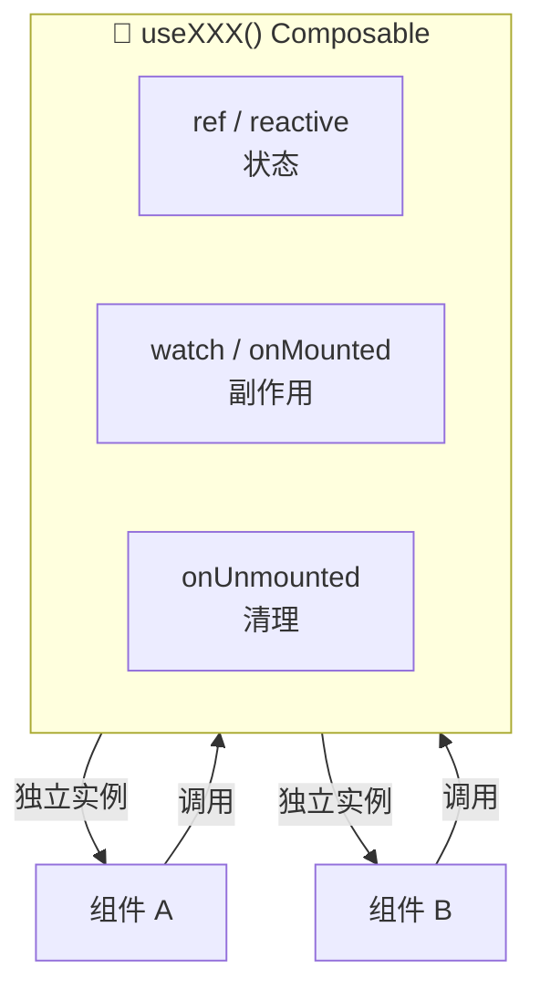

# Vue 3 核心原理（四）—— 组合式 API：Composable 与状态复用

> **环境：** Vue 3 Composition API 全量机制，替代 Mixins 的高阶抽象范式

在 Vue 2 中，由于经常使用 `Mixins` 进行逻辑复用，项目变得庞大后容易出现命名冲突（如 `$data` 属性覆盖）以及数据来源不明确等缺点，导致维护成本增加。

Composition API（组合式 API）除了提供在 `setup` 顶层编写逻辑的能力，其真正的优势在于能将**带副作用的状态和相关的生命周期钩子，抽离封装为可高定制度复用的纯函数（Composables）**。

---

## 1. 原则规范：如何设计可靠的 Composable？



编写可靠的 `useXXX()` 函数，不仅仅是将代码移出组件。
规范的 Composable 需要充分兼顾参数类型的自适应性以及严格的生命周期清理机制。

### 1. 灵活的参数解析（`toValue`）
Composable 的输入参数类型是不确定的，有可能是基础类型值，也有可能是 `ref`、响应式对象甚至 Getter 函数。作为一个封装库，需要对输入参数进行兼容。

```javascript
// 使用 Vue 3.3+ 提供的 toValue 进行参数规范化解包
import { toValue, watch } from 'vue'

export function useDynamicTitle(titleInput) {
  // 无论传入的是 ref、字符串常量还是 Getter 函数，
  // toValue 都能安全地提取最新值，同时保留响应式追踪链路
  watch(() => toValue(titleInput), (newTitle) => {
    document.title = newTitle
  }, { immediate: true })
}
```

### 2. 生命周期回调：自动清理副作用
在纯函数里，如果使用了 `addEventListener` 或者开启了 `setInterval` 等全局事件监听与定时器，必须随作用域一起进行副作用清理，防止内存泄漏。

```javascript
import { onUnmounted } from 'vue'

export function useAutoRefresh() {
  const timer = setInterval(() => {
    // 刷新逻辑
  }, 1000)
  
  // 自动绑定到调用方组件的卸载钩子上进行清理
  onUnmounted(() => clearInterval(timer)) 
}
```

## 2. 状态共享：基于外层闭包的全局单例

利用 Composition API，开发者不再受限于 `this`，这使得状态能够脱离特定的组件实例单独存在。
若将一个包含 `reactive` 或 `ref` 属性的变量定义在 Composable 模块代码的顶层空白作用域（而非导出的函数内部），该变量将变为全局单例。

```javascript
/* useSharedCount.js */
import { ref } from 'vue'

// 脱离单一组件生命周期、存活在模块全局空间中的状态源
const globalCounter = ref(0) 

export function useSharedCount() {
  const increment = () => globalCounter.value++
  return { counter: globalCounter, increment }
}
```

任何在不同组件中调用 `useSharedCount()` 的逻辑，其取出的 `globalCounter` 将指向同一块物理内存。这种去中心化的状态复用可用于跨组件通信，作为轻量级的非库状态管理方案。

## 3. 跨层级通信：Provide / Inject

有些场景下，全局状态不符合封装安全需求（例如在同一个页面渲染多个完全独立的商品展示区域，区域内的子孙组件需要共享该商品的颜色信息，但不同区域之间不能相互干扰）。
此时可以使用具备**作用域层级限制**的 `Provide / Inject` 模式。

**显式权衡（Trade-offs）**：
这种注入机制省去了中间多层级冗余的 `Props` 逐层传递（Prop drilling）。
但**代价增加了组件间的隐性耦合**：底层的子组件依赖来自外部的特定注入环境运行，脱离这个环境后会直接运行报错，排查成本较高，并且不易直观地了解其接收参数的全貌。

```typescript
// 利用 Symbol 配合泛型定义 InjectionKey，避免字符串魔法键名带来的重名和类型丢失
import type { InjectionKey, Ref } from 'vue'
export const ShoeColorKey: InjectionKey<Ref<string>> = Symbol('shoeColor')
```

## 4. 常见坑点

**在异步回调之后调用 `inject` 导致异常报错**
如果在网络请求（如 `setTimeout` 或 `fetch` 返回）后尝试使用 `inject` 获取全局信息，控制台常会抛出 `Injection "Symbol(xxx)" not found`。
**原理解释**：`inject` 和 `provide` 内部依赖于当前同步执行的 Vue 实例上下文游标。当把调用放在异步回调宏/微任务中时，同步主线程上的 `setup()` 早已执行完毕，Vue 已经清除了当前组件的指向标识。此时再去寻找实例链路将导致断联。
**解法约束**：与当前组件实例高度绑定的 API 调用（包括 `inject` 和 `onMounted` 等生命周期方法），必须在 `setup()` 同步执行队列的最顶层进行提取和留存，避免被延后至异步流程执行。

## 5. 延伸思考

近年来类似 VueUse 这样积累了海量 Composable 函数库的开源生态逐渐走向繁荣，涵盖了浏览器端所有的 API 探测响应封装。
在广泛享受模块化组合调用便利的同时，项目可能会隐式构建出涉及成百上千个细碎 `Ref` 依赖和监听回调池的高维状态树。与直接操作局部状态或 DOM 相比，这种极端细粒度反应式抽象模式，在极端重构场景或者性能敏感业务下是否会带来难以管控的隐性开销？

## 6. 总结

- 配合 `toValue` 和 `onUnmounted` 等辅助方法，Composable 函数才能成为真正无惧副作用和调用输入类型污染的高质量封装。
- 定义在 Composable 模块外层空间的响应式数据，可以被灵活运用为轻量全局状态单例。
- `Provide / Inject` 减轻了 Props 透传噩梦，但应审慎使用，避免构建过于隐匿的数据依赖环境。

## 7. 参考

- [Vue 官方 Composables 编写指南](https://cn.vuejs.org/guide/reusability/composables.html)
- [VueUse: Collection of Essential Vue Composition Utilities](https://vueuse.org/)
