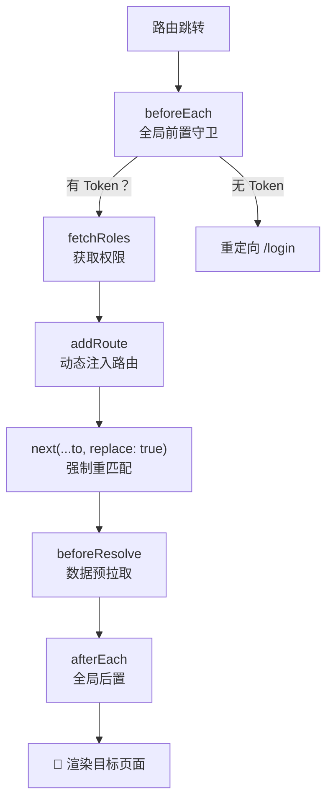

# Vue 3 核心原理（五）—— Vue Router 4：动态路由与异步加载策略

> **环境：** Vue Router 4.x+, 权限认证体系

单页应用（SPA）的路由系统不仅负责路径映射，还要处理细粒度的权限控制和数据预加载。
对于中后台等含有复杂角色和几十级权限体系的大型应用，深度掌控路由守卫（Navigation Guards）和动态挂载机制显得尤为关键。

---

## 1. 动态挂载：`addRoute` 与鉴权体系



在一个规范的后端主导权限控制系统中，前台前端在初始启动时所暴露的静态路由通常只包含登录页（如 `/login`）及少数公开页面。

所有需要登录或特定角色的业务页面 URL 映射表，都必须在运行时获取到用户身份和菜单权限数据后，被动态注入到 Vue Router 中。

### 动态挂载完毕后的白屏重定向

获取权限并调用 `router.addRoute()` 追加页面时，如果不配合特定的重定向机制，常会导致路由寻址失效并出现白屏 `Not Found`。

```javascript
/* src/permission.js 路由守卫拦截 */
router.beforeEach(async (to, from, next) => {
  if (hasToken && !hasRolesFetched) {
    try {
      // 1. 获取拥有进入哪些页面的权限表
      const accessRoutes = await store.dispatch('fetchRoles')
      
      // 2. 依次加载动态路由注入应用
      accessRoutes.forEach(route => router.addRoute(route))

      // <--- 坑点核心解法：处理 addRoute 引起的寻址未同步问题
      // 由于 addRoute 的底层配置更新具有时序差，如果此时接着走普通的 next() 放行，
      // Router 的内部机制可能会错过当前正准备前往的那条新被添加的路径。
      // 必须通过带有 replace: true 标识的强制重定向触发新一遍全流程路径匹配。
      next({ ...to, replace: true }) 
      
    } catch (err) {
      next(`/login`)
    }
  } else {
    next() // 正常的常规放行
  }
})
```

## 2. 拦截与预检：不同的生命阶段

部分开发者习惯将绝大多数逻辑集中在全局的 `beforeEach` 守卫中。事实上，Vue Router 提供的不同层级的回调钩子可以分别处理不同类型的副作用逻辑。

### `beforeResolve`：数据预拉取前哨

当我们要进入某个加载依赖极其庞大的主数据分析页面时，若选择在页面内部自身的 `onMounted` 里发起数据请求，用户在经历路由切换后可能会看到大块的数据空白区域以及无反馈的转圈加载（Loading）。

有时业务需求期望将等待转移到跳转前，实现不拿到基础数据、不渲染组件的平滑过渡体验，可以在 `beforeResolve` 拦截点完成数据抓取阻塞：

```javascript
router.beforeResolve(async to => {
  // 判断目标路由是否配置了需要前置依赖抓取的标识
  if (to.meta.requiresDataPrefetch) {
    try {
      await fetchDashboardDataFor(to.params.id) // 阻塞式异步等待请求完成
    } catch (error) {
      // 如果发生网络或鉴权错误，直接取消切卡动作，保持原页面视图不变
      return false 
    }
  }
})
```

> **观测验证**：使用这个 Hook 执行网络查询时，打开浏览器网络层抓包并观察。你会发现点击后，URL 并未立刻变更，当前页面的状态会维持（期间发起请求进行等待）。请求完毕后，页面一次性顺滑切入目标成品，避免了二次内容的闪烁填充。

## 3. 过渡动效：组件留存与更替

结合 Vue 3 的 `<Transition>`，页面切换可附带动画过渡效果。但在缺乏合理模式设定的前提下，常容易引发容器高度变化或元素排列错位的布局抖动。

```html
<router-view v-slot="{ Component, route }">
  <!-- <--- 核心设定：mode="out-in" 强制退场入场次序 -->
  <transition name="fade" mode="out-in">
    <component :is="Component" :key="route.path" />
  </transition>
</router-view>
```

**显式权衡（Trade-offs）**：
不加 `mode="out-in"` 会导致何种情况？在路由切换且包含转场动画时间窗内，**旧组件的 DOM 未完全离场移除，而新组件的 DOM 却被动画树强制并行挂载于页面**。这会立刻引起容器尺寸剧烈波动，引发内容错位跳动。增加 `out-in` 配置的副作用是引入并增加了串行等待所需的微小空档期，但稳定保障了渲染引擎不会出现双重结构折叠的排版异常。

## 4. 常见坑点

**忽略了 Keep-Alive 对路由复用钩子的截断影响**
如果在 `<router-view>` 外层使用了 `<KeepAlive>` 以缓存表格的查询状态。当用户第二次带着不同的 URL Query 参数 `?id=999` 进入这个已缓存的同一个组件外壳时：
**原理解释**：`created`、`mounted` 钩子不会再次执行响应。因为 Vue 评估外壳缓存生效，直接把上一次处于挂起状态的基础 DOM 送回前台。
**解法必修**：开发者必须利用组件复活专用的生命周期钩子 `onActivated`，或者在组件更深层代码直接 `watch(() => route.query, () => {}, { immediate: true })` 来侦听并重置请求条件。

## 5. 延伸思考

传统的 Web 后台路由往往会将所有防波堤筑死在每次拦截周期的全局 `beforeEach` 中。如果在巨型系统中，拥有极其复杂的路由判定树和角色判断，该处的耗时就有可能拖慢渲染帧率。
针对服务端渲染 SSR，以及如今被推崇的微前端架构。由于鉴权控制、应用子模块派发已经提前推演至 HTTP Header 通信或基座应用。对于被挂载渲染的子应用或者路由树本身而言，这种将庞大的路由表查询与映射配置全部集成在一个庞大的运行主包中的开发范式，是否还存在被优化切割的空间？

## 6. 总结

- 利用 `addRoute` 和重定向技巧可解决静态预声明路由的局限性和安全权限问题。
- `beforeResolve` 实现异步接口的预备吸纳加载，进而改善视图响应时的“先空架子再填充”闪烁问题。
- `mode="out-in"` 动画守则是治理跨页面更替布局失控的标准防御手段。

## 7. 参考

- [Vue Router 导航守卫执行全钩子顺序解读](https://router.vuejs.org/zh/guide/advanced/navigation-guards.html)
- [动态路由与 addRoute 重定向机制](https://router.vuejs.org/zh/guide/advanced/dynamic-routing.html)
