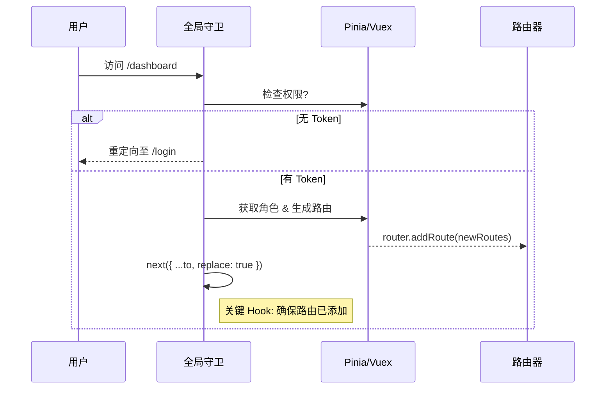

# Vue 3 深度精通 (五) —— Vue Router 4 的路由哲学

路由不仅是 URL 跳转，更是单页应用（SPA）的骨架。Vue Router 4 的设计更加契合 Composition API，同时也提供了强大的动态路由和导航守卫机制。

## 动态路由与权限控制

在后台管理系统中，根据用户角色动态生成菜单和路由是常见需求。

### `addRoute`：运行时的路由注入

```javascript
/* permission.js */
import router from '@/router'
import { generateRoutes } from '@/utils'

router.beforeEach(async (to, from, next) => {
  const hasToken = getToken()
  if (hasToken) {
    if (to.path === '/login') {
      next({ path: '/' })
    } else {
      const hasRoles = store.getters.roles && store.getters.roles.length > 0
      if (hasRoles) {
        next()
      } else {
        // 获取用户信息
        try {
          const { roles } = await store.dispatch('user/getInfo')
          // 根据角色生成路由表
          const accessRoutes = await store.dispatch('permission/generateRoutes', roles)
          
          // 动态添加路由
          accessRoutes.forEach(route => {
            router.addRoute(route)
          })

          //Hack: 确保 addRoute 完成
          // set replace: true so the navigation will not leave a history record
          next({ ...to, replace: true }) 
        } catch (error) {
          await store.dispatch('user/resetToken')
          next(`/login?redirect=${to.path}`)
        }
      }
    }
  } else {
    // ...
  }
})
```

**关键点**：`addRoute` 不会立即触发新的导航，在添加完路由后，通常需要 `next({ ...to, replace: true })` 来重新触发一次导航，确保新路由生效。



## 导航守卫的最佳实践

### `beforeResolve`：数据预获取的时机

除了 `beforeEach` 做鉴权，`beforeResolve` 是获取组件数据的理想场所。因为它是在所有组件内守卫和异步路由组件被解析之后调用的。这意味着此时路由已确认，可以安全地拉取数据。

```javascript
router.beforeResolve(async to => {
  if (to.meta.requiresData) {
    try {
      await fetchData()
    } catch (error) {
      if (error instanceof NotAllowedError) {
        // ... handle the error and cancel the navigation
        return false
      } else {
        // ... unexpected error, cancel the navigation and pass the error to the global handler
        throw error
      }
    }
  }
})
```

## 路由过渡动效

Vue Router 4 结合 Vue 3 的 `<Transition>` 组件，可以实现非常流畅的页面切换动画。

```html
<router-view v-slot="{ Component, route }">
  <!-- 使用 route.meta.transition 来动态设置动画名 -->
  <transition :name="route.meta.transition || 'fade'" mode="out-in">
    <component :is="Component" :key="route.path" />
  </transition>
</router-view>
```

**注意**：`mode="out-in"` 能保证当前页面先淡出，新页面再淡入，避免两个页面同时存在导致的布局跳动。

## 滚动行为控制 (`scrollBehavior`)

SPA 的常见问题是切换页面后滚动条位置不变。可以通过 `scrollBehavior` 修复这个问题。

```javascript
const router = createRouter({
  scrollBehavior(to, from, savedPosition) {
    if (savedPosition) {
      // 如果是浏览器后退，恢复位置
      return savedPosition
    } else {
      // 否则滚动到顶部
      return { top: 0 }
    }
  },
  // ...
})
```

亦可根据 hash 滚动到锚点：

```javascript
if (to.hash) {
  return {
    el: to.hash,
    behavior: 'smooth',
  }
}
```

## 结语

掌握了路由的动态控制和守卫机制，即可构建出安全、流畅的大型应用。下一篇将深入 **Pinia**，解析它如何重新定义 Vue 的状态管理。
