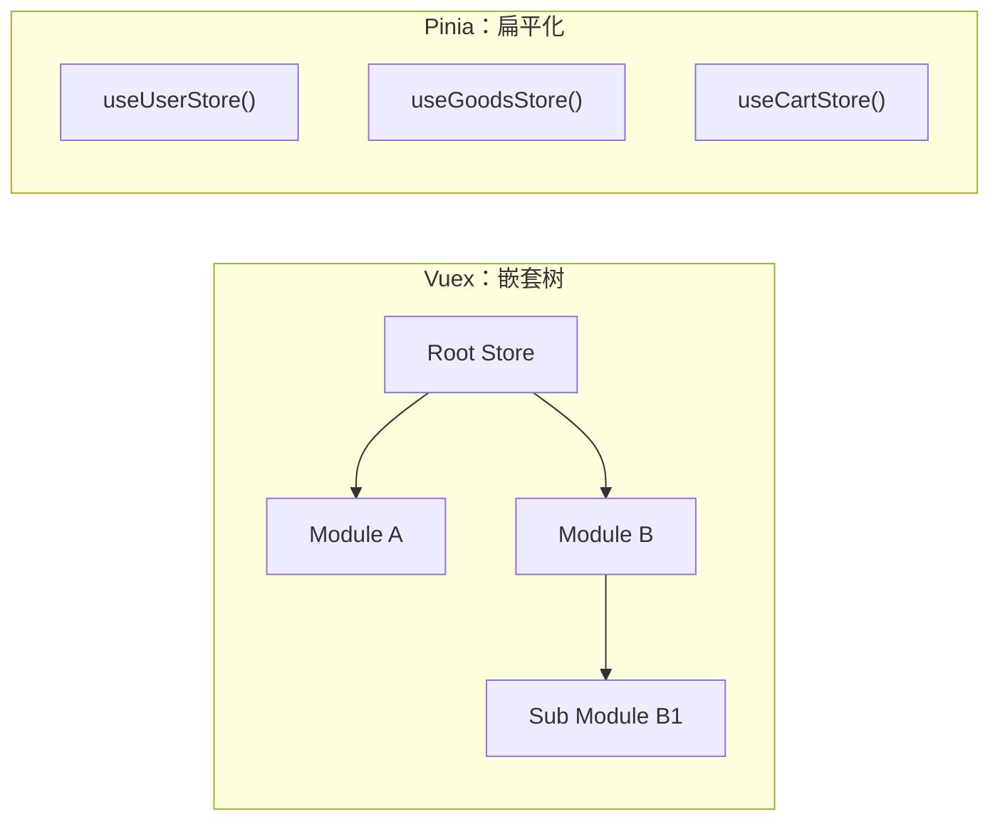

# Vue 3 核心原理（六）—— Pinia：新一代状态管理模式

> **环境：** Pinia 2.x+, Composition API

在 Vue 2 的开发中，大型项目往往重度依赖 Vuex 进行全局状态管理。然而 Vuex 严格的 `Mutations` 同步修改限制以及深层的嵌套模块，使得状态的使用和维护变得繁琐。
随着 Vue 官方推荐使用 Pinia 替代 Vuex 作为默认的状态库，状态管理模式正朝着更加轻量和扁平化的方向演进。

---

## 1. 核心设计：扁平化与去中心化



Pinia 核心解决的问题在于，将原本 Vuex 中存在的一个“单一全局树（Root Store）”，拆解成了分布式的**扁平化状态集合**。

- **不存在 Root Store 的嵌套层级**：开发者可以根据功能模块定义独立的 Store（例如：`useUserStore()`，`useGoodsStore()`）。这些 Store 在调用时是平级对等的，模块之间不需要通过命名空间去互相引用。
- **取消 `Mutations` 层级**：过去修改状态必须通过派发 `commit('XXX_TYPE')` 来保障同步事务。现在可以直接在 Actions 或者组件内通过 `store.count++` 更新状态，甚至能安全地与 `v-model` 进行双向绑定结合。
- **原生的 TypeScript 支持**：因为抛弃了多重嵌套和动态字符串提交机制，Pinia 的 API 设计可以提供完美的类型推断，不再需要复杂的类型断言或者额外的包装函数。

## 2. Setup Store 模式：直观的组合式封装

Pinia 支持类似于 Vuex 的 Options 配置式写法，但其更加推崇的是结合 Composition API 特性的 **Setup Store**。

这使得 Store 本质上变成了一个能够保持内部状态的闭包环境：

```typescript
import { defineStore } from 'pinia'
import { ref, computed } from 'vue'
// 支持在内部自由组合第三方的 Composable 函数
import { useLocalStorage } from '@vueuse/core' 

export const useUserStore = defineStore('user', () => {
  // 1. ref/reactive 对应原有的 State，用于存储基础数据
  const name = ref('Jack')
  const token = useLocalStorage('app-token', '') // 利用组合式函数快速挂载持久化逻辑
  
  // 2. computed 对应原有的 Getters，用于派生计算
  const isVip = computed(() => name.value === 'Boss')
  
  // 3. function 对应原有的 Actions，支持同步和异步，不再区分 Mutations
  async function performLogin(username: string) {
    const res = await api.auth(username)
    name.value = res.data.nickname 
  }

  // <--- 核心：通过 return 对象决定哪些状态向外部暴漏。
  // 未 return 的内部变量可以作为私有的内部作用域状态存在。
  return { name, token, isVip, performLogin }
})
```

## 3. 状态持久化机制

当浏览器刷新页面时，存在内存栈中的 Pinia 状态会被清空（例如存放在内存里的 Token 丢失导致用户被迫下线）。为了应对这部分需求，通常需要将关键状态持久化到本地存储。

**显式权衡（Trade-offs）**：
开发者可以手动在数据的变更处写入 `localStorage.setItem`，但这将使得原本纯粹的业务逻辑与底层 I/O 深度耦合。
引入 `pinia-plugin-persistedstate` 插件是目前常见的解决方案，它能在底层自动执行状态向存储介质的序列化以及初始化时候的神奇注入。
需要注意的是，**这种自动序列化由于使用 `JSON.stringify` 并在主线程执行，若 Store 内存储了数百 KB 甚至 MB 级的巨型复杂对象（如图表实例、大量表格数据），频繁的变更会带来明显的帧数骤降与主线程阻塞**。因此持久化应严控在核心必要字段级别。

```typescript
// main.ts 无需在各个组件修改即可配置全局插件
import { createPinia } from 'pinia'
import piniaPluginPersistedstate from 'pinia-plugin-persistedstate'

const pinia = createPinia()
pinia.use(piniaPluginPersistedstate)

// store/user.ts 里在第三个参数声明配置即可激活该 Store 的持久化存取
export const useUserStore = defineStore('user', () => { /* ... */ }, {
  persist: true
})
```

## 4. 常见坑点

**解构取出响应式导致状态失效**
由于 Pinia Store 通过 Proxy 进行了包装，一旦在组件内像普通对象一样进行解构展开，将导致提取出的变量彻底变为固定基础值，从而失去响应式特征。

```javascript
/* 反面错误示例 */
const userStore = useUserStore()
// 解构赋值会破坏 Proxy 结构引物，返回纯静态常量
const { name, isVip } = userStore 
```

**原理解释**：在 Vue 中针对通过 Proxy 响应的对象使用花括号对基本类型进行解体剥离，就等同于进行内存的二次拷贝赋值。这切断了挂载在该变量上的 `get`/`set` 监听轨道。
**解法方案**：这和处理局部的 `reactive` 解构一样，必须使用与 Store 专门配套的 `storeToRefs()` 函数，将取出的数据包装为单独响应式的 `ref` 对象后，再做使用和页面注入。

## 5. 延伸思考

Pinia 的推广使得传统框架中强调的单一数据流和强约束规则（如 Redux、Vuex 等流派）发生了转变，它更倡导局部独立拆分和高度自由的操作。
在大型的几十人合作的企业级中后台开发中，如果任何组件都能够不经约束地直接导入某个全局 Store 并在随意的地方执行 `store.count = xxx`，一旦数据产生意外逻辑覆盖，其溯源可能会变得极其困难。作为架构设计者，如何在此类自由度极高的工具库之上，建立明确的代码规范、修改准则乃至统一事件总线？

## 6. 总结

- 利用 Setup 写法进行 Store 组织，能够以组合原生的方式对业务模块进行高度内聚的抽象。
- 使用各司其职的扁平化并存模块，取代了 Vuex 将所有树节点混装于 Root Store 的复杂结构层级体系。
- 正确使用插件对特定需要常驻的关键数据实现低侵入的持久化控制，需要警惕全量持久化引发的阻塞性能灾难。

## 7. 参考

- [Pinia 官方深入学习文档](https://pinia.vuejs.org/zh/)
- [Vuex vs Pinia: What to use for your next Vue.js app](https://vueschool.io/articles/vuejs-tutorials/vuex-vs-pinia/)
