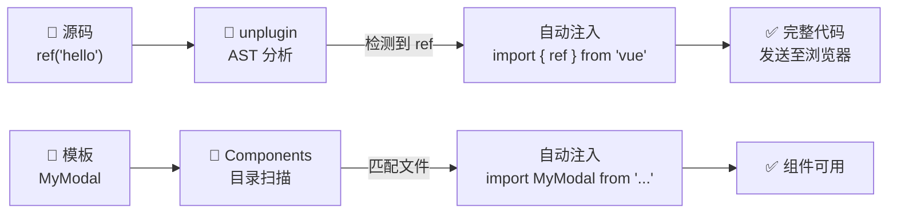

# Vue 3 核心原理（七）—— 工程基建：自动导入与环境配置的最佳实践

> **环境：** Vite 5.x+, unplugin 系列生态架构

随着现代前端项目工程化逐渐发展，频繁地引入如 `import { ref, computed } from 'vue'` 变成了一类重复性极高的体力劳动。
借助 Vite 构建生态圈内的相关编译期插件，可以将这些导入过程自动化。但若不理解其背后的机制与其边界带来的副作用，可能会在新项目搭建与维护中产生诸多由于隐式依赖造成的困扰。

---

## 1. 自动注入：编译期的代码前置拦截



`unplugin-auto-import` 和 `unplugin-vue-components` 这类插件并非某种新的 JavaScript 语法或者浏览器环境本身带有的特性。它们是在打包流编译阶段工作在构建流程中的 **AST 级代码重写工具**。

当在业务文件中未写 `import` 引用就调用 `console.log(ref('hello'))` 并保存时，Vite 的开发服务器处理管道在这段代码返回到浏览器解析前执行了拦截。
插件借助语法分析探测到预配规则词库内的 `ref` 出场，紧接着会在该源码模块的顶层静默追加写入特定的引入声明（即 `import { ref } from 'vue'`），借此规避运行期的缺少变量报错。

### 全局组件无感加载

除开诸如 Vue 内置全局 API，业务项目甚至可以免除内部 UI 组件及第三方开源 UI 库的页面头部引入头文件：

```javascript
// vite.config.ts
import Components from 'unplugin-vue-components/vite'

export default defineConfig({
  plugins: [
    Components({
      // <--- 核心配置：动态监听和扫描你设定的组件库目录
      dirs: ['src/components'], 
      dts: 'src/components.d.ts'
    })
  ]
})
```

配置生效之后，在模板中遇到 `<MyModal />`，插件会自动结合对应的 `components` 内部的文件模块进行关联和引入组装。

## 2. 工具使用的代价：类型系统的盲区

**显式权衡（Trade-offs）**：
自动导入虽然极速提升了编码的效率以及清理了繁杂的页面文件头部依赖区块，使得代码看起来更为干净整洁。但付出的代价是：**彻底斩断了代码静态推导所依赖的显式 `import` 引用溯源**，并且提高了多模块产生命名冲突或同调问题的隐患。

**坑点 1：TypeScript 缺少声明报错**
在缺乏 `import` 的情况下，纯 TS 编译引擎以及主流编辑器由于无法定位目标会通篇显示下划线红杠警告标识，提示“找不到名称 'xxx'”。
**解法**：在运行该类插件时，它会自动在项目根部投喂并生成一个 `auto-imports.d.ts` 等衍生声明文件。必须通过编辑确保将这个全局类型定义册手动注册加入至 `tsconfig.json` 的 `include` 扫描白名单。如此方能令整个编辑器正确获得推断恢复。

**坑点 2：命名空间的冲突覆盖**
假设项目中有一个自带的弹窗组件命作 `Dialog.vue`，而如果在自动导入扫描列表时同时接入了包含内置 `Dialog` 引用的其他 UI 库。这就极容易引发非预期的交叉覆盖与覆盖编译的混淆行为。因此自动组件引入务必要建立具有显著标识或者自定义前缀规则的隔离防撞策略。

## 3. 环境变量注入：构建期的硬替换隔离

Vite 在使用和规划全局环境变量时，摒弃了传统的注入方式，选用了围绕 `import.meta.env` 对象组织的内置暴露机制。然而此处也隐藏着常见的初级错误。

```javascript
// .env.production
# <--- 常见坑点：没有 VITE_ 开头的自定义秘钥，将会全部被拦截从而不被打包进入到前端产物中
DB_PASSWORD=8888 
VITE_API_DOMAIN=https://api.com
```

如果开发者试图在 Vue 逻辑层输出 `console.log(import.meta.env.DB_PASSWORD)`，结果将返回 `undefined`。
出于安全原则设计，部署在静态 CDN 提供给客户端浏览器的源码文件容易被任意访问，这意味着所有嵌入进打包代码后的常量均没有保密性。底层引擎因此作了预设定拦截：**仅显式具有安全标识前缀 `VITE_` 命名的词条，才会被特许暴露处理，其余均锁定在了只属构建阶段能够识别到的私有域中。**

> **观测验证**：去项目中拉出 `dist` 运行打包环境后的结果文本搜索 `VITE_API_DOMAIN`。你会发现环境变量并不具备在浏览器环境中重新组装获取或者基于外部服务器在运行中提供赋值。相反，所有的值**在构建阶段（Docker build / npm run build）那个短暂时间内，被视为纯字符串做了全盘的强行硬编码占位符全局替换**。

## 4. 延伸思考

随着前端工具链深度向类似 Unplugin 或各种基于编译时 AST 注入宏机制的方向倾泻，开发层面越来越具有框架特有的定制方言（DSL）意味。我们撰写的很多源码到达真正的客户端解析器之前，需要经历层层重组替换。
相对于传统更强调路径溯源和代码全量严谨显式书写的重型开发环境而言。这套广泛依赖预处理挂载配置、约定俗成潜规则或正则识别自动注入来提升工程体验前端范式，对于新入职成员项目的源码长期可维护性和代码行为预测是否存在更陡峭的工程隐性理解成本门槛？

## 5. 总结

- 自动配置注入插件拦截了底层的构建预处理节点，能够有效地静默完成诸如组件、API 等样板代码代码的调用补充封装。
- 引入对应的 `.d.ts` 类型文件的动态覆盖注册可以从 TS 服务器的层面解决全局隐式导入导致的推导失效。
- 环境变量受安全底线控制以及在编译期的单次字符串全盘硬性替换逻辑决定了其实际部署后不支持动态获取更新的特性。

## 6. 参考

- [Vite 官方文档：环境变量与模式](https://cn.vitejs.dev/guide/env-and-mode)
- [unplugin-auto-import 机制剖析](https://github.com/unplugin/unplugin-auto-import)
