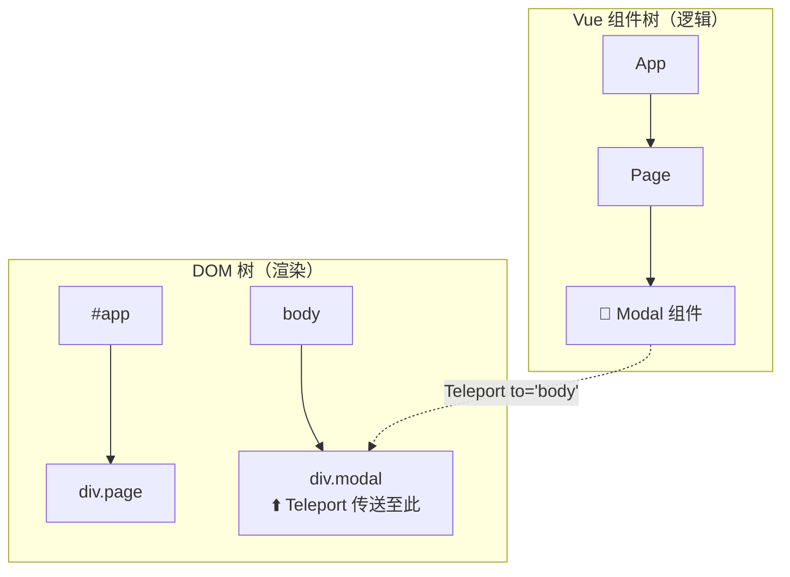

# Vue 3 核心原理（八）—— 进阶技巧：宏指令、Teleport 与 Suspense

> **环境：** Vue 3.4+ 内置宏指令，Teleport 与 Suspense 特性

在日常的 Vue 业务开发中，除了基础的组件通讯和响应式状态管理，还会遇到一些边缘场景。例如如何将深层嵌套的模态框挂载到外层节点，或是如何优雅地处理异步组件加载过程中的加载态。
Vue 3 引入的一系列高阶内置组件和编译宏，正是用于解决这些特定场景下的难题。

---

## 1. `defineModel`：双向绑定的简化利器

在 Vue 3.4 之前，为了在一个自定义组件中实现 `v-model` 双向绑定，开发者需要经历一系列固定的样板代码：声明引用的 `props`，定义对应的 `emit` 事件，然后在内部变量修改时手动去派发类似于 `update:modelValue` 的事件。

Vue 3.4 引入了更为简洁的编译阶段机制：

```javascript
<script setup>
// <--- 核心：这一行代码在编译后，会自动展开为对应的 props 和 emit 声明
const text = defineModel() 

function clearInput() {
  text.value = '' // 直接修改返回的 ref，编译器会自动转换为向父组件派发 update 事件
}
</script>
```

**显式权衡（Trade-offs）**：
`defineModel` 极大地减少了处理双向绑定时的样板代码数量，提升了开发效率。但这也带来了一定的**心智模型转换成本**：由于它的用法与定义在组件局部的普通 `ref` 非常相似，对于不熟悉该宏指令的新手可能产生困惑，容易误以为这仅仅是一个不涉及跨组件通信的内部响应式变量而已。需要在团队规范中加以说明。

## 2. `<Teleport>`：突破 DOM 结构限制的传送门



**典型痛点**：全屏模态框（Modal）层叠问题。
当将一个提示框组件挂载在其调用方局部组件的 DOM 内部时，如果该容器组件或其祖先节点设置了 `overflow: hidden` 或者复杂的 `z-index` 堆叠上下文，模态框的绝对定位展示往往会被截断或遮挡。

`<Teleport>` 提供了一种在组件逻辑层级与实际物理渲染层级解耦的方案。

```html
<!-- to 指令接收 CSS 选择器。 -->
<!-- 组件逻辑上仍归属当前上下文实例，但渲染时 DOM 会被插入到 body 的子节点中。 -->
<Teleport to="body" :disabled="isMobile">
  <div class="global-killer-modal">
    我在数据关联上属于原组件，但在 DOM 结构上已经附加到了 body 下！
  </div>
</Teleport>
```

> **观测验证**：打开 DevTools 检视 Elements 面板，你会清晰地看到模态框的实际 DOM 节点游离于原本应用挂载点（如 `#app`）之外的顶级同级。但切换至 Vue DevTools 观察 Component 树结构时，它依然安稳地处于原来的父组件下，能正常通讯、接收 props 及触发事件，实现了逻辑从属与物理绘图的有效分离。

## 3. `<Suspense>`：异步加载的统一降级处理

当封装了包含了大量前置资源依赖的异步组件（如需要在 setup 阶段 await 接口或者大体积图表初始化的 `<HeavyMap async setup />`）时，如果网速存在延迟，通常需要在父组件中编写诸如 `isLoading` 之类的标志位状态，并维护繁琐的传参逻辑。

`<Suspense>` 作为内置组件负责在组件树中协调嵌套异步依赖的解决状态，并提供回退（Fallback）UI。

```html
<onErrorCaptured>
  <!-- <--- 核心：统筹异步加载进行期间与完毕状态的协调器 -->
  <Suspense>
    <!-- 如果内部的异步组件有 await 未执行完成，组件自身将处于挂起等待中 -->
    <HeavyMap /> 
    
    <template #fallback>
      <!-- 在异步任务未处理完毕的空档窗体内，展示占位的骨架屏 -->
      <div class="skeleton-shimmer">努力连接地图卫星中...</div>
    </template>
  </Suspense>

  <template #error>
    <!-- 配合 onErrorCaptured 从外部兜底处理挂载期抛出的异常 -->
    <div class="error-bomb">抱歉，卫星地图加载失败</div>
  </template>
</onErrorCaptured>
```

## 4. 常见坑点

**动态挂载目标节点不存在导致的寻址报错**
在使用 `<Teleport to="#modal-root">` 的过程中，有时会在控制台看到 `Target container is not a DOM element` 的警告。
**原理解释**：`<Teleport>` 组件在挂载（mount）时，目标节点必须已经存在于 DOM 环境中。如果其目标选择器指向的 `div` 节点是由兄弟组件负责生成渲染，且渲染时间稍晚于该 Teleport 本身，引擎在尝试执行转移插入操作时将因寻找目标锚点落空而挂起报错。
**解法方案**：应当确保目标节点存在于入口层级的主骨架如 index.html，或是增加状态条件使得包含了 Teleport 的组件推迟到底层 DOM 完全就位后再行控制触发展示（例如使用 `v-if="isMounted"`）。

## 5. 延伸思考

虽然 `<Suspense>` 能够统一协调深埋层级中同时在发起的异步依赖加载任务状态展示，能够让复杂应用在初始化期间仅提供更具备视觉一致性的占位框架，不至于因为多个组件不同步加载导致视图结构乱跳。
但经历多次 Vue 的版本更迭，此特性仍在官方文档中挂载有 `(Experimental)` 实验性免责标签说明。除了针对流式 SSR 输出整合等架构层面的挑战因素之外。在对于被打断放弃或者已经开始执行的已解析挂起组件的缓存释放周期设计上，这种全局性质的恢复复苏树模型具体还面临着哪些有待讨论的阻碍和权衡？

## 6. 总结

- `defineModel` 削减了定义双向绑定需要经历的传递流程模板声明时间，是最具效用的语法糖之一。
- `Teleport` 摆脱了由于包含层样式约束带来的视图展现死角，确保层级跨越渲染的高自由度展现。
- `Suspense` 作为外皮兜底组件对深层包含了大规模前置非同步操作的等待态提供了简练而友好的空窗期替代视图处理。

## 7. 参考

- [Vue 官方使用 Teleport 教程说明](https://cn.vuejs.org/guide/built-ins/teleport.html)
- [全面讲解 Suspense 特性与支持状态](https://cn.vuejs.org/guide/built-ins/suspense.html)
