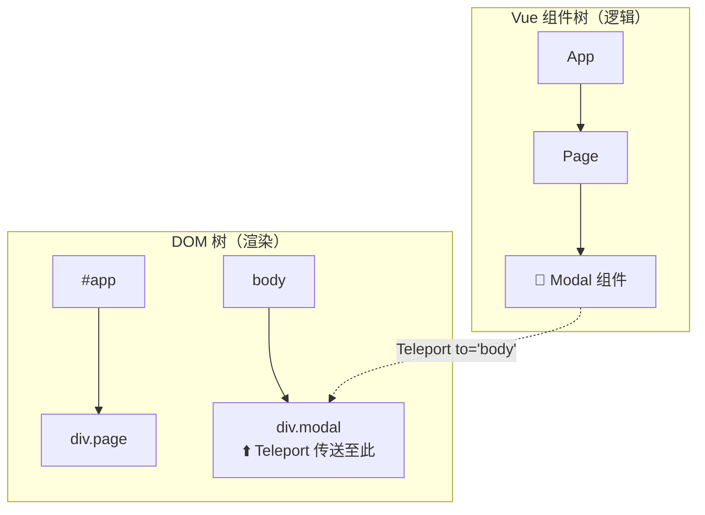

# Vue 3 核心原理（八）—— 进阶技巧：宏指令、Teleport 与 Suspense

> **环境：** Vue 3.4+ 内置宏指令，Teleport 与 Suspense 特性

在日常的 Vue 业务开发中，除了基础的组件通讯和响应式状态管理，还会遇到一些边缘场景。例如如何将深层嵌套的模态框挂载到外层节点，或是如何优雅地处理异步组件加载过程中的加载态。
Vue 3 引入的一系列高阶内置组件和编译宏，正是用于解决这些特定场景下的难题。

---

## 1. `defineModel`：双向绑定的简化利器

在 Vue 3.4 之前，为了在一个自定义组件中实现 `v-model` 双向绑定，开发者需要经历一系列固定的样板代码：声明引用的 `props`，定义对应的 `emit` 事件，然后在内部变量修改时手动去派发类似于 `update:modelValue` 的事件。

Vue 3.4 引入了更为简洁的编译阶段机制：

```javascript
<script setup>
// <--- 核心：这一行代码在编译后，会自动展开为对应的 props 和 emit 声明
const text = defineModel() 

function clearInput() {
  text.value = '' // 直接修改返回的 ref，编译器会自动转换为向父组件派发 update 事件
}
</script>
```

**显式权衡（Trade-offs）**：
`defineModel` 极大地减少了处理双向绑定时的样板代码数量，提升了开发效率。但这也带来了一定的**心智模型转换成本**：由于它的用法与定义在组件局部的普通 `ref` 非常相似，对于不熟悉该宏指令的新手可能产生困惑，容易误以为这仅仅是一个不涉及跨组件通信的内部响应式变量而已。需要在团队规范中加以说明。

## 2. `<Teleport>`：突破 DOM 结构限制的传送门



**典型痛点**：全屏模态框（Modal）层叠问题。
当将一个提示框组件挂载在其调用方局部组件的 DOM 内部时，如果该容器组件或其祖先节点设置了 `overflow: hidden` 或者复杂的 `z-index` 堆叠上下文，模态框的绝对定位展示往往会被截断或遮挡。

`<Teleport>` 提供了一种在组件逻辑层级与实际物理渲染层级解耦的方案。

```html
<!-- to 接收 CSS 选择器 -->
<!-- 组件逻辑上仍归属当前上下文实例，但渲染时 DOM 会被插入到 body 的子节点中 -->
<Teleport to="body" :disabled="isMobile">
  <div class="global-modal">
    组件逻辑上属于原组件，但 DOM 已挂载到 body 下
  </div>
</Teleport>
```

> **验证**：在 DevTools Elements 面板中，模态框 DOM 节点在 `#app` 之外的顶级位置。切换到 Vue DevTools Component 树时，它仍在原父组件下，能正常接收 props 和触发事件。

## 3. `<Suspense>`：异步加载的统一降级处理

当 `setup` 阶段需要 `await` 接口数据或大体积资源初始化时，通常需要在父组件维护 `isLoading` 标志位并手动传参。`<Suspense>` 统一处理嵌套异步依赖的加载状态，并提供 fallback UI。

```html
<onErrorCaptured>
  <Suspense>
    <!-- 内部异步组件 await 未完成时，Suspense 保持挂起 -->
    <HeavyMap />

    <template #fallback>
      <!-- 异步任务未完成时显示占位内容 -->
      <div class="skeleton-shimmer">加载中...</div>
    </template>
  </Suspense>

  <template #error>
    <div class="error-state">地图加载失败</div>
  </template>
</onErrorCaptured>
```

## 4. 常见坑点

**动态挂载目标节点不存在导致的寻址报错**
在使用 `<Teleport to="#modal-root">` 的过程中，有时会在控制台看到 `Target container is not a DOM element` 的警告。
**原理解释**：`<Teleport>` 组件在挂载（mount）时，目标节点必须已经存在于 DOM 环境中。如果其目标选择器指向的 `div` 节点是由兄弟组件负责生成渲染，且渲染时间稍晚于该 Teleport 本身，引擎在尝试执行转移插入操作时将因寻找目标锚点落空而挂起报错。
**解法方案**：应当确保目标节点存在于入口层级的主骨架如 index.html，或是增加状态条件使得包含了 Teleport 的组件推迟到底层 DOM 完全就位后再行控制触发展示（例如使用 `v-if="isMounted"`）。

## 5. 延伸

`<Suspense>` 在官方文档中仍标注为实验性特性。在流式 SSR 场景下，异步组件的挂起/恢复与服务端流输出的协调还有待完善。生产项目中需要注意这个状态。

## 6. 总结

- `defineModel` 把双向绑定的 props + emit 样板代码压缩为一行，但需要在团队中说明其本质是跨组件通信。
- `<Teleport>` 解决了深层嵌套组件受 `overflow: hidden` 和 `z-index` 堆叠上下文影响的定位问题。
- `<Suspense>` 统一处理异步组件的加载态，替代父组件中分散的 `isLoading` 标志位管理。

## 7. 参考

- [Vue 官方使用 Teleport 教程说明](https://cn.vuejs.org/guide/built-ins/teleport.html)
- [全面讲解 Suspense 特性与支持状态](https://cn.vuejs.org/guide/built-ins/suspense.html)
