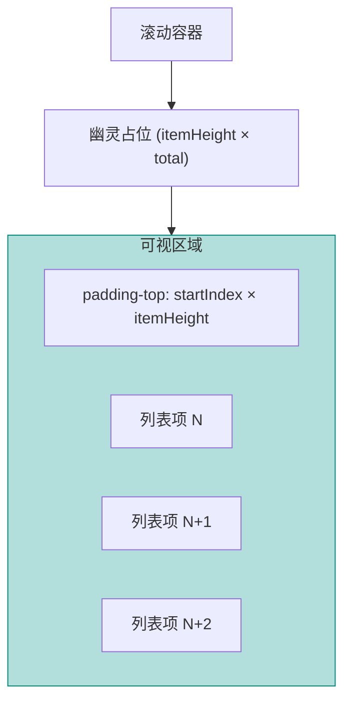

# Vue 3 深度精通 (九) —— 极致性能优化终极指南

性能优化涵盖从网络加载到运行时渲染的全过程。本章深入每一个细节，力求最大化利用浏览器性能。

## 网络层优化：不仅仅是 Code Splitting

除路由懒加载外，还有几个容易忽略的优化点。

### Bundle Analysis

明确打包内容至关重要。使用 `rollup-plugin-visualizer` 分析打包结果：

```bash
npm install --save-dev rollup-plugin-visualizer
```

```javascript
// vite.config.ts
import { visualizer } from 'rollup-plugin-visualizer'

export default defineConfig({
  plugins: [
    visualizer({ open: true, gzipSize: true }),
  ],
})
```

找出那些巨大的依赖（如 lodash, moment），替换为轻量级替代品（lodash-es, dayjs）。一个常见问题是 `lodash` 全量引入——即使只用了 `debounce`，也会把整个 lodash 打进 bundle。

### 预加载机制 (Prefetch / Preload / Preconnect)

三种策略针对不同场景：

| 策略 | 时机 | 场景 |
|------|------|------|
| `<link rel="preload">` | 当前页面**立即**需要 | LCP 关键图片、首屏字体 |
| `<link rel="prefetch">` | 用户**可能**访问的资源 | 下一页路由的 JS chunk |
| `<link rel="preconnect">` | 提前建立 TCP/TLS 连接 | 第三方 CDN、API 域名 |

```html
<!-- 首屏关键资源 -->
<link rel="preload" href="/fonts/Inter.woff2" as="font" type="font/woff2" crossorigin>

<!-- 预连接第三方 CDN -->
<link rel="preconnect" href="https://cdn.example.com">
```

Vite 默认会对动态 `import()` 的 chunk 自动注入 `<link rel="modulepreload">`，但对于图片和字体需要手动配置。

### defineAsyncComponent + Suspense

路由级懒加载之外，组件级懒加载也能有效减小初始 bundle。`defineAsyncComponent` 配合 `Suspense` 可以优雅地处理加载状态：

```vue
<script setup>
import { defineAsyncComponent } from 'vue'

const HeavyChart = defineAsyncComponent({
  loader: () => import('./HeavyChart.vue'),
  loadingComponent: () => h('div', { class: 'skeleton' }, '图表加载中...'),
  errorComponent: () => h('div', '加载失败'),
  delay: 200,    // 200ms 内加载完成则不显示 loading
  timeout: 10000, // 超过 10s 显示 error 组件
})
</script>

<template>
  <Suspense>
    <HeavyChart :data="chartData" />
    <template #fallback>
      <div class="skeleton-chart" />
    </template>
  </Suspense>
</template>
```

`delay: 200` 是个重要细节——如果组件在 200ms 内就加载完了，用户根本看不到 loading 状态，避免了闪烁。

## 运行时优化：在主线程上跳舞

### v-memo：列表渲染的精确制导

`v-memo` 是 Vue 3.2 引入的指令，作用是**跳过子树的 VNode 创建**。当依赖数组的值没有变化时，整个子树复用上一次的 VNode，连 diff 都不做。

```vue
<template>
  <div v-for="item in list" :key="item.id" v-memo="[item.id === selectedId]">
    <!-- 只有当 item 是否被选中的状态变化时，才重新渲染 -->
    <div :class="{ active: item.id === selectedId }">
      {{ item.name }}
      <ComplexSubComponent :data="item.details" />
    </div>
  </div>
</template>
```

**适用场景**：大列表（1000+ 项），每项包含复杂子组件（图表、富文本），且操作只影响少量项（如选中、高亮）。在这种场景下，`v-memo` 可以让 update 性能提升一个数量级。

**不适用场景**：简单列表（几十项），或者每次更新几乎所有项都变化。此时 `v-memo` 的依赖检查反而是额外开销。

### KeepAlive 缓存策略

`<KeepAlive>` 让被包裹的组件在切换时不被销毁，而是缓存在内存中。用于 Tab 切换、路由缓存等场景：

```vue
<router-view v-slot="{ Component }">
  <KeepAlive :include="['Dashboard', 'Settings']" :max="5">
    <component :is="Component" />
  </KeepAlive>
</router-view>
```

*   `include`：白名单，只缓存列出的组件（匹配 `name` 属性）。
*   `max`：最大缓存数量。超出后按 LRU (Least Recently Used) 策略淘汰。

**生命周期**：被缓存的组件不会触发 `onMounted` / `onUnmounted`，而是触发 `onActivated` / `onDeactivated`。如果需要在组件被重新激活时刷新数据，应该用 `onActivated`：

```javascript
onActivated(() => {
  // 重新获取可能已过期的数据
  fetchLatestData()
})
```

### 调度器 (Scheduler) 与 `nextTick`

Vue 的更新是异步的。多次修改状态只会触发一次更新。

如果有繁重的计算任务，可以使用 `requestIdleCallback` 或 `scheduler.postTask`（实验性）切分任务，避免阻塞 UI 渲染：

```javascript
// 长任务切片
async function heavyTask() {
  const steps = 10000
  for (let i = 0; i < steps; i++) {
    process(i)
    if (i % 100 === 0) {
      // 让出主线程
      await new Promise(resolve => requestIdleCallback(resolve))
    }
  }
}
```

### Web Workers

对于纯计算逻辑（如复杂的 Excel 处理、图像压缩），不要让它占用主线程。Vite 内置了 Worker 模块支持：

```javascript
// heavy-worker.ts
self.onmessage = (e: MessageEvent) => {
  const result = heavyCompute(e.data)
  self.postMessage(result)
}

// 在组件中使用
const worker = new Worker(new URL('./heavy-worker.ts', import.meta.url), { type: 'module' })
worker.postMessage(rawData)
worker.onmessage = (e) => {
  result.value = e.data
}
```

推荐库：`comlink` 可以让 Worker 通信变得像调用普通函数一样简单。

### 虚拟列表 (Virtual List)

当列表项超过 1000 个时，渲染所有 DOM 必然卡顿。虚拟列表的核心思想是：**只渲染可视区域及其缓冲区**。

VueUse 提供了 `useVirtualList`，但理解其原理至关重要：



核心步骤：
1.  计算总高度（`itemHeight * total`），撑起滚动区域。
2.  监听 `scroll` 事件。
3.  根据 `scrollTop` 计算 `startIndex` 和 `endIndex`。
4.  只截取 `list.slice(start, end)` 渲染。
5.  使用 `padding-top` 或 `transform: translateY()` 把可视区域定位到正确位置。

对于不定高度的列表项，需要动态测量每项高度并维护一个高度缓存表，复杂度更高。这种场景建议直接使用 `vue-virtual-scroller` 库。

## 性能分析工具

### Chrome DevTools Performance 面板

1.  打开 DevTools → Performance → 点击录制。
2.  操作页面（如滚动列表、切换 Tab）。
3.  停止录制，观察 **Main** 线程的火焰图。
4.  找到长任务（黄色方块 > 50ms）的调用栈，定位到具体的组件或函数。

### Vue DevTools Performance Tab

Vue DevTools 提供了组件级的渲染耗时分析：

*   **Component Render Time**：每个组件的 render 耗时排名。
*   **Timeline**：按时间轴查看哪些组件在哪一帧被重新渲染。
*   **Inspector**：选中组件后查看其 props、state 的变化历史。

通过这些工具可以精确定位"哪个组件在不该渲染的时候渲染了"——这往往是性能问题的根源。

## SSR / SSG

若首屏性能是瓶颈（SEO, FCP），SSR 是有效解决方案。

*   **SSR**: Nuxt 3。服务器直接返回渲染好的 HTML，LCP 显著改善。
*   **SSG**: VitePress / Nuxt generate。构建时生成静态 HTML。适用于博客、文档。
*   **ISR**: Nuxt 的 `routeRules` 支持增量静态生成（ISR），适合电商等数据会变但访问量大的场景。

## 结语

性能优化不存在银弹。熟悉工具（DevTools, Lighthouse）、理解浏览器原理（重排重绘）、掌握框架机制（异步更新、v-memo、KeepAlive），三者结合才能在实战中准确判断瓶颈并对症下药。下一篇将深入 Vue 3 的**内核源码**，揭开响应式与编译器的底层机制。
