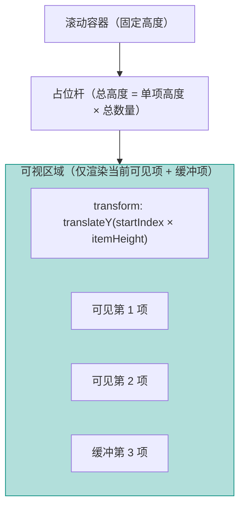

# Vue 3 核心原理（九）—— 性能优化：列表渲染与资源打包

> **环境：** 浏览器渲染大列表全链路，Vite 打包解析模块矩阵

当页面一次性加载数万条数据时，`v-for` 的暴力渲染会瞬间压垮主线程——滚动卡顿、风扇狂转、白屏等待接踵而至。Vue 虽然在虚拟 DOM 层构建了缓冲区，但在海量数据面前仍需借助更精细的优化手段。

---

## 1. 免检机制：`v-memo` 与 `KeepAlive` 的按需跳过

每次页面状态变化，Vue 的 Diff 算法都会遍历整棵虚拟 DOM 树。即使只有一处细微变更，所有组件节点都可能参与比对校验。

### `v-memo`：子树免检标记

对于包含 1000 项的列表，如果只点击了其中第 999 项使其高亮，让 Vue 重新比对 1000 个元素就属于浪费。

```html
<template>
  <!-- 只有 item.id === selectedId 的那一项参与 Diff，其余直接跳过 -->
  <div v-for="item in list" :key="item.id" v-memo="[item.id === selectedId]">
    <div :class="{ active: item.id === selectedId }">
      {{ item.name }}
    </div>
  </div>
</template>
```

`v-memo` 接收一个依赖数组。只要数组中的表达式值未变，Vue 就跳过整棵子树的 Diff，直接复用现有 DOM。

### `<KeepAlive>`：组件实例缓存

当用户从 Tab A 切换到 Tab B 再切回来时，如果没有 `<KeepAlive>`，Tab A 组件会被完全销毁，切回时重新创建并重新请求数据。

```vue
<template>
  <KeepAlive :include="['HeavyChart', 'DataTable']">
    <component :is="currentTab" />
  </KeepAlive>
</template>
```

`<KeepAlive>` 会缓存被包裹组件的实例，使其在切换后保留状态。需要注意的是，被缓存的组件**不会触发 `onMounted`**——如需在每次"可见"时执行逻辑，需使用 `onActivated` 钩子：

```javascript
onMounted(() => {
  // 仅首次加载时触发
  fetchData()
})

onActivated(() => {
  // 每次组件从缓存中被唤醒时触发
  refreshData()
})
```

## 2. 虚拟列表：只渲染"视口内"的数据

对于十万量级的列表，绝对不应该往真实 DOM 中插入十万个节点。虚拟列表的思路是：**只渲染用户当前能看到的那一小部分节点，通过占位元素撑开滚动容器高度**。



**实现要点**：
- 占位杆用 `position: absolute` + `height: 总数 × 单项高` 撑开滚动条
- 可视区域固定高度，`transform: translateY(偏移量)` 动态定位当前项
- 监听滚动事件，计算可视起止索引，只渲染 `startIndex - buffer` 到 `endIndex + buffer` 的节点

**适用场景**：商品列表、聊天记录、日志流、大表格等。

**需权衡的问题**：

| 权衡点 | 说明 |
|--------|------|
| `Ctrl+F` 失效 | 全文搜索只能搜到已渲染的 DOM，隐藏在占位杆中的内容不可检索 |
| 动态高度 | 如果列表项高度不固定（展开详情等），虚拟列表实现复杂度大幅上升 |
| 滚动位置保持 | 跳转到列表底部/指定位置需要特殊处理 |

## 3. Bundle 优化：Tree Shaking 与按需加载

即使业务逻辑优化到极致，如果首屏加载了一个 5MB 的 JS 包，所有优化都会功亏一篑。

### 诊断工具

使用 `rollup-plugin-visualizer` 可以可视化打包产物，按大小排列各模块：

```bash
pnpm add -D rollup-plugin-visualizer
```

```javascript
// vite.config.js
import { visualizer } from 'rollup-plugin-visualizer'

export default defineConfig({
  plugins: [
    vue(),
    visualizer({
      open: true,
      gzipSize: true,
      filename: 'stats.html'
    })
  ]
})
```

### 常见体积杀手

**全量引入 Lodash**：

```javascript
// ❌ 错误：即使只用了一个 debounce，也会被完整引入 (~72KB)
import _ from 'lodash'
const debouncedFn = _.debounce(fn, 300)

// ✅ 正确：Tree Shaking 按需引入
import debounce from 'lodash-es/debounce'
const debouncedFn = debounce(fn, 300)

// ✅ 最佳：直接用原生实现
const debouncedFn = (fn, ms) => {
  let timer
  return (...args) => {
    clearTimeout(timer)
    timer = setTimeout(() => fn(...args), ms)
  }
}
```

**策略汇总**：

| 策略 | 说明 |
|------|------|
| ESM 优先 | 使用 `lodash-es` 替代 `lodash`，支持 Tree Shaking |
| 动态导入 | `const Module = () => import('./Module.vue')`，按路由拆分 |
| 组件按需引入 | `import { ElButton } from 'element-plus'` 而非全量引入 |
| 压缩与分块 | Vite 默认分 chunk，大依赖单独拆出，长尾加载不影响首屏 |

## 4. 常见坑点

**`requestIdleCallback` 在高帧率页面不触发**

`requestIdleCallback` 只在浏览器空闲时调用回调。如果页面有持续的动画或高频交互，回调可能迟迟不会被执行：

```javascript
// ❌ 问题：动画帧率高时，回调可能永不触发
await new Promise(resolve => requestIdleCallback(resolve))
processHeavyData()

// ✅ 解法：用 Web Worker 处理计算密集型任务，主线程完全不受影响
// worker.js
self.onmessage = ({ data }) => {
  const result = heavyComputation(data)
  self.postMessage(result)
}

// main.js
const result = await new Promise(resolve => {
  const worker = new Worker('./worker.js')
  worker.onmessage = ({ data }) => resolve(data)
  worker.postmessage(payload)
})
```

**`KeepAlive` + `onMounted` 的陷阱**

如果把数据请求写在 `onMounted` 里期望"每次进入页面都刷新"，配上 `<KeepAlive>` 后会失效。正确做法是 `onActivated` 或在路由层面控制缓存策略。

## 5. 延伸思考

Vue 通过 `v-memo` 和虚拟 DOM 在框架层尽可能减少不必要的渲染。但对于那些需要处理百万级数据（如地理测绘、3D 图表、大规模可视化）的场景，建议将数据处理层完全脱离 Vue 的响应式系统——在纯 JS/WASM 中完成计算，只把最终结果传回视图。

何时该"脱离 Vue 做计算"：
- 数据量超过浏览器单线程处理能力（> 50 万条复杂计算）
- 需要 WebGL/WASM 加速渲染
- 数据更新频率远高于视图刷新频率（生产者/消费者模式）

## 6. 总结

- 利用 `v-memo` 按条件跳过无变更子树的 Diff，减少不必要的比对开销。
- 虚拟列表通过只渲染可视区节点，实现海量数据下的流畅滚动体验。
- Bundle 体积优化从源头保证首屏加载速度，配合 Code Splitting 实现按需加载。
- 对于超重计算任务，交给 Web Worker 彻底解放主线程。

## 7. 参考

- [Vue 性能优化官方指南](https://cn.vuejs.org/guide/best-practices/performance.html)
- [使用 Chrome Performance 面板分析长任务](https://developer.chrome.com/docs/devtools/performance)
