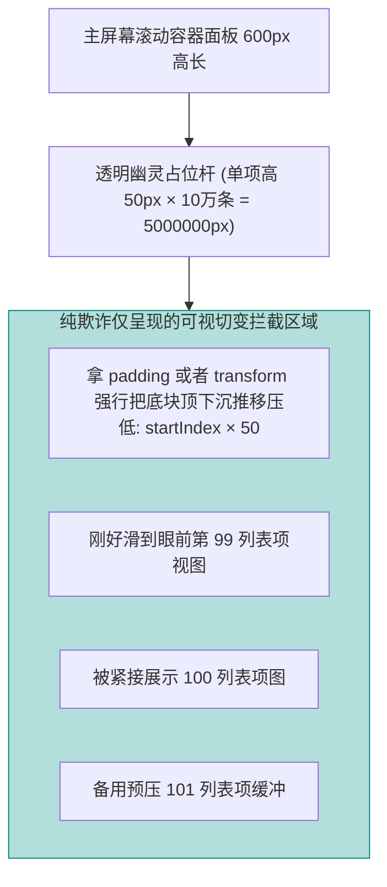

# Vue 3 核心原理（九）—— 性能榨汁机：长列表切片与静态提升红利

> **环境：** 浏览器渲染大列表全链路，Vite 打包解析模块矩阵

当你费劲千辛万苦从大屏后端把一条超过 20M 容量的 JSON 返回值拿下来，试图用一个 `v-for` 强行硬塞进表格试图炫技时。你会见证你的网页主线程瞬间卡死宕机、滚动条变成凝固水泥柱子并且电脑风扇开始凄厉呼啸的恐怖性能黑洞现场惨剧。
Vue 虽然用虚拟 DOM 构建了一层缓冲区，但在这种恐怖量级的硬生生巨型挂载渲染算力狂潮面前，依然如同纸张一样薄弱。

---

## 1. 免死金牌：`v-memo` 与 `KeepAlive` 的跳检缓存

每次页面只要有哪怕一个极小的响应状态拨动，Vue 的比对 Diff 两列快车引擎（将在下篇详细讲述）都会在两棵树之间来回横跳狂扫。

### `v-memo`：给子树挂免战牌
对于有着 1000 项条目的清单表，仅仅因为高亮点击选中其中的一个第 999 选项条。如果你让 Vue 傻傻把这 1000 项元素全部走一次比对校验它有没有发生变化，那就是纯正的浪费。

```html
<template>
  <!-- <--- 核心：依赖封印。只有 item.id 属于变动的那一对旧/新幸运儿，才会被唤醒并检查 -->
  <!-- 其他 998 个没被抽中的小倒霉蛋，被这个标签贴了死符直接彻底跳过了 Diff 检测扫描！ -->
  <div v-for="item in list" :key="item.id" v-memo="[item.id === selectedId]">
    <div :class="{ active: item.id === selectedId }">
      {{ item.name }} 超大型算力卡图展示...
    </div>
  </div>
</template>
```

### `<KeepAlive>`：拦截死亡的销魂阵
当你打开了一个有无数报表数据的看板然后无聊地点去别的设置页，再点回来时。如果没有 `<KeepAlive>`，那个包含了庞大图表演算的看板会被生生死斩除掉并且在切回来的一刹那被重启复活重绘再加载一次！

包在外层的缓存阵不仅拦住了卸载钩子，更可怕的是这组件从此掉进了墓地进入长眠沉寂状态。

> **观测验证**：在此类被保护包裹复用的骨架里，如果你依然指望着写死在 `onMounted` 里的代码能在你每次点击回来查看页卡情报时执行发起获取新消息！你打开 Network 去等！你等到死也绝对不会发出一丝一毫的网络电波。你必须启用与之配套匹配的一对生鲜还魂触发特定勾：`onActivated`。

## 2. 硬通货：虚拟列表 (Virtual Scroll) 的障眼欺诈魔法

十万条数据的绝对终极解法，有且只有这一个原理（类似于大名鼎鼎的 `vue-virtual-scroller` 所做的事）。

你绝对不应该真的往浏览器的物理 DOM 树里面填装下 10 万个节点重压。



**显式权衡（Trade-offs）**：
这种视觉保留戏法只保留屏幕上下眼前的最多两三十个挂件实时渲染，其性能甚至等同于你在看一个永远只有这一小簇节点在内存中存活空滑页。
其代价极其痛切惨厉：**你从此永远告别且再也不能用页面全局 `Ctrl+F` 查找任何不再肉眼当前范围列表底端潜藏的条名字眼**。并且一旦你的列表每个盒子高低错落被撑开参差不齐（不定高），光是测量并实时运算这些箱子的总坠地落差图，其复杂和闪屏带来的卡顿维护代价能直冲天际。

## 3. 网络拆分：Bundle Size 分析与 `lodash` 之死

你花巨量的运行力把页面优化到极致，却在点开网站第一眼被 5MB 大小巨大发酵胖头鱼一样的全局打捆主包硬生生卡成几秒呆白死屏干等！

利用 `rollup-plugin-visualizer` 可以把你的主打包构建 JS 文件按大小剖开成圆饼展示地图。
全量引入犹如 `import _ from 'lodash'` 就是典型的谋杀案发生器：就算你在这个几万行只取了一句微小的防抖 `debounce` 计算逻辑。因为没有采用拆分树摇（Tree Shaking）特定指向加载手法 `d-import` 提取或平替挂引入（如 `lodash-es` ）。它会绝望地把那几万行的整个包体积连同根带土一把塞死进最终打压传输物！

## 4. 常见坑点

**盲目迷信使用 Scheduler 微任务分片导致的白屏长挂事件**
当你觉得一个操作真的卡出翔了（例如暴力递归拼合三万行表单的树形层级重构）。你想起可以在代码之间利用 `await new Promise(resolve => requestIdleCallback(resolve))` 强制去让步主线程执行大发慈悲的喘息切割大法。
**底层原理解释**：如果你在一个极度繁忙吃紧疯狂操作交互或者动画跑圈刷新的页面采用这招。由于 `requestIdleCallback` 只有在浏览器真正完全处理完一圈大闭环确认“我暂时实在无事可做进入低闲频挂机场时”才会屈尊降临去唤醒回调这片等待死林。如果在复杂环境帧率拉满，你的这个任务块就像是永不超生排不上号的小兵，被死死冻结锁死押后迟迟等不来被执行调用完成组合收发，导致白屏逻辑一直残废收不到终局完结篇。
**解法方案**：对于纯硬拆算的计算大山工作包。请将视线死死移去真正的异步跨界处理：交给另外劈开进程跑计算黑箱回吐数据的 `Web Worker` 海底捞面机制。

## 5. 延伸思考

如果 Vue 依靠自身架构层级利用 `v-memo` 与虚拟 DOM 的阻绝来最大程度阻止主线程卡顿坍缩。
对于那些不得不加载极大批次模型顶点数量（成百上千万点集构成）并且通过拉扯三维控件极其细碎频繁抛回通知重绘交互界面的巨量场景。究竟什么时候该用 Vue 的状态数据做接驳，什么时候该将所有的响应式包袱脱离出去，只在一个纯静默非响应的外部黑箱系统里做跑马并且只取最后一丝结果？

## 6. 总结

- 利用 `v-memo` 封印无差别狂暴大扫荡式的子树检测扫场遍历性能黑洞。
- 解除加载量级和页面极巨化的生死枷锁有赖于仅靠视觉戏法欺骗换时间的虚拟缓冲渲染技术。
- 将冗长的重逻辑剥离塞进 Worker 逃离出单一微弱拥塞前端主线程命脉，将大块无用体积切割防灌输避免启动崩溃。

## 7. 参考

- [Vue 响应式与渲染极其复杂的内部性能分析最佳解法篇](https://cn.vuejs.org/guide/best-practices/performance.html)
- [使用 Chrome Performance 分析揪出 JS 长任务卡帧断条指引](https://developer.chrome.com/docs/devtools/performance)
