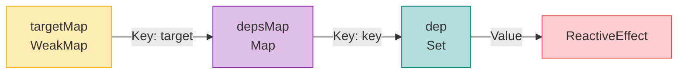
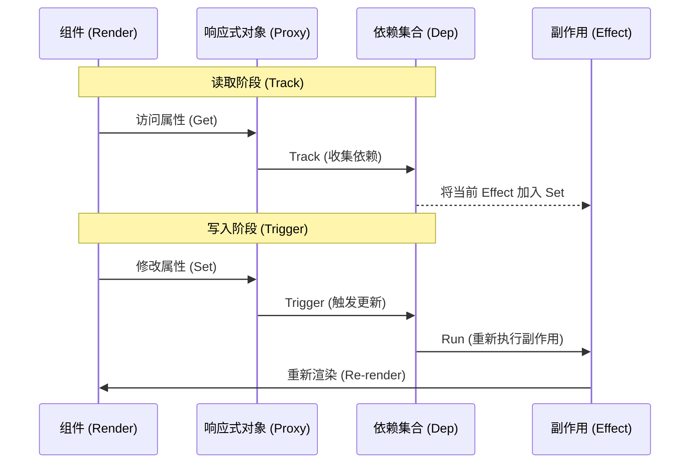
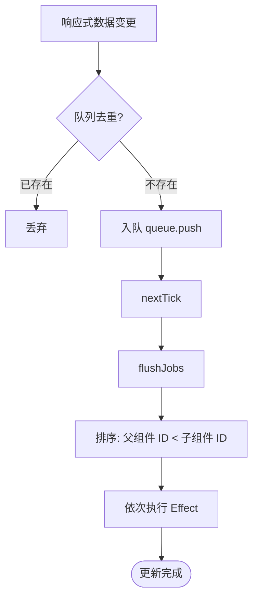

# Vue 3 深度精通 (十) —— 源码级解析与核心原理

真正的精通在于理解 API 背后的设计思想与运行机制。深入理解 Vue 的工作原理有助于编写极致性能的代码，并迅速定位疑难杂症。本章将深入 Vue 3 的核心机制。

## 1. 响应式系统 (Reactivity)：魔法背后的数据结构

Vue 3 使用 `Proxy` 拦截对象操作，但这只是冰山一角。真正的核心在于**依赖收集**与**派发更新**的映射关系。

### 1.1 核心地图：`WeakMap` -> `Map` -> `Set`

Vue 3 在内部维护了一个全局的依赖存储结构，这决定了响应式的精确度。

*   **`targetMap` (WeakMap)**: 存储所有的响应式对象。
    *   Key: 原始对象 (`target`)
    *   Value: `depsMap` (Map)
*   **`depsMap` (Map)**: 存储该对象所有被追踪的属性。
    *   Key: 属性名 (`key`)
    *   Value: `dep` (Set)
*   **`dep` (Set)**: 存储所有依赖于该属性的副作用 (`Effect`)。
    *   Value: `ReactiveEffect`

**可视化结构：**



### 1.2 `track` 与 `trigger` 的流程图



### 1.2 `track` 与 `trigger` 的伪代码实现

这是理解响应式最直观的方式：

```javascript
let activeEffect = null // 当前正在运行的副作用

// 1. 拦截 Get
function track(target, key) {
  if (!activeEffect) return // 如在 console.log 中访问，不需要收集依赖
  
  let depsMap = targetMap.get(target)
  if (!depsMap) {
    targetMap.set(target, (depsMap = new Map()))
  }
  
  let dep = depsMap.get(key)
  if (!dep) {
    depsMap.set(key, (dep = new Set()))
  }
  
  dep.add(activeEffect) // 将当前副作用添加到依赖集合中
}

// 2. 拦截 Set
function trigger(target, key) {
  const depsMap = targetMap.get(target)
  if (!depsMap) return
  
  const dep = depsMap.get(key)
  if (dep) {
    // 运行所有依赖于该属性的副作用
    dep.forEach(effect => {
      if (effect.scheduler) {
        effect.scheduler() // 也就是 computed 或 watcher 的调度逻辑
      } else {
        effect.run() // 重新运行，通常对应组件的重新渲染
      }
    })
  }
}
```

### 1.3 `ref` 的真相

关于 `ref` 是否为 Proxy：
对于**对象类型**，`ref.value` 内部确实是 `reactive` (Proxy)。
但对于**基本类型** (Primitive values)，Proxy 无法拦截。所以 `ref` 实际上是一个带有 `get value()` 和 `set value()` 的**类 (Class)**。

```typescript
class RefImpl {
  private _value
  
  constructor(val) {
    this._value = val
  }

  get value() {
    track(this, 'value') // 手动收集依赖
    return this._value
  }

  set value(newVal) {
    this._value = newVal
    trigger(this, 'value') // 手动触发更新
  }
}
```

---

## 2. 渲染器 (Renderer)：Diff 算法的全流程

Vue 3 的 Diff 算法（在 `patchKeyedChildren` 中实现）是其性能的核心。它不仅仅是简单的对比，而是采用了**双端对比 + 最长递增子序列 (LIS)** 的混合策略。

### 2.1 Diff 的五个步骤

假设我们需要将旧列表 `[A, B, C, D, E]` 更新为新列表 `[A, B, F, C, E]`。

```mermaid
graph TD
    Start([Diff 开始]) --> SyncStart{1. 前序同步<br/>(Sync from Start)}
    SyncStart -- 匹配 --> SyncStart
    SyncStart -- 不匹配 --> SyncEnd{2. 后序同步<br/>(Sync from End)}
    
    SyncEnd -- 匹配 --> SyncEnd
    SyncEnd -- 不匹配 --> CheckNew{3. 是新增节点吗?<br/>(Mount New)}
    
    CheckNew -- 是 --> Mount[挂载新节点]
    CheckNew -- 否 --> CheckOld{4. 是多余节点吗?<br/>(Unmount Old)}
    
    CheckOld -- 是 --> Unmount[卸载旧节点]
    CheckOld -- 否 --> LIS{5. 乱序处理<br/>(Unknown Sequence)}
    
    LIS --> KeyMap[构建 Key Map]
    KeyMap --> CalcLIS[计算 LIS<br/>最长递增子序列]
    CalcLIS --> Move[移动 & 更新节点]
    
    Mount --> End([结束])
    Unmount --> End
    Move --> End
    
    style LIS fill:#ffe0b2,stroke:#fb8c00,stroke-width:2px
    style CalcLIS fill:#ffe0b2,stroke:#fb8c00,stroke-width:2px
```

1.  **前序同步 (Sync from Start)**:
    从头开始对比，直到遇到不同的节点。
    *   `A` vs `A` (相同，复用)
    *   `B` vs `B` (相同，复用)
    *   `C` vs `F` (不同，停止) -> 此时指针停在 `C` 和 `F`。

2.  **后序同步 (Sync from End)**:
    从尾部倒序对比，直到遇到不同的节点。
    *   `E` vs `E` (相同，复用)
    *   `D` vs `C` (不同，停止) -> 此时范围缩小到中间杂乱部分。

3.  **挂载新增节点 (Mount New)**:
    如果旧列表遍历完了，新列表还有剩，说明是新增。

4.  **卸载多余节点 (Unmount Old)**:
    如果新列表遍历完了，旧列表还有剩，说明是删除。

5.  **乱序处理 (Unknown Sequence)** - **核心难点**:
    如果两边都有剩余（如本例中的 `[C, D]` 变 `[F, C]`），Vue 需要找出最小移动步数。
    *   **构建 Key Map**: 建立新节点 `key` 到 `index` 的映射，快速查找旧节点在新列表中的位置。
    *   **最长递增子序列 (LIS)**: 计算出一个不需要移动的节点序列。在这个序列之外的节点，才需要移动或挂载。这保证了 DOM 操作次数最少。

---

## 3. 编译器 (Compiler)：动静分离的极致

Vue 3 性能飞跃的最大功臣是编译器。它在编译阶段分析模板，生成带有"提示"（Hints）的渲染函数，从而在运行时跳过大量无用工作。

### 3.1 Block Tree 与动态节点收集

在 Vue 2 中，无论组件结构多稳定，Diff 过程总是递归遍历整棵树。
在 Vue 3 中，编译器引入了 **Block** 的概念。

*   **Block**: 一个负责收集内部所有**动态后代节点**的父节点。
*   **Dynamic Children**: 每个 Block 节点会维护一个 `dynamicChildren` 数组，直接保存所有需要更新的动态节点，**磨平了 DOM 树的层级结构**。

**运行时效果：**
当组件重渲染时，Vue 渲染器**不再遍历整棵树**，而是直接遍历这个平铺的 `dynamicChildren` 数组。
这意味着：**更新性能与模板大小无关，只与动态节点的数量成正比**。

### 3.2 PatchFlags (位运算标记)

编译器不仅标记"哪里变了"，还标记"怎么变了"。

```typescript
// 伪代码
_createVNode("div", { id: "foo" }, text, PatchFlags.TEXT)
```

`PatchFlags.TEXT` (1) 告诉渲染器：这个节点只有文本内容是动态的。
运行时检查：
```javascript
if (vnode.patchFlag & PatchFlags.TEXT) {
  // 只更新 textContent，完全跳过 props、style、class 的对比
  el.textContent = vnode.children
}
```

这就是为什么 Vue 3 的更新速度能达到原生的级别。

---

## 4. 调度器 (Scheduler)：异步与去重

执行 `count.value++` 十次，Vue 不会更新 DOM 十次。这是因为调度器的存在。

### 4.1 Queue Job 与 去重

当响应式数据变化触发 `trigger` 时，更新任务（Effect）会被推入一个全局队列 `queue`。
推入前会进行去重检查 (`!queue.includes(job)`)。所以连续修改同一个数据，只会产生一个更新任务。

### 4.2 排序与 Flush

在微任务（Microtask）中执行 `flushJobs` 时，Vue 会先对队列进行**排序**。



*   **排序原因**
    1.  **组件更新顺序**：父组件总是先于子组件更新（因为父组件创建子组件）。需保证 ID 小的（父）先执行，否则子组件可能被重复更新，或者在父组件更新期间已经被卸载的子组件还在尝试更新（导致报错）。
    2.  **用户 Watcher 先于渲染**：用户定义的 `watch` 通常需要在组件更新前执行。

---

## 5. 自定义渲染器 (Custom Renderer)

Vue 3 的运行时核心 (`@vue/runtime-core`) 与平台无关。DOM 操作被封装在 `@vue/runtime-dom` 中。
这意味着可用 `createRenderer` API 创建自己的渲染器，将 Vue 渲染到任何地方。

### 5.1 示例：渲染到控制台 (Terminal)

```javascript
import { createRenderer } from '@vue/runtime-core'
import { nodeOps } from './my-terminal-ops' // 实现 insert, remove, createElement 等

const { render, createApp } = createRenderer({
  createElement(type) {
    return { type, children: [] } // 虚拟节点对象
  },
  insert(el, parent) {
    parent.children.push(el) 
    // 调用终端绘图 API 绘制界面
  },
  patchProp(el, key, prevValue, nextValue) {
    // 更新属性
  },
  // ... 其他 DOM 操作接口
})

// 现在可以像 Web App 一样写代码，但运行在命令行里！
const App = {
  data: () => ({ count: 1 }),
  template: `<text>Count: {{ count }}</text>`
}

createApp(App).mount(rootNode)
```

这正是 Weex (移动端)、UniApp (跨端)、TroisJS (Three.js) 等框架的底层原理。

---

## 结语：通过源码看本质

Vue 3 的强大不仅仅在于 API 的易用性，更在于其内部对性能的极致追求。
*   **响应式系统** 保证了数据驱动的精确性。
*   **编译器** 通过静态分析减少了运行时的负担。
*   **渲染器** 通过高效的算法保证了视图更新的速度。

通过理解这些内部机制，编写代码时就能自然地做出最优选择，避免性能陷阱，真正达到"人码合一"的境界。
