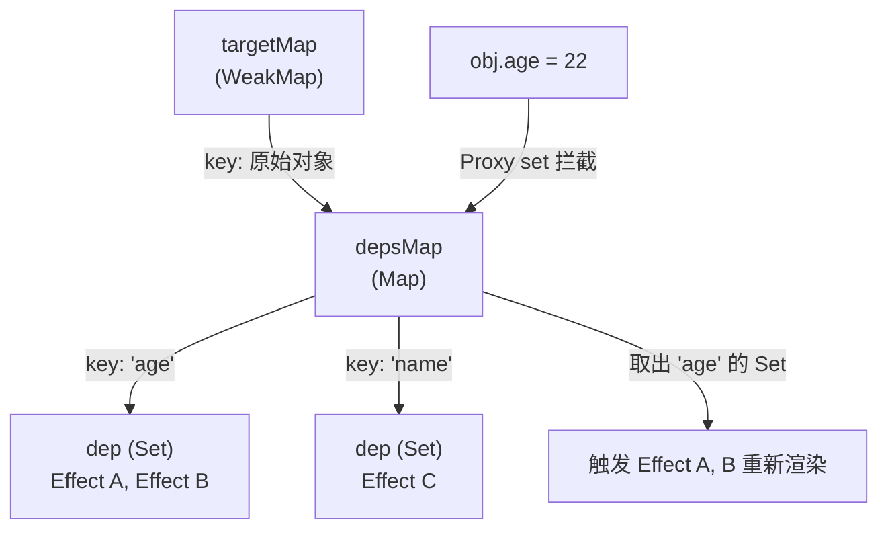
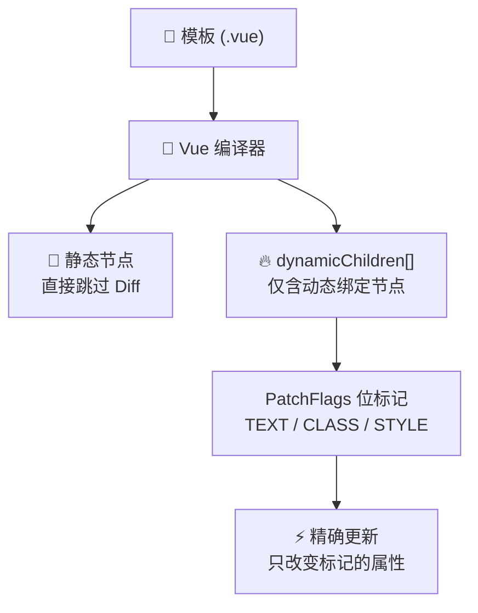

# Vue 3 核心原理（十）—— 内部机制：响应式依赖与编译优化

> **环境：** Vue.js 3 源码维度，WeakMap 缓存机制与 LIS 算法

理解 Vue 3 的底层运作机制，能够帮助开发者在遇到复杂的渲染性能瓶颈时，给出更科学的调优方案。
本节将深入探讨 Vue 3 如何使用 `WeakMap` 构建响应式依赖收集系统，以及它是如何在 Diff 算法中通过最长递增子序列（LIS）优化 DOM 移位的。

---

## 1. 响应式系统底核：依赖追踪集



当在组件中声明一个包裹数据的 `obj = reactive({ age: 18 })` 并在模板的插值表达式 &#123;&#123; obj.age &#125;&#125; 中使用时。
当后续触发了 `obj.age = 22` 的修改，Vue 是如何做到只精确更新试图绑定了 `age` 属性的 DOM 节点的？

其底层维护着一个庞大的三级映射字典结构：**依赖追踪集**。

### 三级储存结构：`WeakMap` -> `Map` -> `Set`

- **顶层集 (`targetMap`: WeakMap)**：它的键（Key）存储了被 `reactive` 或 `ref` 劫持的原始 Target 对象本身。因为是**弱引用**，当组件卸载且该源数据脱离作用域时，垃圾回收机制会自动回收这部分空间，避免全局内存泄漏。
- **属性隔离 (`depsMap`: Map)**：它是 WeakMap 的值。其键存放着对应的具体对象属性名，例如提取到的字符串 `"age"`。
- **副作用集合 (`dep`: Set)**：它是 Map 的值。它包含了所有对该 `"age"` 属性进行了读取并需要响应更新的**副作用函数集合（Effects）**。由于使用了 Set 结构，可以自动对同一个组件多次触发的渲染依赖进行滤重。

当 `obj.age` 发生改变时，Proxy 的 `set` 拦截器会从这套依赖结构中取出对应的 Set，并触发（`trigger`）里面挂载的所有响应渲染函数重新执行。

## 2. 核心 Diff 引擎：节点对撞与位运算优化

当数据发生变更引发视图更新时，Vue 的核心渲染器并不总是做暴力的全量销毁重建。它会运用算法匹配新老节点集合的共性，计算出最少次数的 DOM API 移动路径。

### 双端扫描探测

假设新旧虚拟节点列表因为内部乱序重新排序。
在正式开始计算移位前，渲染器会执行一种基础的优化策略：
1. **掐头去尾寻址**：首先从列表头与尾部分别往中间逼近进行检测（即双端比对）。提取出未发生修改原位保留的界线范围（比如首部的 `[A, B]` 和最尾部的 `[E]` 完全一致），直接进行复用。
2. **中间待检区处理**：经过夹逼后，旧节点列表和新节点列表只会遗留下两段核心不规则部分。在这个范围内，多出的旧元素将被执行销毁机制卸载，而新增的尚未匹配到复用的新元素将被执行挂载插入。

### 原理数学推演：最长递增子序列（LIS）

在比对剩余旧序列和新序列相互散乱错位的场景中（比如留下一段顺序为 `3, 1, 2, 4` 的对应键位）。为了把老节点按照需求重排进新位置，如果采用一个个移除重插的做法无疑开销较大。
此时，Vue 源码在深层应用了一个暴力算法：**计算节点索引的最长递增子序列 (LIS)**。
经过该算法引擎推演，可以得出 `1, 2, 4` 是原有排列中顺序递增且长度最长的子序列。既然它们原本的位置顺序已经符合最终要求，在底层移动执行时便无需干预，只需把剩余的 `3` 移动到正确位置即可。通过这种机制最大化减少 DOM 的移动次数。

## 3. 编译器飞腾：Block 块与补丁标记（Patch Flags）



在此前 Vue 2 系列生命周期里，不论页面布局外层嵌套了多少层完全纯静态不需要刷新的 `<div>`，每次只要有一丝组件内变量波动的风吹草动，全生命周期渲染函数依然需要对其整体树深度进行重新翻找。

在 Vue 3 引入了在编译阶段的重大颠覆式变革：**带补丁标记的 Block 树动态扁平扫描**。

一个负责容纳的 Block（通常为模版根元素或携带特定结构性指令如 `v-if` 的包装层）。在其被系统从模板代码转为呈现函数时，会提前探明其下包裹了五十层深的静态 HTML 节点，并且把树内部极少数带有动态绑定需求（诸如 &#123;&#123; text &#125;&#125;，`v-bind:color`）的子节点，单独提取出来放置入一个叫做 `dynamicChildren` 的一维线性数组中。

```javascript
/* dynamicChildren 一维数组：仅含需要精确更新的动态节点 */
[
  dynamicTextNode1, // 文本内容可能变化的节点
  dynamicButtonNode, // 绑定了事件处理的按钮节点
]
/* 其余静态节点在 Diff 时被直接跳过，无需任何处理 */
```

同时，针对这些已经被送上检视榜的少数目标元素，Vue 编译器还会进一步优化——给予特定的位运算标记（如 `PatchFlags.TEXT` 或 `PatchFlags.CLASS`）。这意味着若标记表明该处只需要切换文本内容，系统便只更新对应 `nodeValue`，无需比对属性。

## 4. 常见坑点

**忽视了调度任务（Flush Jobs）引起时序不同步报错**
很多开发者在重度更新逻辑中遇到"拿到了旧值"或"获取到已销毁组件"的报错，根本原因是 Vue 的**批量更新调度机制**。
大量高频的状态更新，Vue 并不遵循“触发一次就渲染一次”的模式。它将产生的渲染作业收集到缓冲队列（`flushJobs`）中统一批处理。在队列执行过程中，所有组件的更新顺序受制于 Vue 的层级优先排序——父组件的执行优先级硬性高于子组件。这意味着，如果在一次更新链中试图同步读取某个尚在队列中等待处理的子组件状态，就会拿到"旧的"或"已被销毁"的数据。使用 `nextTick` 确保在队列清空后再读取：

## 5. 延伸思考

Vue 的编译时优化策略（静态提升、Patch Flags）在面对高度碎片化的 UI 时，是否依然优于纯函数重渲染的流派？这两条路线各有什么取舍？

## 6. 总结

- **WeakMap 三级映射**保证了响应式依赖追踪在海量订阅场景下不会造成内存泄漏——组件卸载后自动 GC。
- **双端 Diff + LIS 算法**将大量 DOM 移动计算压缩为最少次数的有效插入，避免了 $O(n^2)$ 的暴力重建。
- **Block + Patch Flags**将深层的静态树打平为 `dynamicChildren` 一维数组，把 Diff 范围从整棵树降级到仅需检视的少数动态节点。

## 7. 参考

- [Vue.js 深入渲染与 Diff 指南](https://cn.vuejs.org/guide/extras/rendering-mechanism.html)
- [解析 JavaScript WeakMap 的弱引用应用场景](https://developer.mozilla.org/zh-CN/docs/Web/JavaScript/Reference/Global_Objects/WeakMap)
