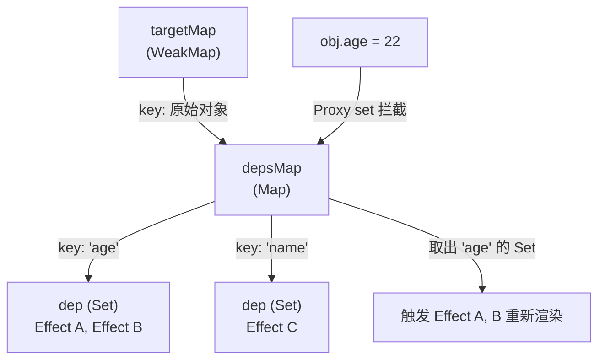
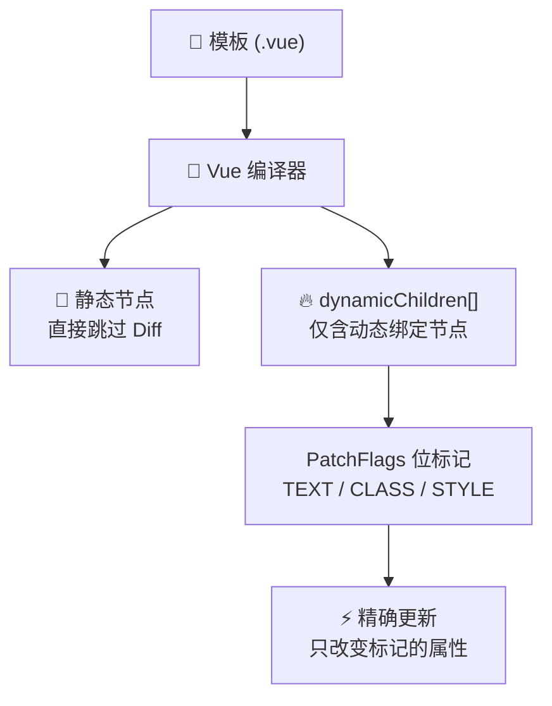

# Vue 3 核心原理（十）—— 内部机制：响应式依赖与编译优化

> **环境：** Vue.js 3 源码维度，WeakMap 缓存机制与 LIS 算法

理解 Vue 3 的底层运作机制，能够帮助开发者在遇到复杂的渲染性能瓶颈时，给出更科学的调优方案。
本节将深入探讨 Vue 3 如何使用 `WeakMap` 构建响应式依赖收集系统，以及它是如何在 Diff 算法中通过最长递增子序列（LIS）优化 DOM 移位的。

---

## 1. 响应式系统底核：依赖追踪集



当在组件中声明一个包裹数据的 `obj = reactive({ age: 18 })` 并在模板的插值表达式 &#123;&#123; obj.age &#125;&#125; 中使用时。
当后续触发了 `obj.age = 22` 的修改，Vue 是如何做到只精确更新试图绑定了 `age` 属性的 DOM 节点的？

其底层维护着一个庞大的三级映射字典结构：**依赖追踪集**。

### 三级储存结构：`WeakMap` -> `Map` -> `Set`

- **顶层集 (`targetMap`: WeakMap)**：它的键（Key）存储了被 `reactive` 或 `ref` 劫持的原始 Target 对象本身。因为是**弱引用**，当组件卸载且该源数据脱离作用域时，垃圾回收机制会自动回收这部分空间，避免全局内存泄漏。
- **属性隔离 (`depsMap`: Map)**：它是 WeakMap 的值。其键存放着对应的具体对象属性名，例如提取到的字符串 `"age"`。
- **副作用集合 (`dep`: Set)**：它是 Map 的值。它包含了所有对该 `"age"` 属性进行了读取并需要响应更新的**副作用函数集合（Effects）**。由于使用了 Set 结构，可以自动对同一个组件多次触发的渲染依赖进行滤重。

当 `obj.age` 发生改变时，Proxy 的 `set` 拦截器会从这套依赖结构中取出对应的 Set，并触发（`trigger`）里面挂载的所有响应渲染函数重新执行。

## 2. 核心 Diff 引擎：节点对撞与位运算优化

当数据发生变更引发视图更新时，Vue 的核心渲染器并不总是做暴力的全量销毁重建。它会运用算法匹配新老节点集合的共性，计算出最少次数的 DOM API 移动路径。

### 双端扫描探测

假设新旧虚拟节点列表因为内部乱序重新排序。
在正式开始计算移位前，渲染器会执行一种基础的优化策略：
1. **掐头去尾寻址**：首先从列表头与尾部分别往中间逼近进行检测（即双端比对）。提取出未发生修改原位保留的界线范围（比如首部的 `[A, B]` 和最尾部的 `[E]` 完全一致），直接进行复用。
2. **中间待检区处理**：经过夹逼后，旧节点列表和新节点列表只会遗留下两段核心不规则部分。在这个范围内，多出的旧元素将被执行销毁机制卸载，而新增的尚未匹配到复用的新元素将被执行挂载插入。

### 原理数学推演：最长递增子序列（LIS）

在比对剩余旧序列和新序列相互散乱错位的场景中（比如留下一段顺序为 `3, 1, 2, 4` 的对应键位）。为了把老节点按照需求重排进新位置，如果采用一个个移除重插的做法无疑开销较大。
此时，Vue 源码在深层应用了一个暴力算法：**计算节点索引的最长递增子序列 (LIS)**。
经过该算法引擎推演，可以得出 `1, 2, 4` 是原有排列中步调递增且连贯性最长的组块。既然它们原本的位置先后层级符合最终要求，在底层移动执行时便无需干预，只需直接把那个唯一叛逆打乱顺序的 `3` 找出并插入到合适的空隙即可。通过这种机制最大化降低 DOM 的强操作性能损耗。

## 3. 编译器飞腾：Block 块与补丁标记（Patch Flags）



在此前 Vue 2 系列生命周期里，不论页面布局外层嵌套了多少层完全纯静态不需要刷新的 `<div>`，每次只要有一丝组件内变量波动的风吹草动，全生命周期渲染函数依然需要对其整体树深度进行重新翻找。

在 Vue 3 引入了在编译阶段的重大颠覆式变革：**带补丁标记的 Block 树动态扁平扫描**。

一个负责容纳的 Block（通常为模版根元素或携带特定结构性指令如 `v-if` 的包装层）。在其被系统从模板代码转为呈现函数时，会提前探明其下包裹了五十层深的静态 HTML 节点，并且把树内部极少数带有动态绑定需求（诸如 &#123;&#123; text &#125;&#125;，`v-bind:color`）的子节点，单独提取出来放置入一个叫做 `dynamicChildren` 的一维线性数组中。

```javascript
/* 最终 Block 收集提纯出的仅仅含有一维深度的靶向变动记录数组： */
[
  dynamicTextNode1, // 可能会变的段落文本 
  dynamicButtonNode, // 挂接了双向事件的按钮
] // 除了这 2 个含有特殊性质靶子节点会被抛入最终更新期的 Diff 对比审查中，
  // 那些层叠嵌套毫无变化的整块静态树干在触发重绘里将直接被视为免检从而光速越过！！
```

同时，针对这些已经被送上检视榜的少数目标元素。Vue 编译器还会再压榨一丝优化——给予特定的位运算优化标记（如 `PatchFlags.TEXT` 或 `PatchFlags.CLASS`）。意味着它连比对属性都懒得去全面盘查了：若标记表明这处仅仅只会切换字面内容，系统直接只更新对应 `nodeValue` 即可脱身撤离。

## 4. 常见坑点

**忽视了调度任务（Flush Jobs）引起时序不同步报错**
很多深陷重度更新逻辑循环报错的新手没有意识到，Vue 自身在组件层级重刷执行时具备队列消抖排布特性。
**原理解释**：面对瞬间被大量业务函数高频翻转响应源的情况时，Vue 并不遵循“翻转一次就更新绘制一次”的线索。它会将产生的渲染作业收集放入缓冲批处理队列（`flushJobs`）。在这个队列处理执行期，**所有重新挂载派发任务的过程是被施加了强行层级优先级排序的（即父组件的执行动作被要求硬性先于子组件）**。
**解法方案**：这正是为什么当你通过数据流引发某一连串包含子孙结构链坍塌卸载的过程中。如果你企图试图用一个同步提取引用去找寻某个还在队列内尚未及时跟着一起被更新或者销毁殆尽的废旧子元件数据，将会捕获失效对象。遇到极端的批处理翻转错位异常，使用 `nextTick` 挂靠一个在清空队列循环结束时方才介入检测的回调函数方是规避方案。

## 5. 延伸思考

如果前端框架最终能够依靠类似于 Vue 3 编译器这种：将前端死文本的字符串前置剥削并进行特征符号打孔、辅以如 LIS 算法配合拦截比对的方法论建立起高维的过滤预设机器。
那么在大模型辅助生成页面或者未来 UI 高度碎片化混沌状态下的架构中，类似于具备极其浓厚数据驱动及强编译期标记基底的这种流派，和偏向于极简纯函数无状态每次重渲染生成的流派相比，哪个会获得运行长青优势？

## 6. 总结

- 三级套娃的弱储响应池保证了对海量订阅劫持时具备自适应垃圾释放脱钩保护免除内存外溢可能。
- 掐头去尾及 LIS 最长递增解法将杂乱无章的大量挪移计算转化为最少数的有效插入动作。
- 动态直推的收集快策略将由于不合理的深层页面标签结构给带来查询负担问题削减降级到了仅仅只有所需检视变化标签节点的直面级别。

## 7. 参考

- [Vue.js 深入渲染与 Diff 指南](https://cn.vuejs.org/guide/extras/rendering-mechanism.html)
- [解析 JavaScript WeakMap 的弱引用应用场景](https://developer.mozilla.org/zh-CN/docs/Web/JavaScript/Reference/Global_Objects/WeakMap)
