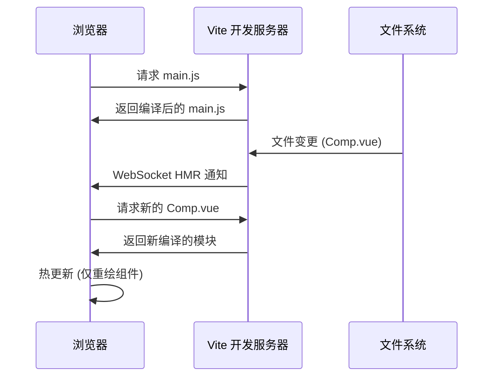
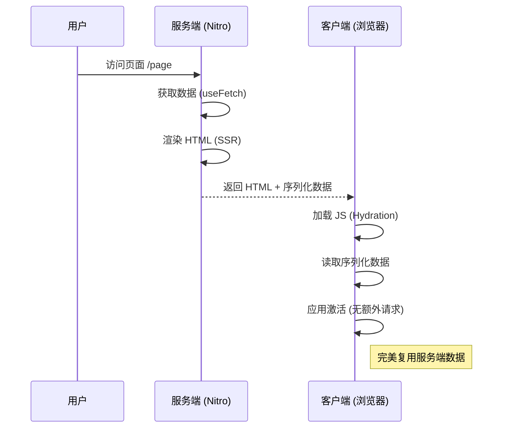

# Vue 3 深度精通 (十一) —— 全栈生态与未来展望

现代前端开发中，Vue 很少单独存在，通常与一系列强大的工具协同工作。本章探讨 Vite、Nuxt 3 以及测试策略，并展望 Vue 的未来。

## 1. Vite：下一代前端工具链的核心

Vite 不仅是 Vue 的构建工具，更重新定义了开发体验。

### 1.1 ESM Dev Server 原理

传统的打包工具（如 Webpack）在启动开发服务器时，需要先将所有模块打包（Bundle），这在大型项目中非常慢。
Vite 利用浏览器原生支持 ES Module (ESM) 的特性：

1.  **No Bundle**: Vite 启动时不打包，只启动一个简单的 HTTP 服务器。
2.  **按需编译**: 当浏览器请求 `main.js` 遇到 `import App from './App.vue'` 时，浏览器向服务器发请求。
3.  **即时转换**: Vite 服务器拦截请求，将 `.vue` 文件实时编译成 JS 返回给浏览器。

### 1.2 HMR (热模块替换) 为什么这么快？

在 Webpack 中，修改一个文件通常需要重新构建整个依赖图的一部分。
而在 Vite 中，HMR 是通过 WebSocket 实现的精确更新：
*   修改 `Comp.vue` -> Vite 编译该文件 -> 发送消息给浏览器 -> 浏览器重新 import 该模块。
*   由于只需要编译和替换变更的单个模块，无论项目多大，**HMR 的速度几乎是常数级 (O(1)) 的**。



---

## 2. Nuxt 3：Vue 的全栈最佳实践

若需要 SEO、服务端渲染 (SSR) 或者构建复杂的全栈应用，Nuxt 3 是必然选择。

### 2.1 文件路由 (File-based Routing)

Nuxt 3 延续了 `pages/` 目录即路由的约定，但更强大：

*   `pages/user/[id].vue` -> 自动生成 `/user/:id` 路由。
*   `pages/index.vue` -> 根路由。

这消除了手动配置 `vue-router` 的繁琐。

### 2.2 数据获取与水合 (Hydration)

Nuxt 3 提供了 `useFetch` 和 `useAsyncData`，完美解决了 SSR 中的数据获取问题：

```typescript
<script setup>
// 在服务端执行一次，在客户端复用结果（避免重复请求）
const { data, pending } = await useFetch('/api/users')
</script>
```

Nuxt 会自动将服务端获取的数据序列化到 HTML Payload 中，客户端激活（Hydrate）时直接读取，无需再次发起 API 请求。



### 2.3 Nitro 引擎

Nuxt 3 的服务端引擎 Nitro 极其强大：
*   **零配置部署**: 支持 Vercel, Netlify, Cloudflare Workers, Node.js 等多种环境。
*   **Server API**: 可以在 `server/api/` 目录下直接编写后端 API (基于 h3)，与前端代码无缝集成。

---

## 3. 坚如磐石的应用：测试策略

没有测试的代码是不可维护的。在 Vue 3 生态中，测试体验也得到了极大的提升。

### 3.1 单元测试：Vitest

Vitest 是专为 Vite 项目设计的测试框架。
*   **极速**: 与 Vite 共享配置和转换管道，速度比 Jest 快得多。
*   **兼容性**: API 与 Jest 几乎完全兼容 (`describe`, `it`, `expect`)。

```javascript
// math.test.ts
import { expect, test } from 'vitest'
import { sum } from './math'

test('adds 1 + 2 to equal 3', () => {
  expect(sum(1, 2)).toBe(3)
})
```

### 3.2 组件测试：Vue Test Utils

对于 Vue 组件，我们关注的是交互和渲染结果。

```javascript
// Counter.test.ts
import { mount } from '@vue/test-utils'
import Counter from './Counter.vue'

test('increments value on click', async () => {
  const wrapper = mount(Counter)
  expect(wrapper.text()).toContain('Count: 0')

  await wrapper.find('button').trigger('click')
  expect(wrapper.text()).toContain('Count: 1')
})
```

---

## 4. 展望未来：Vapor Mode

Vue 团队正在进行一项革命性的实验：**Vapor Mode**。

### 4.1 抛弃虚拟 DOM (No VDOM)

受 Solid.js 启发，Vapor Mode 是一种新的编译策略。其不再将模板编译成 Virtual DOM 渲染函数，而是直接编译成**细粒度的原生 DOM 操作**。

**传统 Vue 3 (VDOM):**
```javascript
// 每次更新都需要创建 VNode，对比 Diff
render() {
  return createVNode('div', { id: 'app' }, ctx.count)
}
```

**Vapor Mode (预期):**
```javascript
// 只有在 count 变化时，才会执行这一行 DOM 操作
effect(() => {
  div.textContent = ctx.count
})
```

### 4.2 意义

*   **极致性能**: 真正实现了只更新需要更新的节点，零 Diff 开销。
*   **更小的包体积**: 不需要打包负责 Diff 和 VNode 的 Runtime 代码。

Vapor Mode 将作为 Vue 的一个可选模式存在，这意味着可在同一个应用中混合使用传统组件（高灵活性）和 Vapor 组件（高性能）。

---

## 结语
 
从基础语法到组件设计，从状态管理到性能优化，再到源码解析与生态展望，我们已经掌握了 Vue 3 的大部分核心知识。但探索并未结束。
 
下一篇，我们将进入最后一章——**高级设计模式与实战技巧**，汇集社区前沿的 Composable 设计与 Pinia 高级用法，助你写出更优雅的代码。
