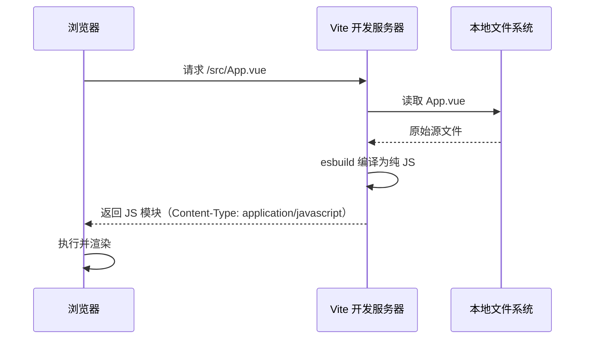

# Vue 3 核心原理（十一）—— 生态工具：Vite、Nuxt 3 与 Vapor Mode

> **环境：** Vite HMR 架构，Nuxt 3 Nitro 引擎，Vapor Mode 概念前瞻

Vite 解决了大型项目开发启动慢的问题；Nuxt 3 解决了 Vue SPA 的 SEO 和首屏白屏问题；Vapor Mode 是下一个编译策略方向。这篇梳理这三者的核心机制和实际使用中的边界。

---

## 1. Vite：基于 ESM 的开发服务器

Webpack 的开发模式是 Bundle 模式：启动时把所有文件打包成一个 `bundle.js`，大型项目冷启动需要数分钟。

Vite 的开发服务器不做预打包。浏览器原生支持 `<script type="module">`，Vite 利用这个能力，把每个文件作为独立模块按需处理，浏览器发起 import 请求时才编译对应文件。



### HMR 的 O(1) 更新

Vite 通过 WebSocket 与浏览器保持连接。文件修改后，只推送变更的那个模块给浏览器，浏览器原地替换该模块引用，无需重新加载整个应用。更新耗时与项目文件总数无关。

**Trade-offs**：如果模块之间存在循环依赖，HMR 可能触发大范围的模块链失效，退回到整页刷新。

## 2. Nuxt 3：SSR 与 Hydration

Vue SPA 的 HTML 初始内容为空，爬虫抓不到页面内容，首屏需要等待 JS 执行完才显示内容。Nuxt 3 在服务端渲染完整 HTML 后发给浏览器，同时处理 SSR 中最常见的数据重复请求问题。

### `useFetch` 的 Hydration 去重

经典错误：服务端执行一次 `axios.get` 拉取数据，浏览器端 Vue 激活（Hydrate）时又执行一次，导致双倍请求。

Nuxt 3 的 `useFetch` 在服务端完成请求后，将结果序列化注入 HTML 的 `<script>window.__NUXT__={...}</script>`。浏览器端激活时，`useFetch` 直接从这个内联数据读取，不发起二次请求。

```typescript
<script setup>
// 在服务端和浏览器端都能调用，但只发一次网络请求
const { data, pending } = await useFetch('/api/users')
</script>
```

## 3. 常见坑点

**Vite 开发态与生产态使用不同引擎**

Vite 开发态使用 esbuild + No-bundle，生产态使用 Rollup 打包。两套引擎行为存在差异，可能出现开发正常、生产报错的情况。

另一个常见问题：生产构建未配置 `manualChunks` 时，异步组件过多会产生大量小 chunk，造成首屏 HTTP 请求数爆炸。在不支持 HTTP/2 的环境中影响尤为明显。

## 4. 延伸

**Vapor Mode** 是 Vue 团队正在开发的编译新策略：跳过 VNode，编译器直接输出 `document.createElement()` 等原生 DOM 操作指令。思路与 Solid.js 类似。代价是放弃了现有基于 VNode 的部分动态特性（如动态 slot），适配旧代码需要额外迁移成本。

## 5. 总结

- Vite 开发服务器基于浏览器原生 ESM，按需编译，HMR 更新粒度为单个模块。
- Nuxt 3 的 `useFetch` 通过内联序列化数据解决了 SSR Hydration 的双重请求问题。
- Vite 开发态（esbuild）和生产态（Rollup）是两套引擎，行为差异需要在 CI 中验证。

## 6. 参考

- [Vite 官方文档：为什么选 Vite](https://cn.vitejs.dev/guide/why.html)
- [Nuxt 3 数据获取文档](https://nuxt.com/docs/getting-started/data-fetching)
