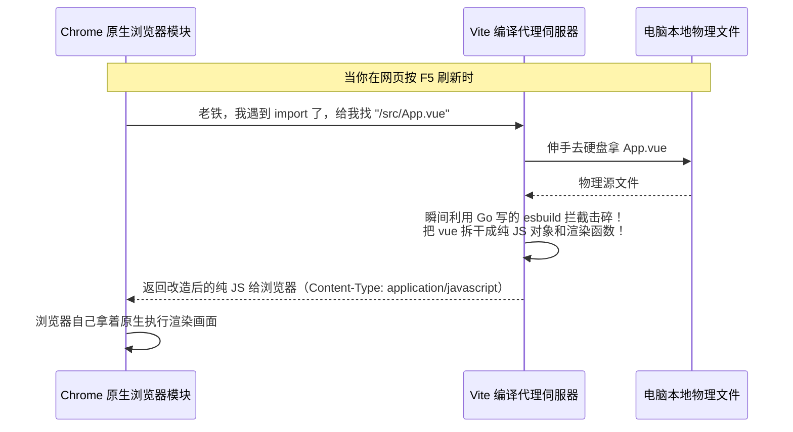

# Vue 3 核心原理（十一）—— 极客生态圈：打劫打包器的 ESM 与无 VDOM 纪元

> **环境：** Vite HMR 架构，Nuxt 3 Nitro 引擎，Vapor Mode 概念前瞻

当你在 Vue 3 的地基上修建了摩天大楼。如果没有强大的吊臂与脚手架生态，单靠原始的原生构建必定会让你在两万个文件的庞大架构里迷失和卡死。
这一篇，我们将剥开 Vue 3 周边那几个号称能够颠覆整个前端构建史的极客神级生态黑盒。看它们是如何压榨浏览器底层潜力，去实现那被神话了的毫秒级 O(1) 热更新的。

---

## 1. Vite：对传统 Webpack 构建引擎的宣战

老式的 Webpack 思维被称为 Bundle 模式：管你浏览器请求了哪一页，在启动开发服务器前，引擎必须苦哈哈地把你两万个文件在后台爬取梳理一遍，打包揉搓成一个 `bundle.js` 的铅球。这就导致了启动一个大型中层后台应用时动辄砸进去两三分钟的苦等。

### ESM 逆向代理：不建高楼，只送砖块
Vite 选择彻底掀桌子，它打出了 **No Bundle** 的旗帜。
利用了当代主流浏览器内置对 `<script type="module">` (ESM) 的原生拥抱。Vite 在启动开发主机时根本不做任何预处理关联检查。它的服务端本质上就是个带上了快速映射和编译过滤器的拦截器大网卡。



### O(1) 毫秒热推送 (HMR) 探秘
在老款构建里，你改了一个子树叶的边距颜色，整个树都跟着重建刷新。
而在 Vite 中，由于每个文件模块是独立通过 WebSocket 和浏览器端保持着心跳呼吸线牵挂着的。当你修改后保存：
**显式权衡（Trade-offs）**：Vite 的 HMR 直接精确定点轰炸推送你改动的那一个小片段的 JS 报文给浏览器让它自己原地更换模块引用！无论你的应用有三万个系统文件，这**一次更新耗时永远是极其扁平的毫秒 O(1) 级别**。这就是这把快刀之所以快的真实现场。（代价是如果你在某个全局核心层引用写出了环形嵌套或者互相纠缠死亡结群，会导致大规模的波及滚雪球连环失效刷新退场降级白屏）。

## 2. Nuxt 3：对 SEO 和白屏焦虑的终极抹杀

当你想用 Vue 3 去做对外招商发文需要被 Google 爬虫 100% 抓取扫描的大型门面，或当你的首屏因为夹带了高达几 MB 的图表库 JS 文件必须等到几秒钟后才开始闪现画面时。基于 SSR (服务端渲染) 的 Nuxt 3 是你无路可退的单行道战车。

### `useFetch` 的脱水与水合防重轰炸 (Hydration)

在一个纯净的 SSR 应用流里最臭名昭著的错误是：服务器里执行了一次发起网络爬虫拉取数据。服务器拼装好了带着数据的 HTML 发给了用户页面。结果用户的 Vue 在本地苏醒活过来接收接管页面时，这货又傻傻地跑了一遍 `axios.get` 二次拉数据！

```typescript
<script setup>
// <--- 极其恐怖的跨界双栖函数
const { data, pending } = await useFetch('/api/users')
</script>
```

**原理解释**：在 Nuxt 3 的黑科技里。当这个词汇被 Node 服务器执行获取了 5MB 的后端报文。服务器会利用底层的特写通道，把这段结果直接序列化后，偷偷当成一个隐形大字串 `<script>window.__NUXT__ = {...}` 塞进发出去的 HTML 网页底裤下。
当用户拿到并唤醒页面时（水合）。由于这里存在同位记录缓存，`useFetch` 不会发出一枪一炮请求，**它直接白嫖利用抽出那个垫底送来的数据块填充进内存并继续执行逻辑**。完美斩断了双倍请求并发造成的撕裂时差抖动卡顿异象。

## 3. 常见坑点

**Vite 生产环境下的幽灵降级灾难与 Chunk 破碎**
很多新人极度崇拜 Vite 的开发时无打捆秒开特性。他们理所应当地觉得线上的打包构建（`npm run build`）肯定也就完全是一模一样的复制。结果发现线上服务器不仅没有这该死的速度，遇到超多模块组件的项目首屏加载请求碎片数高达上百个导致完全网络瘫痪白屏！
**解法解释**：记住极其残酷的事实：**Vite 的开发态（ESbuild No-bundle）和生产态（Rollup 全局大盘打捆）是两套彻头彻尾截然不同的物理引擎！** 因为真实线上网络不支持建立上百条昂贵的并发 HTTP 握手去索要你那些打散的纯碎片 JS（除非全面采用 HTTP/2）。你必须亲自出手配置大包切割 `manualChunks` 合并同类项等常规底层工程操作来拯救极密集的异步请求风暴瘫痪命脉。

## 4. 延伸思考

作为下一代对现有架构的反叛：**Vapor Mode（蒸发汽化模式）** 已经在路上。
它宣称要抛弃 Vue 引以为豪整整两代的那个基于虚拟节点的构建机制。不再在内存里面建那个吃算力、占据极重底座基底和负责各种递归扫场的 VNode 影子树。而是试图在代码编译期间一步到位，彻底翻译输出成**直接调用 `document.createElement()` 拼合和增删去改动的直接刺刀物理级原生强压式指令**。
这种退回到十年前 jQuery 那种最暴力简单直白修改 DOM，但依靠了全新编译器指挥的大杀器流派归来。在同层竞品（Solid.js）那不讲理的刷新极速红利压迫下。我们该如何去适应并改造我们老旧代码那庞大的各种动态槽机制以避免兼容坍塌阵痛？

## 5. 总结

- Vite 将前端构建的阵地从本地打杂搓面粉，平移改造成了带拦截器的点对点实时 ESM 投喂分发器机房。
- Nuxt 3 的双宿主钩针用同名占位符缓存切断了服务端骨盆和前端唤醒时互相踩踏引发网络二重奏耗血危机。
- 深刻认知开发编译隔离和对于无 VDOM 极致路线将能帮助你抢回前端控制流制海权红利与话语高枝主导权。

## 6. 参考

- [Vite: 为什么选择构建这套没有根底的空巢开发库（官方哲学讲义）](https://cn.vitejs.dev/guide/why.html)
- [Nuxt 3 数据获取水合的魔法根源解析](https://nuxt.com/docs/getting-started/data-fetching)
