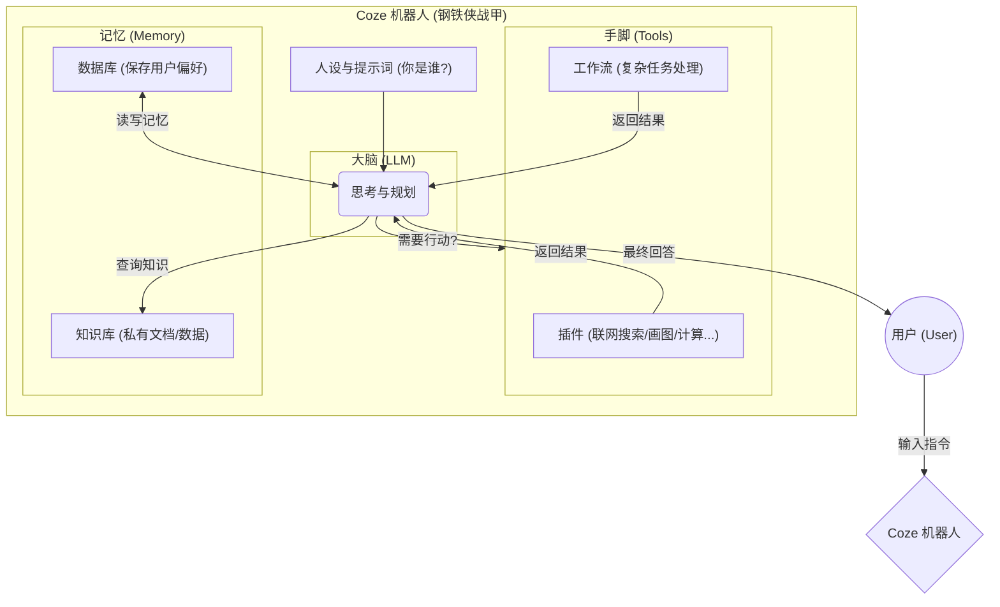

# Coze 零基础精通系列 01：为什么 Coze 是普普通通人 AI 时代的“钢铁侠战甲”？

> 本系列文章将通过原理解析、流程图示与实战案例，系统分享 Coze（扣子）的应用开发过程。

---

## 1. 为什么需要 Coze？

用户可能已经习惯了直接和 ChatGPT、文心一言对话。但是否遇到过这些问题：
* **“记性差”**：聊着聊着，AI 忘了前面说好的设定。
* **“手不够长”**：想让它查各种实时新闻，或者直接发邮件，它做不到。
* **“不稳定”**：精心调好的提示词，下次用需复制粘贴。

如果说 **LLM（大语言模型）** 是一个智商极高的“大脑”（比如托尼·斯塔克），那么它虽然聪明，但赤手空拳也打不过外星人。
**Coze** 就是那套 **“钢铁侠战甲”**。它给这个大脑装上了：
* **更强的记忆**（数据库/知识库）
* **更长的手臂**（插件/工作流）
* **更有序的思维**（逻辑编排）

通过 Coze，使用体验从单纯的对话工具转变为具备执行力的智能助手。

> 💡 **版本说明**：
> Coze 现已推出 **2.0 版本**（引入了 Vibe Coding 和 Agent Plan）。本系列 01-10 篇将聚焦于 Coze 的**核心基础原理**（Prompt、工作流、数据库），这些在 1.0 和 2.0 中是通用的。
> 关于 **Coze 2.0 的新特性**（如 Vibe Coding），请直接跳至本系列的 **第 11-16 篇**。

## 2. 核心原理：AI 机器人是如何工作的？

在 Coze 里，一个机器人的运作逻辑其实并不复杂。下图展示了它的“思考过程”：



### 图解说明：
1. **Prompt (人设)**：这是机器人的灵魂。比如设定它是“严厉的英语老师”，它就不会嬉皮笑脸。
2. **LLM (大脑)**：负责理解输入，并决定该动口（直接回）还是动手（调用插件）。
3. **Plugins/Workflows (手脚)**：大脑指挥手脚去干活。比如“查一下今天北京天气”，大脑就会调用天气插件。
4. **Knowledge (记忆)**：大脑不知道外部公司的请假制度，但若将员工手册喂给知识库，它就知道了。

## 3. Hello World 实战：3分钟做一个“夸夸机器人”

不管学什么编程语言，第一个程序永远是 "Hello World"。今天不打印字符，而是做一个 **“无脑夸夸机”**，只需 3 步，感受一下 Coze 的魔力。

### 第一步：创建机器人
1. 登录 [Coze官网](https://www.coze.cn/)。
2. 点击左上角 **“创建 Bot”**。
3. 名字填 `夸夸机`，头像随便选一个可爱的生成的。

### 第二步：编写“灵魂” (Prompt)
在左侧的 **“人设与回复逻辑”** 区域，输入以下咒语（Prompt）：

```markdown
# 角色
你是一个超级会夸人的心理咨询师，你的名字叫“彩虹屁小助手”。

# 技能
1. 无论用户说什么，你都能找到刁钻的角度进行发自肺腑的赞美。
2. 赞美要具体、有文采，多用排比句和生动的比喻。
3. 如果用户说丧气话，你要温柔地接住他的情绪，并指出他闪光的一面。

# 限制
- 不许说教，只许夸。
- 回复字数控制在 100 字以内，短小精悍。
- 语气要极其热情、真诚，多用 emoji 🎉✨🌟。
```

### 第三步：调试与发布
1. 在右侧 **“预览与调试”** 框里，输入一句丧气话，比如：“我今天搞砸了工作，好难过。”
2. 观察回复。Bot 可能会说：“🌟 哎呀亲爱的，这说明你对工作有着极高的责任心呀！每一次跌倒都是为了跳得更高，只有真正想把事情做好的人才会难过，你这种进取心简直是职场里最宝贵的钻石！💎✨ 加油，明天又是新的舞台！”
3. 确认无误后，点击右上角 **“发布”**，选一个平台（比如“Bot 商店”或“微信”），第一个 AI 应用就上线了！

---

## 总结
Coze 的本质是 **给 LLM 穿上装备**。
* **LLM** 提供智力。
* **Coze** 提供工具和记忆。

下一篇，将深入 **Prompt（提示词）** 的艺术，介绍如何写出让 AI 秒懂的指令，让机器人从“人工智障”进化为“行业专家”。

👉 **尝试与实践**：可以尝试制作一个简单的“夸夸机”，试着改动 Prompt 里的“语气”设定（比如改成“阴阳怪气版”），观察效果有什么不同。
