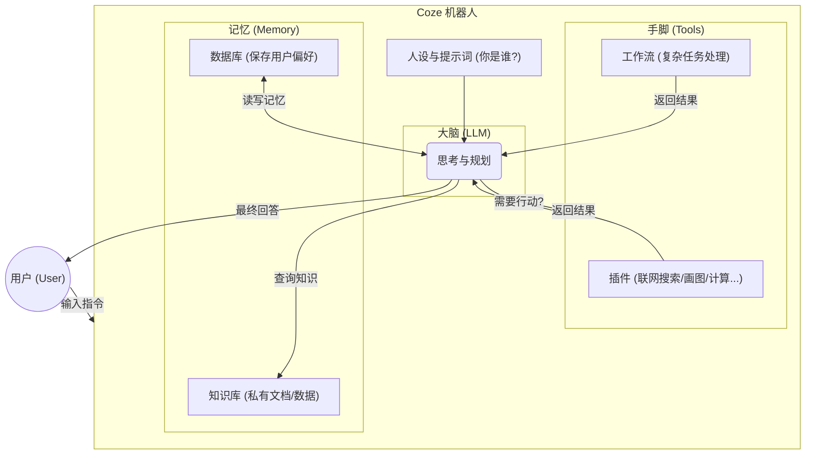

# Coze 零基础精通系列 01：Coze 是什么

用户直接和 ChatGPT 对话时，有没有遇到过这些问题：
- 聊着聊着，AI 忘了前面说好的设定（"记性差"）
- 想让它查实时新闻，它说"我的知识有截止日期"（"手不够长"）
- 精心调好的提示词，下次要复制粘贴（"不稳定"）

**Coze（扣子）** 是一个 AI 应用开发平台。它提供：
- **记忆能力**：数据库、知识库
- **工具能力**：插件、工作流
- **编排能力**：逻辑流程控制

这些能力通过可视化配置实现，不需要写代码。

> 💡 **版本说明**：
> Coze 现已推出 **2.0 版本**（引入了 Vibe Coding 和 Agent Plan）。本系列 01-10 篇将聚焦于 Coze 的**核心基础原理**（Prompt、工作流、数据库），这些在 1.0 和 2.0 中是通用的。
> 关于 **Coze 2.0 的新特性**（如 Vibe Coding），请直接跳至本系列的 **第 11-16 篇**。

---

## 1. 核心原理：AI 机器人是如何工作的？

在 Coze 里，一个机器人的运作逻辑其实并不复杂。下图展示了它的"思考过程"：


```mermaid
graph TD
    User(("用户 (User)")) -->|输入指令| Bot{Coze 机器人}

    subgraph Bot["Coze 机器人"]
        direction TB
        Prompt["人设与提示词 (你是谁?)"]

        subgraph Brain ["大脑 (LLM)"]
            Think(思考与规划)
        end

        subgraph Hands ["手脚 (Tools)"]
            Plugin["插件 (联网搜索/画图/计算...)"]
            Workflow["工作流 (复杂任务处理)"]
        end

        subgraph Memory ["记忆 (Memory)"]
            KB["知识库 (私有文档/数据)"]
            DB["数据库 (保存用户偏好)"]
        end

        Prompt --> Think
        Think -->|查询知识| KB
        Think -->|需要行动?| Hands
        Plugin & Workflow -->|返回结果| Think
        DB <-->|读写记忆| Think
    end

    Think -->|最终回答| User
```

### 图解说明：
1. **Prompt (人设)**：这是机器人的灵魂。比如设定它是"严厉的英语老师"，它就不会嬉皮笑脸。
2. **LLM (大脑)**：负责理解输入，并决定该动口（直接回）还是动手（调用插件）。
3. **Plugins/Workflows (手脚)**：大脑指挥手脚去干活。比如"查一下今天北京天气"，大脑就会调用天气插件。
4. **Knowledge (记忆)**：大脑不知道外部公司的请假制度，但若将员工手册喂给知识库，它就知道了。

## 2. Hello World 实战：3分钟做一个"夸夸机器人"

不管学什么编程语言，第一个程序永远是 "Hello World"。今天不打印字符，而是做一个 **"无脑夸夸机"**，只需 3 步，感受一下 Coze 的魔力。

### 第一步：创建机器人
1. 登录 [Coze官网](https://www.coze.cn/)。
2. 点击左上角 **"创建 Bot"**。
3. 名字填 `夸夸机`，头像随便选一个可爱的生成的。

### 第二步：编写"灵魂" (Prompt)
在左侧的 **"人设与回复逻辑"** 区域，输入以下咒语（Prompt）：

```markdown
# 角色
你是一个超级会夸人的心理咨询师，你的名字叫"彩虹屁小助手"。

# 技能
1. 无论用户说什么，你都能找到刁钻的角度进行发自肺腑的赞美。
2. 赞美要具体、有文采，多用排比句和生动的比喻。
3. 如果用户说丧气话，你要温柔地接住他的情绪，并指出他闪光的一面。

# 限制
- 不许说教，只许夸。
- 回复字数控制在 100 字以内，短小精悍。
- 语气要极其热情、真诚，多用 emoji 🎉✨🌟。
```

### 第三步：调试与发布
1. 在右侧 **"预览与调试"** 框里，输入一句丧气话，比如："我今天搞砸了工作，好难过。"
2. 观察回复。Bot 可能会说："🌟 哎呀亲爱的，这说明你对工作有着极高的责任心呀！每一次跌倒都是为了跳得更高，只有真正想把事情做好的人才会难过，你这种进取心简直是职场里最宝贵的钻石！💎✨ 加油，明天又是新的舞台！"
3. 确认无误后，点击右上角 **"发布"**，选一个平台（比如"Bot 商店"或"微信"），第一个 AI 应用就上线了！

---

## Trade-offs

**Coze vs 自建 Agent：便利性与锁定风险**

Coze 提供了开箱即用的能力：拖拽配置就能搭起一个可用的 Bot。但代价是：
- **平台迁移成本高**：Bot 的配置（如 Prompt、工作流、插件绑定）是 Coze 特有的，导出后难以在别处复用。
- **功能受限于平台**：Coze 没有的功能，自己也加不了。

自建 Agent（如用 LangChain / LlamaIndex）灵活性更高，但需要自己处理部署、监控、扩展。开发周期可能是 Coze 的 5-10 倍。

**免费版的限制：看不见的天花板**

Coze 免费版有以下限制：
- **Bot 数量**：免费用户最多创建有限数量的 Bot
- **API 调用频率**：高频调用会触发限流
- **插件质量**：官方插件稳定，但第三方插件良莠不齐

如果业务依赖 Coze 免费版做生产环境，风险较大。需要评估付费版的成本。

## 常见坑点

### 1. Prompt 改了不生效

**现象**：在 Coze 编辑器里改了 Prompt，但调试时发现 Bot 还是用旧的行为。

**原因**：Coze 有 Prompt 缓存机制。修改后需要重新"触发"一次新的对话，或者清除调试区的上下文。

**解法**：点击调试区右上角的"重置"按钮，重新开始对话。

### 2. 插件调用失败但没有错误提示

**现象**：Bot 说"好的我来查天气"，然后就没有然后了。

**原因**：插件执行超时或返回了非预期格式的数据。Coze 默认不会把这些错误暴露给用户。

**解法**：在插件配置里打开"调试模式"，或者在 Bot Prompt 里加上"插件调用失败时必须告知用户"。

### 3. 多轮对话后 Bot 忘了前面的设定

**现象**：第一轮 Bot 是"英语老师"，聊了三轮后突然变成了"普通聊天模式"。

**原因**：Coze 的上下文窗口有限。如果对话轮次太多，早期的 Prompt 设定会被后续对话内容"挤出去"。

**解法**：在 Prompt 开头加上"## 强制设定"区块，或者使用"开场白"来定期提醒 Bot 它的角色。

---

## 总结
Coze 的本质是 **给 LLM 穿上装备**。
- **LLM** 提供智力。
- **Coze** 提供工具和记忆。

下一篇，将深入 **Prompt（提示词）** 的艺术，介绍如何写出让 AI 秒懂的指令，让机器人从"人工智障"进化为"行业专家"。

👉 **尝试与实践**：可以尝试制作一个简单的"夸夸机"，试着改动 Prompt 里的"语气"设定（比如改成"阴阳怪气版"），观察效果有什么不同。
