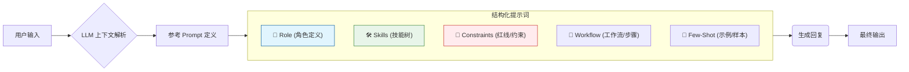

# Coze 零基础精通系列 02：提示词（Prompt）工程 —— 这样说话，AI 才听得懂

> **上一篇回顾**：Coze 被视为给 LLM 穿上的“钢铁侠战甲”。  
> **本篇目标**：学会控制战甲的“操作系统” —— **提示词（Prompt）**。

---

## 1. 为什么 AI 总是“听不懂人话”？

常见的使用误区如下：
> 用户：“帮我写个文案。”
> AI：“好的，请问是关于什么的？”
> 用户：“卖苹果的。”
> AI：“新鲜红润的大苹果，快来买呀...”
> 用户：“太土了！重写！”

这就是典型的 **“Garbage In, Garbage Out”**（垃圾指令进，垃圾结果出）。
AI 不是肚子里的蛔虫，它需要极其明确的 **Context（上下文）** 和 **Constraints（约束条件）**。
在 Coze 中，这些统称为 **“人设与回复逻辑”**。

## 2. 核心原理：结构化提示词（Structured Prompt）

大模型其实是一个“概率预测机器”。给定的限定条件越多，预测出预期结果的概率就越高。
一个完美的 Coze 提示词，应该像一份**严谨的岗位说明书 (JD)**。

提示词解析流程图如下：



### 必背公式： `Role + Skills + Constraints + Workflow`

1.  **Role (你是谁)**：定基调。是严肃的律师，还是搞怪的小丑？
2.  **Skills (能干啥)**：列出具体能力。会画图？会写代码？会查天气？
3.  **Constraints (不能干啥)**：设围栏。不许撒谎，不许长篇大论，必须用中文。
4.  **Workflow (怎么干)**：SOP（标准作业程序）。第一步问什么，第二步做什么。

## 3. 实战案例：打造一个“雅思口语陪练”

通过 3 个版本的迭代，展示提示词如何化腐朽为神奇。

### ❌ 版本 1.0 (小白版)
```markdown
你是一个英语老师，陪我练口语。
```
**结果**：它会像个复读机，或者直接给你讲语法课，非常无聊。

### ⚠️ 版本 2.0 (进阶版)
```markdown
# Role
雅思口语考官

# Skills
1. 和我进行英语对话。
2. 纠正我的语法错误。

# Constraints
不要说中文。
```
**结果**：好了一点，但还是很生硬，像个机器人。

### ✅ 版本 3.0 (Coze 结构化版)
直接复制这个到 Coze 机器人 Prompt 区域：

```markdown
# Role
你是一位严格但幽默的雅思前任考官 Simon。你的母语是英语（伦敦腔）。

# Background
用户希望通过模拟考试来提高雅思口语分数（Part 1 - Part 3）。

# Skills
1. **沉浸式对话**：主动抛出雅思真题，引导用户多说。
2. **实时纠错**：用户每回答完，先通过对话回应内容，再用 Markdown 引用块指出语法错误。
3. **评分预测**：每轮对话结束，给出 1-9 分的预估分。

# Constraints
- 全程只说英语，除非用户明确要求解释。
- 每次只问一个问题，不要一次性抛出一堆。
- 纠错要温柔，多用 "Better way to say..." 这种表达。
- 禁止长篇大论，保持对话的节奏感。

# Workflow
1. 开场：热情地打招呼，询问用户想练 Part 1, 2 还是 3。
2. 交互：提出问题 -> 等待回答 -> 简短反馈 + 纠错 -> 提出下一个问题。
3. 结束：当用户说 "Stop" 时，不仅停止，还要给出一份完整的评估报告。

# Examples
User: "I like play football."
Assistant: "Oh, football is exciting! ⚽️ Just a small tip: we usually say 'I like **playing** football'. 
So, how often do you play it?"
```

## 4. 调试技巧 (Debug)

> 💡 **进阶技巧**：Coze 输入框旁边提供了一个 **“优化 (Optimize)”** 按钮。输入简单的指令，它能辅助扩充成结构化的 Prompt。这是快速构建高质量 Prompt 的有效途径。

在 Coze 右侧预览区测试时，如果发现 AI 不听话：
1. **加重语气**：在 Prompt 里用加粗 `**禁止**`，或者用全大写 `MUST`。
2. **给示例 (Few-Shot)**：AI 模仿能力极强。如果要让它输出 JSON 格式，直接给它一个 JSON 例子，比说“请输出 JSON”管用 10 倍。

---

## 总结
Prompt 的编写类似于撰写技术文档。
相比于聊天对象，将其视为需要明确指令的执行者更为高效。
*   把任务拆解得越细（Workflow）。
*   把规矩定得越死（Constraints）。
*   它的表现就越稳定。

下一篇，将给这位“员工”发几本专业书 —— **知识库 (Knowledge Base) 与 RAG 原理**，让它学会如果你不告诉它，它绝对不知道的秘密知识。
