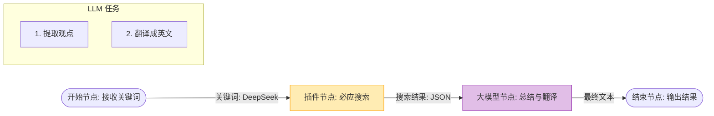

# Coze 零基础精通系列 04：工作流 (Workflow) —— 赋予 AI 逻辑思维

> **上一篇回顾**：已给 AI 装上了知识库这一“外挂记忆”。  
> **本篇目标**：通过 **工作流 (Workflow)**，让 AI 能够处理复杂的、多步骤的任务，这是 Coze 的核心护城河。

---

## 1. 从“单步思考”到“多步推理”

直接对话的 AI 虽然聪明，但它是“线性的”——问一句，它答一句。
如果任务很复杂，比如：
> “先帮我搜一下今天关于‘DeepSeek’的最新新闻，然后提取出前 3 条的核心观点，最后翻译成英文发给我。”

若直接把这段 Prompt 发给 Chatgpt，它可能会因为上下文中途断掉或者搜索内容太多而处理得一塌糊涂。
**工作流 (Workflow)** 就是把这个复杂的任务拆解成一个个标准的生产流水线节点。

## 2. 核心原理：可视化编程 (Visual Logic)

工作流采用可视化的构建方式，逻辑类似于**搭积木**。
需要理解两个核心概念：**节点 (Node)** 和 **连线 (Edge)**。

*   **节点 (Node)**：流水线上的工位。有的负责搜新闻，有的负责写文章。
*   **连线 (Edge)**：传送带。把上一个工位做好的东西传给下一个。
*   **并行 (Parallel)**：如果任务互不干扰（比如同时搜百度和搜头条），可以并行处理，速度翻倍。



### 数据流转 (Data Flow)
**核心要点**：节点之间传的是数据。
*   `Start` 节点的输出是 `Input_Query`。
*   `Search` 节点的输入引用 `Start.Input_Query`。
*   `LLM` 节点的输入引用 `Search.Output`。
*   这就是编程里的 **“变量引用”**。

> 💡 **高阶节点一览**：
> *   **循环 (Loop)**：用于批量处理列表（如把搜到的 10 条新闻逐条分析）。
> *   **HTTP 请求**：无需写代码，直接配置 URL 和 Header 即可调用第三方 API。
> *   **选择器 (Select)**：即 `if-else`，根据条件走不同的分支。

## 3. 实战案例：制作“AI 新闻早报生成器”

本节将构建一个真正有用的工具：输入一个关键词，自动生成带链接的摘要日报。

### 第一步：创建工作流
1. 在你的 Bot 编排页面，点击 **“工作流”** -> **“创建工作流”**。
2. 起名 `news_digest`，描述填“搜索新闻并生成摘要”。

### 第二步：添加节点
画布上默认有 `Start` 和 `End` 节点。要往中间加步骤。

1. **添加搜索能力**：
   - 在左侧菜单找 **“插件”**。
   - 搜索 `Bing Web Search` 或 `Toutiao Search`（头条搜索）。
   - 添加到画布，把 `Start` 节点连上 `Search` 节点。
   - 配置 Search 节点：在输入参数 `query` 处，选择引用 `Start` 节点的 `query` 变量。

2. **添加总结能力**：
   - 在左侧菜单找 **“大模型” (LLM)**。
   - 拖拽到画布，把 `Search` 节点连上 `LLM` 节点。
   - 配置 LLM 节点：
     - **模型**：选一个聪明的（如 GPT-4 或 Doubao-pro）。
     - **输入**：引用 `Search` 节点的 `data`（搜索结果）。
     - **Prompt**：
       ```markdown
       你是一个新闻编辑。
       请根据输入的搜索结果 {{input}}，总结出今天最重要的 3 条新闻。
       要求：
       1. 包含标题、简短摘要。
       2. 必须保留原始链接。
       3. 格式清晰，使用 Markdown。
       ```

### 第三步：连接终点
把 `LLM` 节点的输出连到 `End` 节点。
在 `End` 节点配置一个输出变量 `result`，值引用 `LLM` 的输出。

### 第四步：试运行与发布
1. 点击右上角 **“试运行”** (Run)。
2. 输入测试词：`华为`。
3. 查看绿色的线流动，最后在右侧看到生成的日报。
4. 如果没问题，点击 **“发布”**。

> 💡 **进阶技巧**：逻辑复杂时，单次测试是不够的。Coze 支持 **“批量运行” (Batch Run)**，可以上传包含 50+ 测试用例的 CSV 文件，一键跑完所有 Case，快速验证工作流的稳定性。

### 第五步：在 Bot 中使用
回到 Bot 编排页，在 **“工作流”** 区域点击 `+`，把刚才发布的 `news_digest` 添加进来。
可以写一句 Prompt 引导 Bot：
> “当用户想要看新闻时，请调用 news_digest 工作流。”

---

## 总结
工作流是 Coze 的核心能力。通过它，AI 从“聊天伴侣”变成了“执行工具”。
现在你的 Bot 已经会：
1.  **听懂人话** (Prompt)
2.  **查阅资料** (Knowledge)
3.  **联网干活** (Workflow)

但在调用插件和 API 的时候，工具有很多种，该如何选择？下一篇，将介绍 **Coze 的工具生态 —— 插件与工具**。
