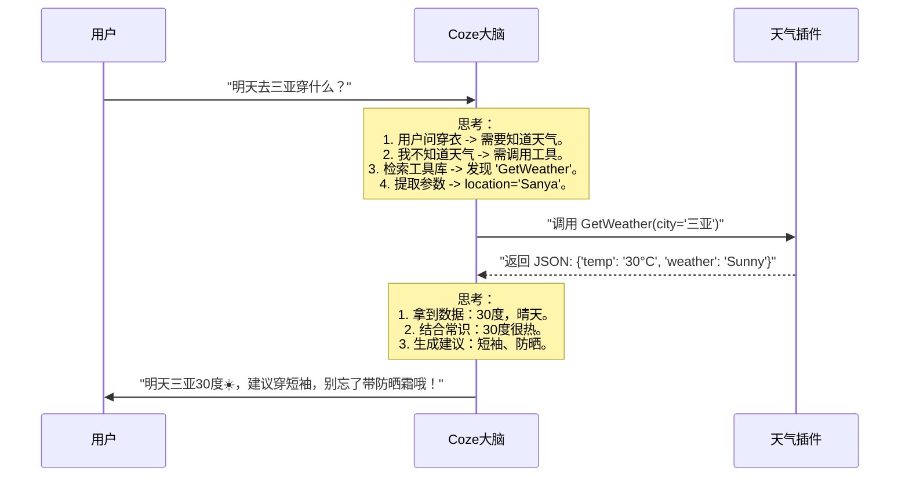

# Coze 零基础精通系列 05：插件 (Plugins) —— 给 AI 装上“三头六臂”

> **上一篇回顾**：工作流已把多个步骤串联了起来。  
> **本篇目标**：了解 Coze 庞大的**插件（Plugin）**生态，让 AI 能够看新闻、画画、读网页、算数学。

---

## 1. 为什么 AI 需要插件？

若在 ChatGPT 里问：“今天上海到北京的机票多少钱？”
如果它是原始的大模型，它会说：“对不起，我的数据截止到 2023 年...”
因为大模型本质上是一个 **“被关在小黑屋里的博学家”**。它读过所有的书，但它连不上网，没有手机。

**插件 (Plugins)** 就是给这个小黑屋拉了一根网线，或者递给它一把计算器。
Coze 平台集成了数千个现成的插件，只需“点击添加”，Bot 就能瞬间学会这个技能。

## 2. 核心原理：函数调用 (Function Calling)

可能会有疑问：*“只是添加了插件，AI 怎么知道什么时候该用，什么时候不该用？”*
这就是大模型神奇的 **Function Calling（工具调用）** 能力。

调用流程如下：



### 关键点：
1.  **意图识别**：AI 自动分析出需要什么服务（无需编写代码）。
2.  **参数提取**：AI 自动从输入中提取关键信息（把“三亚”提取为 `city` 参数）。
3.  **结果处理**：AI 读懂插件返回的一堆乱码（JSON），翻译成自然语言。

## 3. 实战案例：打造“全能生活助理”

本节将构建一个集成了多种能力的助手。

### 第一步：添加插件
1. 创建或打开一个 Bot。
2. 在 **“插件”** 区域点击 `+`。
3. 搜索并添加以下几个插件（如果不确定选哪个，看 Icon 和使用人数选官方/热门的）：
    *   `Weather` (查天气)
    *   `Bing Web Search` (联网搜索)
    *   `Image Generation` (比如 DALL·E 3 或 Coze 自带画图工具)

> 💡 **进阶技巧**：除了官方插件，还可以把 **“工作流”当插件用**。将一个通用的工作流（如“抓取新闻”）发布后，在另一个 Bot 中就可以像调用天气插件一样调用它，实现模块化复用。

### 第二步：编写 Prompt
Prompt 需要告诉 AI 灵活调用这些工具。

```markdown
# Role
全能生活助理

# Skills
1. **天气查询**：当用户问出行建议时，必须先调用 Weather 插件查询当地天气，再根据气温推荐穿搭。
2. **信息检索**：当用户问新闻或实时信息时，调用 Search 插件。
3. **创意绘画**：当用户想要看照片或设计图时，调用画图插件。

# Constraints
- 调用工具前不要废话（不要说“好的，我正在为您查询...”），直接调用。
- 如果搜索结果不理想，尝试换个关键词再次搜索。
```

### 第三步：测试联动
在右侧调试：
1. **测试天气**：
   > 用户：“这周末去杭州西湖玩，做个攻略。”
   > *（Bot 应该会自动触发天气插件，提示会有雨，建议带伞，然后规划行程。）*

2. **测试画图**：
   > 用户：“给我画一张西湖烟雨蒙蒙的插画，要水墨风格。”
   > *（Bot 应该会自动触发画图插件，几秒后弹出一张图。）*

---

## 总结
插件是 Coze 生态里最丰富的部分。
*   **官方插件**：稳定、好用（如 Bing 搜索、头条新闻）。
*   **用户插件**：民间大神开发的各种奇奇怪怪的功能（如星座运势、股票分析）。

有了插件，AI 就能**听**（语音识别）、**看**（OCR）、**画**（生图）、**搜**（联网）。
但不管是插件还是工作流，它们都是“用完即走”的。若需 AI 记住用户上周说的内容，或者统计用户一共用了多少次，可以使用 **数据库 (Database)**。
下一篇，将学习如何赋予 AI **长久记忆**。
