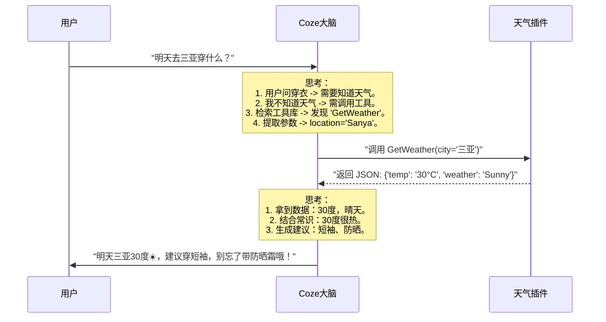

# Coze 零基础精通系列 05：插件 (Plugins) —— 给 AI 装上"三头六臂"

> **上一篇回顾**：工作流已把多个步骤串联了起来。  
> **本篇目标**：了解 Coze 庞大的**插件（Plugin）**生态，让 AI 能够看新闻、画画、读网页、算数学。

---

## 1. 为什么 AI 需要插件？

问 ChatGPT："今天上海到北京的机票多少钱？"

它会说："对不起，我的知识有截止日期，无法回答这个问题。"

这是因为 LLM 有固有限制：
- **知识时效性**：训练数据有截止日期
- **无法访问实时信息**：天气、股票、新闻
- **无法执行操作**：发邮件、查数据库、调用第三方 API

**插件 (Plugins)** 就是解决这些限制的标准方案。Coze 集成了数千个插件，Bot 可以像调用函数一样调用它们。

## 2. 核心原理：函数调用 (Function Calling)

可能会有疑问：*"只是添加了插件，AI 怎么知道什么时候该用，什么时候不该用？"*
这就是大模型神奇的 **Function Calling（工具调用）** 能力。

调用流程如下：


```mermaid
sequenceDiagram
    participant User as 用户
    participant LLM as Coze大脑
    participant Plugin as 天气插件
    
    User->>LLM: "明天去三亚穿什么？"
    
    Note over LLM: 思考：<br/>1. 用户问穿衣 -> 需要知道天气。<br/>2. 我不知道天气 -> 需调用工具。<br/>3. 检索工具库 -> 发现 'GetWeather'。<br/>4. 提取参数 -> location='Sanya'。
    
    LLM->>Plugin: "调用 GetWeather(city='三亚')"
    Plugin-->>LLM: "返回 JSON: {'temp': '30°C', 'weather': 'Sunny'}"
    
    Note over LLM: 思考：<br/>1. 拿到数据：30度，晴天。<br/>2. 结合常识：30度很热。<br/>3. 生成建议：短袖、防晒。
    
    LLM->>User: "明天三亚30度☀️，建议穿短袖，别忘了带防晒霜哦！"
```

### 关键点：
1. **意图识别**：AI 自动分析出需要什么服务（无需编写代码）。
2. **参数提取**：AI 自动从输入中提取关键信息（把"三亚"提取为 `city` 参数）。
3. **结果处理**：AI 读懂插件返回的一堆乱码（JSON），翻译成自然语言。

## 3. 实战案例：打造"全能生活助理"

本节将构建一个集成了多种能力的助手。

### 第一步：添加插件
1. 创建或打开一个 Bot。
2. 在 **"插件"** 区域点击 `+`。
3. 搜索并添加以下插件（若不确定选择，可参考图标及使用人数选择官方或热门插件）：
    * `Weather` (查天气)
    * `Bing Web Search` (联网搜索)
    * `Image Generation` (如 DALL·E 3 或 Coze 自带绘图工具)

> 💡 **进阶技巧**：除了官方插件，还可以把 **"工作流"当插件用**。将一个通用的工作流（如"抓取新闻"）发布后，在另一个 Bot 中就可以像调用天气插件一样调用它，实现模块化复用。

### 第二步：编写 Prompt
Prompt 需要告诉 AI 灵活调用这些工具。

```markdown
# Role
全能生活助理

# Skills
1. **天气查询**：当用户问出行建议时，必须先调用 Weather 插件查询当地天气，再根据气温推荐穿搭。
2. **信息检索**：当用户问新闻或实时信息时，调用 Search 插件。
3. **创意绘画**：当用户想要看照片或设计图时，调用画图插件。

# Constraints
- 调用工具前不要废话（不要说"好的，我正在为您查询..."），直接调用。
- 如果搜索结果不理想，尝试换个关键词再次搜索。
```

### 第三步：测试联动
在右侧调试：
1. **测试天气**：
   > 用户："这周末去杭州西湖玩，做个攻略。"
   > *（Bot 应该会自动触发天气插件，提示会有雨，建议带伞，然后规划行程。）*

2. **测试画图**：
   > 用户："给我画一张西湖烟雨蒙蒙的插画，要水墨风格。"
   > *（Bot 应该会自动触发画图插件，几秒后弹出一张图。）*

---

## Trade-offs

**插件可靠性 vs 维护成本**

Coze 的插件质量参差不齐：
- **官方插件**：稳定，响应快，但功能有限
- **第三方插件**：功能丰富，但可能存在：
  - 不定期维护（接口变更后失效）
  - 响应不稳定（时快时慢）
  - 安全性问题（访问敏感数据）

每增加一个插件，就多了一层依赖。生产环境应该记录每个插件的调用成功率。

**平台锁定风险**

如果 Bot 依赖的插件是 Coze 特有的，换平台时需要重写整个工具层。

## 常见坑点

### 1. 插件返回格式不符合预期

**现象**：Bot 调用插件后说"抱歉，我无法理解返回结果"。

**原因**：插件返回的 JSON 格式和 Coze 文档描述的不一致。

**解法**：在 Bot Prompt 里加上"如果插件返回无法解析，返回'查询失败，请稍后再试'"，防止 Bot 胡编答案。

### 2. 插件调用频率超限

**现象**：Bot 突然回复"服务暂不可用"。

**原因**：某些插件（如 DALL·E 生图）有调用频率限制。

**解法**：在 Prompt 里加上"每天最多生图 3 次，超过时建议用户等待"。

### 3. LLM 无法正确选择插件

**现象**：Bot 应该调用天气插件时，却调用了搜索插件。

**原因**：意图识别不够精准，或者多个插件功能重叠。

**解法**：在 Bot Prompt 里明确指定插件的选择条件，减少歧义。

---

## Trade-offs

**插件可靠性 vs 维护成本**

第三方插件质量参差不齐。热门插件可能：
- API 限流严格
- 返回数据格式不稳定
- 作者停止维护后突然不可用

引入插件意味着引入了一个外部依赖。每次 Coze 平台升级，都可能影响插件的行为。

**Vendor Lock-in 风险**

Coze 的插件体系是平台特有的。如果未来要迁移到其他平台（如 LangChain、LlamaIndex），所有插件调用都需要重写。

经验法则：把插件调用封装在工作流里，而不是直接在 Bot 里裸调。这样迁移时只需改工作流，不用动 Bot 的核心逻辑。

## 常见坑点

### 1. 插件返回 JSON，Bot 不会解析

**现象**：Bot 说"好的我来查天气"，然后把插件返回的原始 JSON 发给用户。

**原因**：插件返回的是结构化数据，不是自然语言。Bot 需要被显式提示"如何解读这个结果"。

**解法**：在 Prompt 的 Skills 部分加一句："当插件返回 JSON 数据时，先提取关键字段，再用自然语言解释给用户。"

### 2. 插件需要认证但没配置

**现象**：插件调用时报 401 或 403 错误。

**原因**：部分插件（如 GitHub、Slack）需要 OAuth 配置。在 Coze 里添加插件时需要完成授权流程。

**解法**：点击插件卡片上的"配置"按钮，按照指引完成第三方平台的 OAuth 授权。

### 3. 插件执行超时

**现象**：Bot 卡在"正在查询..."，最终报错"插件执行超时"。

**原因**：插件背后的 API 响应慢，或者网络不稳定。Coze 的插件有 30 秒超时限制。

**解法**：在 Prompt 里加上超时兜底逻辑："如果插件超过 20 秒没返回，告知用户稍后再试。"
