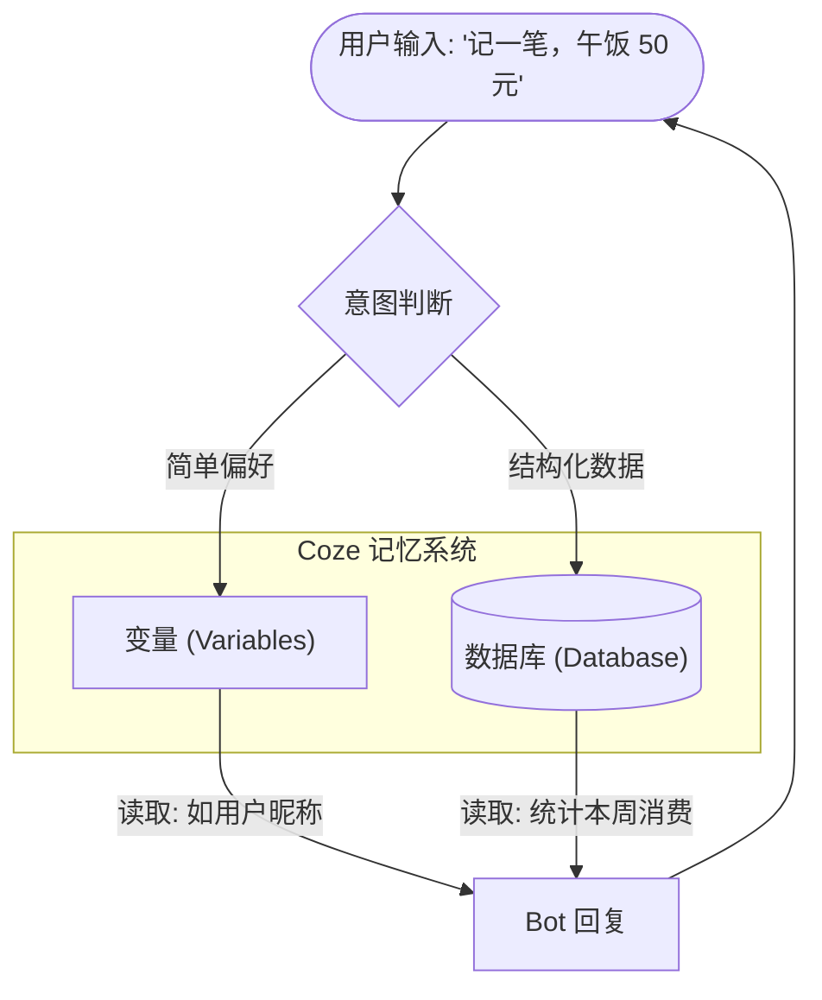

# Coze 零基础精通系列 06：数据库 (Database)与变量 —— 让 AI 记住用户身份

> **上一篇回顾**：AI 已经能联网、能画图了。  
> **本篇目标**：解决 AI“聊完就忘”的问题，赋予它**永久记忆**。

---

## 1. 为什么 AI 像“金鱼”？

虽然 Coze 有上下文记忆，但在常规对话中，如果告知“我叫小明，对花生过敏”，一周后再开启新对话，它就不认识了。
这是因为 **Token 上下文** 是昂贵且有限的，而且通常只存在于当前会话窗口中。

如果要做一个：
*   **记账助手**（需要存每一笔钱）
*   **打卡应用**（需要记录坚持了多少天）
*   **会员系统**（需要识别金牌用户）

必须使用 **数据库 (Database)**。

## 2. 核心原理：变量 vs 数据库

在 Coze 里，存储数据有两种方式，就像“便利贴”和“档案柜”。

### 2.1 变量 (Variable) —— 便利贴
*   **特点**：存取快，适合存简单的东西（如用户偏好语言、当前心情）。
*   **生命周期**：可以是本次对话有效，也可以是长期有效。
*   **原理**：Key-Value 键值对（`language = "English"`）。

### 2.2 数据库 (Database) —— 档案柜
*   **特点**：结构化存储，适合存大量、复杂的数据（如 1000 条消费记录）。
*   **原理**：类似 Excel 表格。有行（Row）有列（Column）。
*   **操作**：增（Add）、删（Delete）、改（Update）、查（Query）。



## 3. 实战案例：制作“私人记账助手”

功能目标：如果不说话，它不知道花了多少钱；一问它，它能从数据库里算出来。

### 第一步：创建数据表
1. 在 Bot 编排页面，点击 **“数据库”** -> `+` -> **“创建数据表”**。
2. 表名：`expense_table`。
3. 添加字段（列）：
    *   `user_id` (文本)：记录用户身份，防止数据混淆。
    *   `amount` (数字)：金额。
    *   `category` (文本)：分类（如餐饮、交通）。
    *   `date` (文本)：时间。
4. 这里的 `user_id` 很关键，Coze 会自动提供当前用户的 ID。

> 💡 **进阶技巧**：调试时如果有数据存入疑问，可以打开 **Coze 数据库后台**。它提供了一个类似 Excel 的可视化界面，允许开发者直接查看、修改和删除数据，对 Debug 极大方便。

### 第二步：创建“记账”工作流
需要一个 Workflow 来把数据写入表里。
1. 创建工作流 `record_expense`。
2. **Start 节点**：接收参数 `amount`, `category`。
3. **Database 节点**（在左侧菜单找）：
    *   选择操作：**插入 (Insert)**。
    *   选择表：`expense_table`。
    *   字段映射：把 Start 节点的参数对应填入表字段。
    *   `user_id` 字段引用系统变量 `Session.User_Id`。
4. **End 节点**：返回“记账成功”。

### 第三步：创建“查账”工作流
需要另一个 Workflow 来算账。
1. 创建工作流 `query_expense`。
2. **Database 节点**：
    *   选择操作：**查询 (Select)**。
    *   条件：`user_id` 等于 `Session.User_Id`。
3. **Code 节点** (或者 LLM 节点)：
    *   因为数据库查出来是多行数据，需要计算总和。
    *   可以用一个简单的 Python 代码节点来把 list 里的 amount 加起来。
    *   *(若不写代码，也可以直接扔给 LLM 节点让它算)*。
4. **End 节点**：返回总金额。

### 第四步：Prompt 粘合
在 Bot 的 Prompt 里写：
```markdown
# Skills
1. 当用户说“花了多少钱”等记录指令时，调用 record_expense 工作流。
2. 当用户问“总共花了多少”时，调用 query_expense 工作流。
```

---

## 总结
有了数据库，AI 就有了**积累**的能力。这赋予了 Bot 长期记忆能力，使其能提供连续的服务。

到目前为止，教程已涵盖 Coze 的 80% 能力。
但若想做更极客的功能（比如处理复杂的 JSON 数据，或者进行复杂的数学运算），单纯靠拖拽节点可能不够灵活。
下一篇，将引入 **代码节点 (Code Node)**，介绍如何用简单的代码，解决 No-Code 难以处理的问题。
