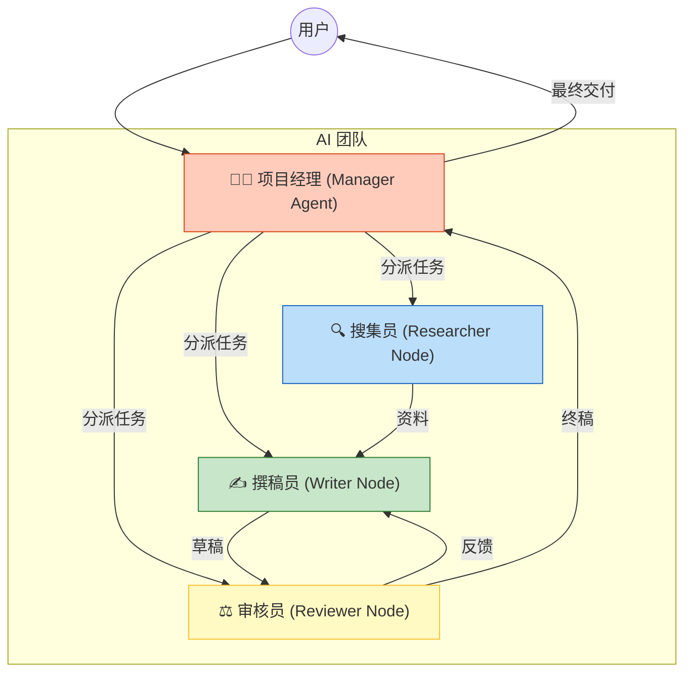

# Coze 零基础精通系列 08：多智能体 (Multi-Agent)与触发器 —— 组建 AI 团队

> **上一篇回顾**：已给 AI 加上了代码逻辑。  
> **本篇目标**：让 AI 主动开启会话（触发器），以及让多个 AI 协同工作（多智能体）。

---

## 1. 从“被动等待”到“主动出击”

传统 Bot 为被动响应模式：用户问一句，它回一句。
但真正的顶级助理，应该在用户唤醒前，就已经把今天的日程和新闻整理好发送。
这就需要 **触发器 (Trigger)**。

同时，一个全能的 Bot 往往很臃肿。更好的架构是：一个“项目经理”带着一群“专员”干活。
这就需要 **多智能体 (Multi-Agent)**。

## 2. 核心原理：SOP 与 分工

### 2.1 触发器 (Trigger)
简单理解就是 **闹钟**。
*   **定时触发**：每天早上 8 点。
*   **事件触发**：当 RSS 有更新时，或者当数据库有新数据时。

### 2.2 多智能体 (Multi-Agent)
如果不分工，Prompt 会写得几千字长，大模型容易“顾此失彼”。
任务拆解如下：

## 3. 实战案例：全自动“早安日报”

本节暂不涉及复杂的多智能体，先体验**触发器**的功能。

### 第一步：准备内容生成器
复用在第 4 篇构建的 `news_digest`（新闻摘要）工作流。
或者创建一个简单的 Bot，技能是“查询天气并讲一个笑话”。

### 第二步：添加触发器
1. 在 Bot 编排页面，找到 **“触发器”** 区域。
2. 点击 `+`，选择 **“定时触发”**。
3. 设置时间：
    *   **循环周期**：每天。
    *   **时间**：08:00。
4. **设置动作**：
    *   触发后执行哪个工作流？选择 `news_digest`。
    *   或者直接写一段 Prompt：“去查一下今天的新闻发给我。”

### 第三步：接收端的配置
AI 产生内容后，发到哪里？
*   如果是测试，可以在 Coze 的调试窗口看到。
*   如果是实用，通常需要推送到 **飞书群/钉钉群/微信**。
    *   在工作流的末尾，添加一个 `Feishu Webhook` 插件。
    *   填入飞书机器人的 Webhook 地址。

这样，每天会自动发送一份 AI 准备的早报。

---

## 4. 多智能体模式简介
在 Coze 的 **“多 Agent 模式”** 下，主要有两种协作方式：
1.  **自动编排 (Auto-Handover)**：只需将各种 Agent（画图、写作、搜索）丢进池子里。用户提问时，系统会根据意图自动选择最合适的 Agent 回答，无需编写复杂的路由逻辑。
2.  **手动编排 (Manual Orchestration)**：创建一个 **Manager** 节点，通过 Prompt 或工作流精确控制：“如果用户要画图，就找画图大师；如果要写文章，就找文案高手。”

类似公司架构，各司其职。这是 Coze 最核心的功能，解决了单一 Prompt 难以处理复杂逻辑的问题。当任务过于庞大时，**拆解**永远是最好的解法。

> 💡 **进阶技巧**：在多 Agent 模式中，建议为每个 Agent 设定清晰的 **"Jump Condition" (跳转条件)**。例如，只有在“用户提及价格”时才跳转到“销售专员”，避免不必要的 Agent 切换带来的延迟。

> ⚠️ **Coze 2.0 更新注记**: 
> Coze 2.0 引入了更强大的 **Agent Plan** 功能来处理长期任务，并在 UI 上对多智能体模式进行了改版。关于 2.0 的 **Agent Plan** 详解，请参阅本系列第 **11** 篇之后的进阶内容。

---

## 总结
*   **触发器** 让 AI 变成了 24 小时待命的管家。
*   **多智能体** 让 AI 变成了各司其职的团队。

至此，AI 应用开发的常用的技能都已介绍。
最后一篇，将讲解怎么把作品 **发布** 出去，让更多人使用。
