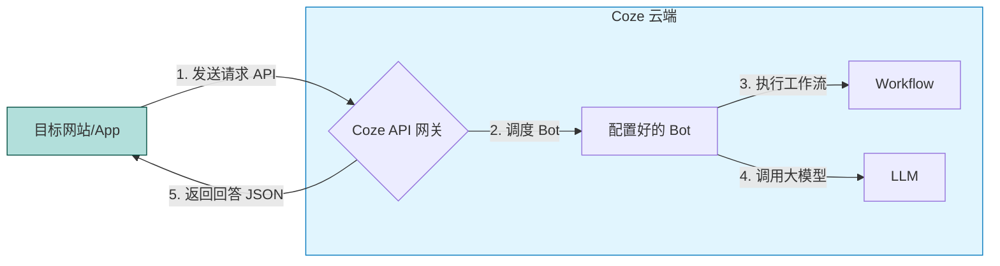

# Coze 零基础精通系列 10：发布与集成 —— 让世界看到作品

> **上一篇回顾**：AI 已经从基础功能进阶到了体验优化。  
> **本篇目标**：这是系列的最后一篇，本篇将介绍如何把 Agent **发布**出去，甚至通过 **API** 集成到网站里。

---

## 1. 写好了 Agent，然后呢？

完成 Agent 开发后，若仅在草稿箱中闲置，未免可惜。
Coze 最大的优势之一就是 **“一次开发，多端运行”**。
只需配置一次，就能发布到：
*   **Coze Agent Store (商店)**：让平台上的其他人使用。
*   **微信公众号**：转化为公众号智能客服。
*   **飞书/钉钉**：变成公司内部效率工具。
*   **Discord/Telegram**：服务海外用户。

## 2. 核心原理：API 集成 (LLM as a Service)

对开发者而言，最兴奋的功能莫过于 **Coze API**。
这意味着，无需自己搭服务器，无需买 GPU，Coze 即为 **“云端大脑”**。



## 3. 实战案例：三种发布方式

### 方式一：发布到商店 (最简单)
1. 点击右上角 **“发布”**。
2. 勾选 **“Bot 商店”**。
3. 填写简介、上传好看的封面。
4. 提交审核。审核通过后，所有人都能在 Coze 首页搜到 Bot。

> 💡 **进阶技巧**：发布并非终点。发布后应定期查看 **“运营分析” (Analytics)** 数据，关注用户常问的问题、Token 消耗量以及点赞/点踩率，依据数据迭代 Bot。

### 方式二：发布到微信公众号
1. 点击 **“发布”** -> **“微信公众号（服务号）”**。
2. 仅需公众号管理员，扫码授权即可。
3. **效果**：粉丝给公众号发消息，不再是死板的关键词回复，而是 AI 在陪聊。

### 方式三：API 调用 (开发者向)
若需将 Bot 接入博客或小程序：
1. **获取 API Key**：在 Coze 个人设置里申请。
2. **获取 Bot ID**：在 Bot 编排页面的 URL 里能找到。
3. **调用代码示例**：
   ```bash
   curl --location 'https://api.coze.cn/v3/chat' \
   --header 'Authorization: Bearer YOUR_API_KEY' \
   --header 'Content-Type: application/json' \
   --data '{
       "bot_id": "YOUR_BOT_ID",
       "user": "uid_123",
       "query": "你好，帮我查一下天气",
       "stream": false
   }'
   ```
   将收到一段 JSON，里面就是 Bot 的回答。

---

## 结语

至此，**《Coze 零基础精通系列》** 的 10 篇文章全部结束。

本系列介绍了：
1.  **认知**：理解 LLM + Coze 的“钢铁侠”关系。
2.  **指令**：用 Role+Skills 写出好 Prompt。
3.  **记忆**：用知识库 RAG 打造私有大脑。
4.  **逻辑**：用工作流处理复杂任务。
5.  **技能**：用插件联网、画图。
6.  **存储**：用数据库记住用户。
7.  **代码**：用 Code Node 计算数据。
8.  **协作**：用多智能体分工。
9.  **进阶**：进阶实践与优化指南。
10. **发布**：连接真实世界。
11. **Coze 2.0 进阶**：Vibe Coding、Skill Store、Agent Office。

AI 的技术在飞速进化，Coze 2.0 的发布更是带来了翻天覆地的变化。
建议大家在掌握了前 10 篇的基础后，继续阅读 **第 11-13 篇**，解锁 Vibe Coding 等黑科技。

**期待创造出有价值的 AI 应用。**
