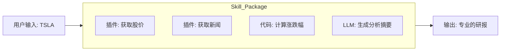

# Coze 零基础精通系列 12：Skill Store (技能市场) —— 站在巨人的肩膀上

> **上一篇回顾**：通过 Vibe Coding，体验了极速开发的快感。
> **本篇目标**：介绍 **Coze 2.0** 的另一个核心特性 —— **Skill Store (技能市场)**。学会如何“买”他人的能力，以及如何“卖”自身的能力。

---

## 1. 什么是 Skill Store？

在 Coze 1.0 时代，如果想要通过 API 获取实时的美股数据，往往需自行寻找插件、配置鉴权、调试参数。
在 **Coze 2.0**，可以直接去 **Skill Store** 搜索“美股助手”。

会发现一个现成的 **Skill**（技能包），里面可能已经封装好了：
1.  **Workflows**：自动查询开盘价、收盘价、PE 的工作流。
2.  **Plugins**：配置好的 Yahoo Finance 接口。
3.  **Prompts**：专门用于解读财报的提示词模板。

只需点击 **“Add to Agent”**，Agent 瞬间就成了华尔街精英。

> 💡 **Skill vs Plugin**：
> *   **Plugin (插件)**：是原材料，比如“一个个 API 接口”。
> *   **Skill (技能)**：是半成品菜，比如“用 API 查完数据并画出 K 线图”的完整逻辑。

## 2. 核心原理：Skill 的封装

为什么 Skill 比单纯的 Plugin 好用？因为 Skill 包含了 **逻辑 (Logic)**。

一个典型的 Skill 结构：

当在商店里购买这个 Skill 时，买到的不是一个死的工具，而是一套 **专家的思维方式**。

## 3. 实战：上架 Skill

假设写了一个非常棒的 `News_Digest` (新闻早报) 工作流，想把它分享给他人，甚至赚取收益。

### 第一步：封装 Workflow
1.  打开 `news_digest` 工作流。
2.  点击右上角的 **“封装为 Skill”**。
3.  填写 Input 描述（如：`query` - 用户想看的新闻关键词）。
4.  填写 Output 描述（如：`report` - 生成的 Markdown 报表）。

### 第二步：上架商店
1.  进入 **Skill Store** 页面。
2.  点击 **“Create Skill”**。
3.  导入刚才封装好的 Workflow。
4.  填写介绍：
    > “这可能是全网最快的新闻早报插件，支持自动去重、自动翻译、自动配图。”
5.  **设定价格**（可选）：可设置为免费，或者按次收费（若集成了昂贵的 API）。

### 第三步：被他人调用
一旦通过审核，全球的 Coze 开发者都可以在其 Agent 里搜到 Skill。
当其 Agent 调用 Skill 时，能在后台看到调用日志（和收入）。

## 4. 进阶玩法：Skill 组合拳

真正的魔法在于 **组合**。
可以创建一个 **Super Agent**，只装配 Skill，不写一行 Prompt。

*   装配 `Skill A`: **深度搜索** (负责找资料)
*   装配 `Skill B`: **爆款文案** (负责改写)
*   装配 `Skill C`: **小红书排版** (负责美化)

Agent 的逻辑就是：
`Input -> A -> B -> C -> Output`

这就是 **“积木式开发”** 的终极形态。

---

## 总结
*   **Vibe Coding** 让开发变快。
*   **Skill Store** 让能力变强。

在 Coze 2.0 的生态里，无需重复造轮子。
遇到难题，先去商店搜一搜，也许已经有人造好了轮子，只需要几块钱就能买来用。

下一篇，将进入企业级应用领域，看看如何把 Coze Agent 接入到 **飞书办公套件** 中，打造真正的 **Agent Office**。
