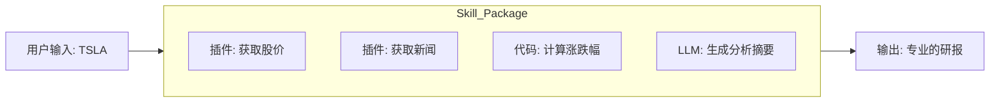

# Coze 零基础精通系列 12：Skill Store (技能市场) —— 站在巨人的肩膀上

> **上一篇回顾**：通过 Vibe Coding，体验了极速开发的快感。
> **本篇目标**：介绍 **Coze 2.0** 的另一个核心特性 —— **Skill Store (技能市场)**。学会如何“买”他人的能力，以及如何“卖”自身的能力。

---

## 1. 什么是 Skill Store？

在 Coze 1.0 时代，如果想要通过 API 获取实时的美股数据，往往需自行寻找插件、配置鉴权、调试参数。
在 **Coze 2.0**，可以直接去 **Skill Store** 搜索“美股助手”。

会发现一个现成的 **Skill**（技能包），里面可能已经封装好了：
1.  **Workflows**：自动查询开盘价、收盘价、PE 的工作流。
2.  **Plugins**：配置好的 Yahoo Finance 接口。
3.  **Prompts**：专门用于解读财报的提示词模板。

只需点击 **“Add to Agent”**，Agent 瞬间就成了华尔街精英。

> 💡 **Skill vs Plugin**：
> *   **Plugin (插件)**：是原材料，比如“一个个 API 接口”。
> *   **Skill (技能)**：是半成品菜，比如“用 API 查完数据并画出 K 线图”的完整逻辑。

## 2. 核心原理：Skill 的封装

为什么 Skill 比单纯的 Plugin 好用？因为 Skill 包含了 **逻辑 (Logic)**。

一个典型的 Skill 结构：

当在商店里购买这个 Skill 时，买到的不是一个死的工具，而是一套 **专家的思维方式**。

## 3. 实战：创建与上架 Skill

在 Coze 2.0 中，创建 Skill 不再需要从头开始。既可用 **Vibe Coding** 一句话生成，亦可将现有的 Workflow 封装。

### 3.1 方式一：Vibe Coding 自动生成 (实战 A股分析)

正如前面的逻辑图所示，本例将构建一个 **“A股分析 Skill”**。

1.  **切换到 Skill 视图**：在 Coze IDE 顶部标签栏选择 **Skill**。
2.  **输入 Prompt**：
    > “我想实现一个A股分析的技能。输入股票代码（如 600519），先获取腾讯财经的实时价格，再获取雪球网的最近 5 条热评，最后分析当前的情绪是看多还是看空。”
3.  **自动构建**：
    Coze 会自动识别意图，从商店里检索所需的 `Get_Stock_Price` 和 `Get_Comments` 工具，并自动配置参数。
    *   *Input*: `stock_code`
    *   *Logic*: 价格查询 -> 评论获取 -> LLM 情感分析
    *   *Output*: 分析结论
4.  **预览调试**：在右侧输入股票代码测试。注意：在 IDE 模式下，修改代码后需要点击右上角的 **“部署” (Deploy)** 按钮使新代码生效，然后才能进行测试。

### 3.2 方式二：手动封装 Workflow
若已构建复杂的 `News_Digest` (新闻早报) 工作流，亦可将其转化为 Skill。

1.  打开工作流，点击右上角的 **“封装为 Skill”**。
2.  填写 Input/Output 描述。

### 3.3 上架到 Skill Store
无论是 AI 生成的还是手动封装的，都可以上架赚钱。

1.  进入 **Skill Store** 页面，点击 **“Create Skill”**。
2.  填写介绍：
    > “这可能是全网最快的新闻早报插件，支持自动去重、自动翻译、自动配图。”
3.  **设定价格**（可选）：设置免费或付费使用（比如 0.1 元/次）。
4.  **收益**：一旦审核通过，全球开发者均可搜索并集成该 Skill。

## 4. 进阶玩法：Skill 组合拳

真正的魔法在于 **组合**。
可以创建一个 **Super Agent**，只装配 Skill，不写一行 Prompt。

*   装配 `Skill A`: **深度搜索** (负责找资料)
*   装配 `Skill B`: **爆款文案** (负责改写)
*   装配 `Skill C`: **小红书排版** (负责美化)

Agent 的逻辑就是：
`Input -> A -> B -> C -> Output`

这就是 **“积木式开发”** 的终极形态。

---

## 总结
*   **Vibe Coding** 让开发变快。
*   **Skill Store** 让能力变强。

在 Coze 2.0 的生态里，无需重复造轮子。
遇到难题，先去商店搜一搜，也许已经有人造好了轮子，只需要几块钱就能买来用。

下一篇，将进入企业级应用领域，看看如何把 Coze Agent 接入到 **飞书办公套件** 中，打造真正的 **Agent Office**。
