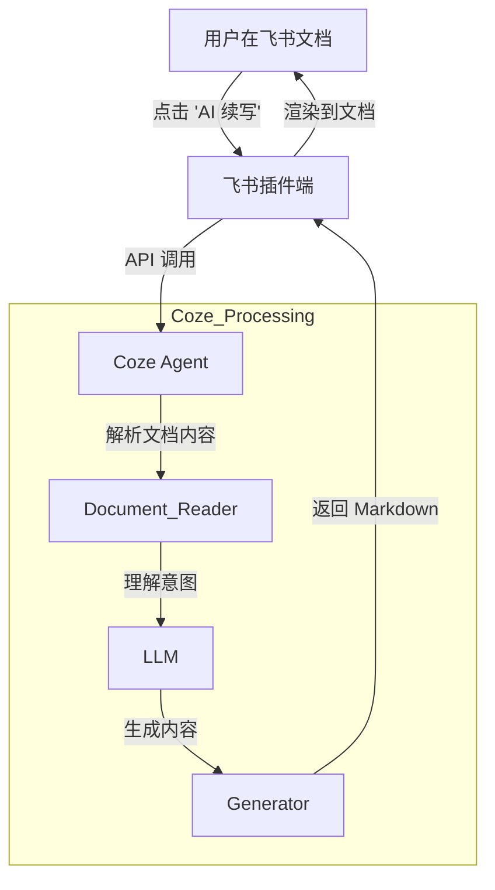

# Coze 零基础精通系列 13：企业级集成 —— Agent Office 与办公自动化

> **上一篇回顾**：已掌握 Skill Store 的交易逻辑。
> **本篇目标**：将视野放大到企业级应用。如何使 Agent 不仅仅是陪聊工具，而是真正协助在 **Word、Excel、PPT** 中工作。

---

## 1. 什么是 Agent Office？

在 Coze 2.0 发布会上，备受关注的功能莫过于 **Agent Office**（智能办公助手）。
它不再是一个独立的聊天窗口，而是直接嵌入到了办公软件中。

**场景举例**：
*   **Word 中**：编写标题“季度总结”后，Agent 自动协助补全剩余内容，并插入数据图表。
*   **Excel 中**：提供杂乱的财务表，指令“标记亏损项目并计算总亏损额”，Agent 自动编写公式完成。
*   **PPT 中**：指令“根据此 Word 文档生成 10 页 PPT”，Agent 自动完成排版与配图。

这不是科幻，这是 Coze 2.0 与飞书/字节办公套件深度集成后的能力。

## 2. 核心原理：Embedded Agent (嵌入式智能体)

实现该功能需要用到 Coze 的 **On-Premise (私有化部署)** 或 **SaaS 集成** 能力。

关键在于：**上下文 (Context) 的无缝传递**。
Agent 不仅读取 Prompt，还读取当前光标所在的文档内容。

## 3. 实战：打造一个“合同审核助手”

**需求**：销售经常在飞书发送合同草稿，需要法务 AI 自动审核风险。

### 第一步：创建 Agent
1.  在 Coze 创建 Agent `Law_Reviewer`。
2.  上传知识库：`公司法务合规手册.pdf`, `风险条款清单.xlsx`。
3.  Prompt：
    > “角色设定：严谨的法务。接收用户发送的合同文本，根据知识库逐条审查。重点标注：赔偿金额过高、管辖法院非本地等风险。”

### 第二步：配置发布渠道
1.  在发布页面，选择 **“飞书 (Feishu)”**。
2.  配置权限：允许读取 **云文档 (Docs)** 权限。
3.  发布。

### 第三步：在飞书中使用
1.  打开一份合同文档。
2.  选中全文。
3.  点击浮动菜单栏的 **“Ask AI”**。
4.  选择已发布的 `Law_Reviewer`。
5.  点击运行。

**结果**：Agent 会在文档右侧的批注栏里生成修改建议。点击“采纳”，文档自动修改。

## 4. 进阶：API 集成到自研系统

如果企业未使用飞书，而是自研 OA 系统，解决方案如下：
**Coze API** 是通用的。

需开发一个简单的中间件：
1.  **Frontend**：在 OA 的富文本编辑器中增加“AI 润色”按钮。
2.  **Backend**：
    *   按钮点击时，打包编辑器内的文本。
    *   调用 `POST https://api.coze.cn/v3/chat`。
    *   将 `query` 设置为编辑器文本。
    *   将 `bot_id` 设置为 Coze Agent ID。
3.  **Callback**：收到 API 返回的 JSON 后，替换编辑器里的文本。

只需几行代码，旧 OA 系统即可拥有 GPT-4 的能力。

---

## 5. 总结

从最简单的对话，讲到了工作流、数据库、代码节点、Vibe Coding，最后到了企业级集成。
Coze 2.0 极大降低了 AI 门槛，同时提升了应用上限。

**给开发者的建议**：
*   **不要迷信 Prompt**：Prompt 只是起点，Workflow 才是护城河。
*   **不要重复造轮子**：多逛 Skill Store。
*   **保持好奇心**：AI 原生应用 (AI-Native Apps) 的形态还在爆发期。

掌握企业级集成后，Bot 功能已非常强大。除了“好用”，是否还能让其变得更“好看”？

下文预告：**第 14 篇 Coze Cards**，介绍如何用可视化卡片打造 App 级的交互体验。
