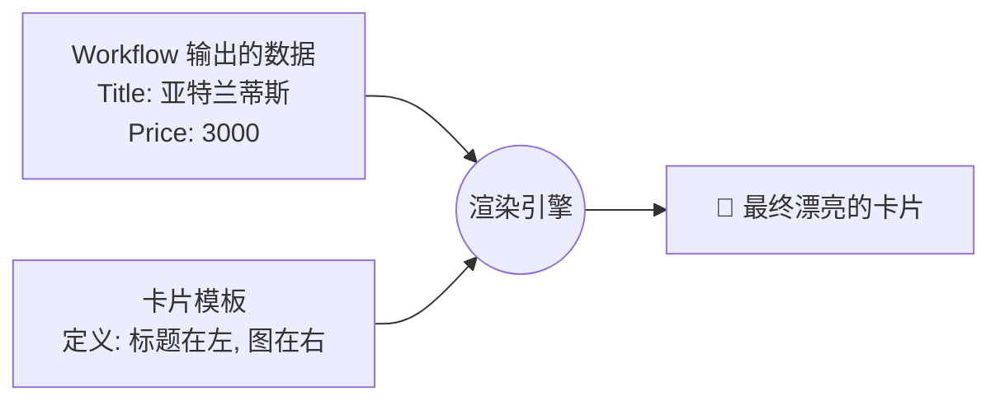

# Coze 零基础精通系列 14：Coze Cards (交互卡片) —— 拒绝纯文本，颜值即正义

> **上一篇回顾**：Bot 已成功集成至飞书或企业系统。
> **本篇目标**：纯文本回复在体验时代略显单薄。本篇介绍如何使用 **Coze Cards** 打造图文并茂、支持点击的 **交互式卡片**。

---

## 1. 为什么需要 Coze Cards？

设想一个“旅游助手 Bot”场景，用户询问：“推荐几个三亚的酒店”。

*   **普通 Bot (纯文本)**：
    > 1. 三亚亚特兰蒂斯，价格3000元，地址...
    > 2. 三亚希尔顿，价格1500元，地址...
    > (阅读成本高，难以激发购买欲)

*   **高级 Bot (Coze Cards)**：
    直接展示一张 **“酒店推荐卡片”**：
    *   左侧为高清海景图 🏖️。
    *   右侧显示大号粗体价格 **¥1500**。
    *   底部设有蓝色的 **[立即预订]** 按钮，点击即可跳转携程。

**结论**：在 AI 时代，**信息展示维度**直接影响用户留存。Coze Cards 能将 Bot 从单纯的“命令行工具”升级为具备现代交互体验的应用。

---

## 2. 核心原理：JSON 驱动的 UI

无需掌握 CSS 或前端布局知识。
Coze 提供 **可视化卡片编辑器**，其底层逻辑为：**数据 (JSON) + 模板 (Template) = 卡片 (Rendered UI)**。



## 3. 实战：制作一张“个人名片”

从基础入手。假设 Bot 需在自我介绍时发送电子名片。

### 第一步：进入编辑器
1.  进入 Coze 编排界面的 **“资源”** (Assets) 或 **“卡片”** (Cards) 区域。
2.  点击 `+ 创建卡片`。
3.  界面操作类似于 PPT 拖拽。

### 第二步：拖拽布局
1.  **容器**：拖入一个“横向容器”。
2.  **图片**：左侧拖入 `Image` 组件，设置圆角（作为头像）。
3.  **文本**：右侧拖入两个 `Text` 组件。
    *   第一个字号调大，加粗（显示姓名）。
    *   第二个字号调小，灰色（显示职位/签名）。
4.  **按钮**：底部拖入 `Button`，文字设为“加我微信”。

### 第三步：绑定变量
*   选中姓名文本框，在右侧属性的“内容”栏选择 **绑定变量**，命名为 `name`。
*   选中头像，将变量命名为 `avatar_url`。

### 第四步：在 Bot 中发送卡片
**调用方式**：在 **Prompt** 或 **工作流** 中引用卡片。

**Prompt 调用示例**：
> "当收到‘你是谁’询问时，返回 `Template_ID=卡片ID`，并填充以下数据：
> name='超级助手', avatar_url='https://xxx.jpg'..."

---

## 4. 进阶实战：工作流中的动态卡片 (Dynamic Binding)

静态名片仅是基础，核心威力在于**工作流**产生的动态数据。
**场景**：搜索“今日推荐新闻”，Bot 返回 **新闻轮播卡片**。

### 1. 准备数据源
`search_news` 工作流输出一个数组：
```json
[
  {"title": "DeepSeek 发布新模型", "img": "url1", "link": "url2"},
  {"title": "SpaceX 发射成功", "img": "url3", "link": "url4"}
]
```

### 2. 设计列表模版
1.  在卡片编辑器中，拖入 **“循环列表” (Loop Container)**。
2.  在循环项内，设计单行新闻样式（左图右文）。

### 3. 数据对接
1.  定位至工作流的 **结束节点 (End Node)**。
2.  将输出类型 (Reply Type) 改为 **Custom Card (自定义卡片)**。
3.  选择已绘制的“新闻列表模版”。
4.  **关键步骤**：将工作流获取的 `news_list` 变量连接至卡片的 `data_source`。

**效果**：
卡片将根据数据量自动生成列表，提供流畅的用户体验。

---

## 5. 交互：让卡片“活”起来

卡片支持交互。按钮可设置 **交互事件 (Action)**：

1.  **跳转链接 (Open URL)**：点击“阅读原文”跳转至浏览器。
2.  **回传消息 (API Callback)**：功能强大。
    *   例如设置按钮为 **“点赞”**。
    *   点击后后台自动发送 `/like_news_id_123` 至 Bot。
    *   Bot 接收后触发后续工作流记录偏好。
    *   **全程无需手动输入。**

---

## 6. 技术约束与避坑 (Technical Constraints)

卡片虽然强大，但也有物理极限。

| 维度 | 限制/建议 | 后果 |
| :--- | :--- | :--- |
| **JSON 大小** | 建议 < 30KB | 过大会导致即时通讯软件（飞书/微信）发送失败。 |
| **图片资源** | 必须使用 CDN 链接 | 不支持 Base64。建议压缩图片，否则卡片加载会“转圈”。 |
| **平台差异** | 飞书 vs 微信 | 某些高级组件（如 Markdown 表格）在飞书支持良好，但在微信可能降级为文本。**务必真机测试。** |
| **层级嵌套** | 建议 < 4 层 | 过深的容器嵌套会导致渲染性能下降。 |

---

## 6. 总结

**Coze Cards** 是区分“玩具 Bot”和“产品级 Bot”的分水岭。

*   **视觉**：吸引眼球，提升专业度。
*   **结构**：将非结构化文本转化为结构化信息块。
*   **交互**：将“对话”转化为“操作”，显著缩短用户路径。

**建议**：尝试使用 Card 升级现有 Bot，转化率往往会有质的飞跃。

---

> **小结**：
> 掌握了内核（逻辑与数据）与外表（UI与交互）后，Bot 的表现已非常出色。
> 但这是否足够？如何确保 Bot 在面对千奇百怪的用户提问时不出错？这需要**运维与评测**。
>
> 敬请期待下一篇：**第 15 篇 扣子罗盘 (Compass)**，介绍如何科学地评测与优化 Agent。
