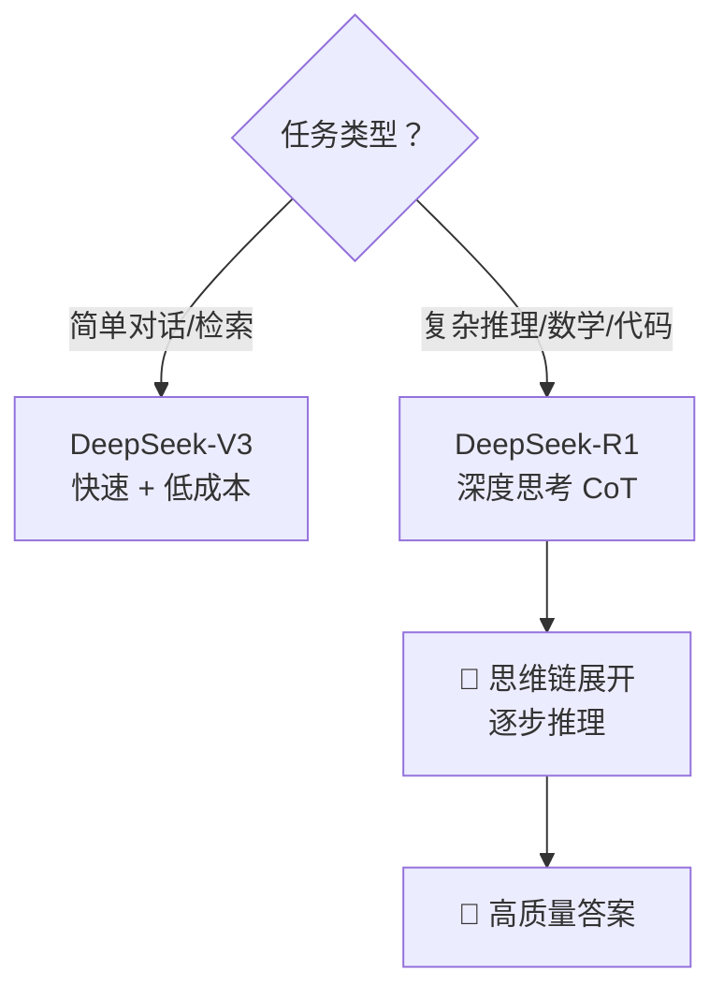

# Coze 零基础精通系列 17：DeepSeek 满血版 —— 深度思考模型的应用指南

> **上一篇回顾**：已掌握 Python SDK 的硬核开发。
> **本篇目标**：解锁 Coze 平台上的最强战力 —— **DeepSeek-R1 (满血版)**。探讨如何利用其“深度思考”能力，构建更聪明的 Agent。

---

## 1. 为什么它是游戏规则改变者？

在 Coze 上，以往习惯了 GPT-4o 的全能与 Claude 的灵动。但 **DeepSeek-R1** 的加入，带来了一个全新的维度：**推理 (Reasoning)**。

它不只是“回答”问题，而是先“思考”问题。
它在输出答案前，会先产生一段 `Thinking Process`（思维链）。

**核心优势**：
1.  **逻辑推演**：处理数学、代码、复杂逻辑任务时，准确率显著提升。
2.  **自我纠错**：在思考过程中，它会反思“这样做对吗？”，并自动调整通过。
3.  **性价比**：在 Coze 平台上，DeepSeek 系列通常拥有极高的调用限额（甚至免费，视具体政策而定）。

---

## 2. 在 Coze 中启用 DeepSeek

目前 Coze 平台已全面接入 DeepSeek 系列模型。

### 2.1 模型选择建议
*   **DeepSeek-R1 (Reasoning)**：
    *   **适用场景**：写复杂代码、解数学题、长篇逻辑分析、Agent 的“大脑”决策节点。
    *   **特点**：慢，但深。输出包含思考过程。
*   **DeepSeek-V3 (General)**：
    *   **适用场景**：日常对话、文本润色、简单翻译、快速问答。
    *   **特点**：快，且强。对标 GPT-4o，但速度极快。

### 2.2 配置方法
1.  **Bot 全局配置**：在 Bot 编排页面的左侧“模型设置”中，直接选择 `DeepSeek-R1`。
2.  **Workflow 节点配置**：
    *   这是高阶玩法。可以在工作流中混用模型。
    *   **决策节点 (LLM Node)**：选用 `DeepSeek-R1`，负责制定计划。
    *   **执行节点 (LLM Node)**：选用 `DeepSeek-V3` 或 `GPT-4o mini`，负责把计划通过邮件发出去（省钱且快）。

---

## 3. R1 专用 Prompt 技巧（重要！）

**DeepSeek-R1 不需要复杂的 Prompt。**

以前为了让 AI 变聪明，会写：
> “请一步步思考 (Let's think step by step)...”
> “你是一个资深专家，你需要...”
> “请按照以下 COT 格式输出...”
> “如果不确定，请反思...”

**现在，这些通通可以删掉！**
R1 自带思维链。如果再强制它遵循 COT (Chain of Thought)，反而会干扰它的原生思考，导致效果下降。

**最佳实践**：
*   **直接提问**：清晰描述任务即可。
*   **给足上下文**：把背景资料给它，剩下的交给它的“大脑”。
*   **避免过度约束**：不要限制它的思考方式，只限制它的输出格式（例如：最后只输出 JSON）。

---

## 4. 实战案例：构建“深度代码审计” Agent

来做一个专门找 Bug 的 Agent。

### 传统模式 (GPT-4o)
Prompt: "帮我检查这段代码的 Bug。"
结果：它可能会一眼看出明显的语法错误，但复杂的逻辑漏洞（如并发死锁、内存泄露）往往被忽略。

### 深度模式 (DeepSeek-R1)
**步骤**：
1.  创建一个 Workflow。
2.  **输入节点**：接收代码字符串。
3.  **LLM 节点 (审计员)**：
    *   模型：`DeepSeek-R1`
    *   Prompt：`请深度分析这段代码的潜在逻辑漏洞，尤其是并发安全方面。`
4.  **LLM 节点 (修复员)**：
    *   模型：`DeepSeek-V3` (速度快)
    *   Prompt：`根据审计员的建议，重写可执行的代码。`

**效果**：
R1 会输出长长的思考过程：
> *Wait, user wants to check for bugs. Let me look at the locking mechanism. The `mutex` is acquired here but... wait, if `do_something()` throws an exception, the lock isn't released. This is a potential deadlock. I need to suggest using `try-finally` or `std::lock_guard`.*

这种“自言自语”的纠错能力，是传统模型不具备的。

---

## 5. 常见坑点与解决方案

### 坑点 1：回复太慢
**现象**：R1 思考需要时间，用户等得不耐烦。
**解法**：开启 **“流式输出” (Streaming)**。在 Coze 中默认开启。让用户看到它“正在思考...”，反而能增加信任感（“看，它真的在动脑子”）。

### 坑点 2：输出格式混乱
**现象**：R1 可能会把 `<think>...</think>` 标签里的内容也混在最终答案里。
**解法**：
1.  Coze 系统层面通常会过滤 `<think>` 标签。
2.  如果在 Workflow 中使用，建议在后接一个简单的 **Code Node (Python)** 或 **LLM Node (Formatter)**，专门用来提取最终答案，去掉无关的思考杂音。

---

## 总结

DeepSeek-R1 的出现，让 Coze 的上限被再次拔高。
*   以前的 Bot 像是一个**熟练工**。
*   接入 R1 的 Bot 像是一个**工程师**。

善用 **R1 (思考)** + **V3 (执行)** 的组合拳，Agent 的能力会明显提升。

> **下集预告**：系列完结？不，AI 进化太快。后续将不定期更新 **DeepSeek 进阶实战** 和 **Coze 3.0** 的最新情报！
