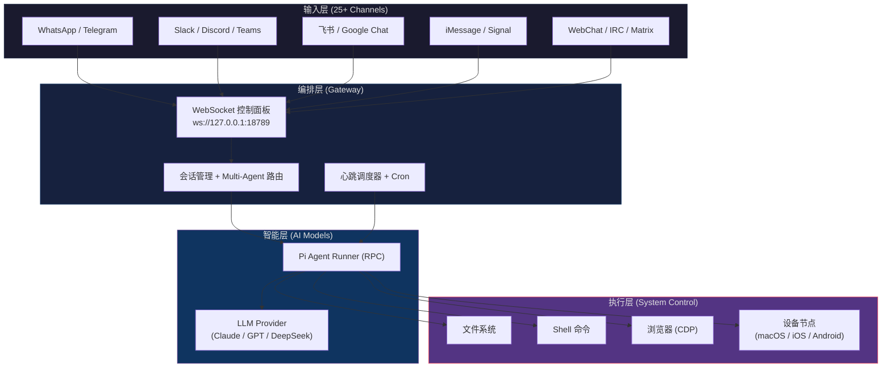
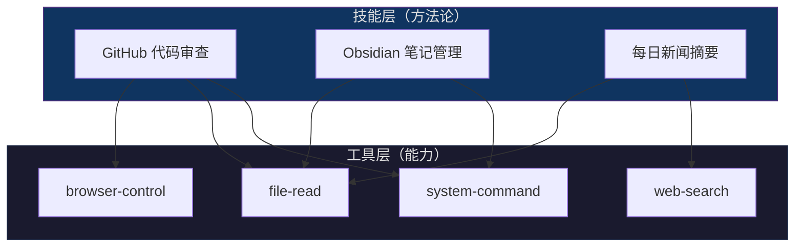
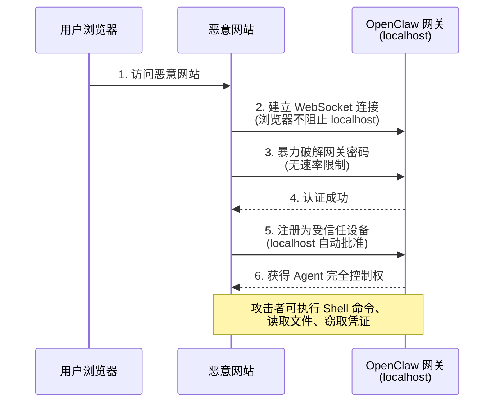

# Coze 零基础精通系列 18：OpenClaw —— 一键部署你的自主 AI 助理

> **环境：** 扣子编程（个人高阶版及以上）、飞书开发者平台

能聊天的 AI 助手到处都是，能打开终端跑命令、处理邮件、管理日历的不多。OpenClaw 属于后者。Coze 把原本需要自建服务器、手动配置的部署流程，简化成了点一下"复制"。

---

## 1. OpenClaw 是什么🦞

OpenClaw（曾用名 Clawdbot / Moltbot，吉祥物是一只太空龙虾 🦞）是一个开源的自主 AI Agent，2025 年底由 Peter Steinberger 发布。上线一周 GitHub Star 破 10 万，截至 2026 年 3 月有 1,060 位贡献者。2026 年初创建者加入 OpenAI，项目移交给独立的开源基金会。

跟 ChatGPT、Kimi 这类对话型 AI 不同，OpenClaw 的定位是**执行型代理（Agentic AI）**——不是回答"怎么做"，而是直接动手：执行 Shell 命令、读写文件、操作浏览器、调用 API、收发邮件。它没有自己的界面，"寄生"在已有的消息平台上——WhatsApp、Telegram、Slack、Discord、飞书、iMessage、Signal 等 25+ 个渠道。

### 1.1 核心架构

OpenClaw 采用 Hub-and-Spoke 架构，分成四层：



几个值得注意的设计点：

- **模型无关**。底层 LLM 随时可切——Claude、GPT-4o、DeepSeek-R1、火山方舟的 Doubao，通过 API Key 接入。支持 model failover，主模型挂了自动切备用。
- **心跳调度器（Heartbeat + Cron）**。OpenClaw 不只是被动等指令，还能按设定间隔主动"醒来"执行任务，也支持 Cron 表达式和 Webhook 触发。
- **Multi-Agent 路由**。一个 Gateway 管理多个隔离的 Agent 实例，不同渠道/账号的消息路由到不同 Agent workspace，互不干扰。
- **本地优先 + 注入式配置**。核心配置就是几个 Markdown 文件：`SOUL.md`（人格定义）、`AGENTS.md`（行为指令）、`TOOLS.md`（工具说明）、`USER.md`（用户偏好）。对话记录也存本地磁盘，数据主权在自己手上。
- **Skill 扩展**。功能通过可执行的代码包（Skill）扩展，社区驱动，类似 VSCode 插件。
- **多模态输入**。支持语音唤醒（Voice Wake）和持续语音对话（Talk Mode），macOS/iOS/Android 都能用。Live Canvas 是可视化工作空间，Agent 可以在上面直接渲染 UI。

### 1.2 OpenClaw vs 传统 Chatbot

|  | 传统 Chatbot | OpenClaw |
|---|---|---|
| 交互方式 | 问答式对话 | 自主任务执行 |
| 系统控制 | 无 | Shell、文件、浏览器（CDP）、设备节点 |
| 渠道覆盖 | 通常 1-2 个平台 | 25+ 渠道统一收件箱 |
| 主动性 | 被动响应 | Heartbeat + Cron + Webhook |
| 数据存储 | 云端 | 本地 Markdown 文件 |
| 模型绑定 | 通常绑定某厂商 | 模型无关 + failover |
| 多模态 | 文本为主 | 文本 + 语音唤醒 + Canvas 可视化 |
| 扩展方式 | 有限的插件系统 | Skill 代码包（MIT 开源） |

### 1.3 谁该用 OpenClaw

在决定是否部署之前，先判断它是否匹配你的场景：

| 适合 | 不适合 |
|---|---|
| 需要跨平台统一收件箱（飞书 + Slack + 邮件 + Telegram 等消息散落在各处） | 只需要一个简单的 FAQ 客服机器人 |
| 需要系统级操作——自动化运维、批量文件处理、定时任务、浏览器抓取 | 面向终端用户的大规模并发服务（OpenClaw 是单用户/小团队工具，不是 SaaS 后端） |
| 个人效率提升——邮件分拣、日程管理、信息聚合、代码审查 | 高合规环境（金融/医疗），Agent 的权限模型和审计能力尚不成熟 |
| 开发者或技术团队的自动化工作流（CI/CD 辅助、日志分析、告警处理） | 对安全零容忍的团队——ClawJacked 漏洞说明生态仍有风险（详见第 4 节） |
| 在意本地数据主权——对话记录和配置文件全部留在本地，不上传云端 | 不愿持续投入积分/Token 的场景——Agent 7×24 在线 + 心跳调度会持续消耗 |

举几个实际用法：

- **独立开发者的"第二大脑"**。接入飞书或 Telegram，让它帮你盯 GitHub PR、扫邮件、整理待办。不用切换十个 App，信息汇到一个对话窗口。
- **小团队的运维助手**。Cron + Shell，定时检查服务器状态、拉日志摘要、群里播报异常。省掉写脚本和配告警通道的活。
- **内容创作者的效率工具**。配合搜索 Skill 和文件读写，收集素材、整理大纲、管理发布排期。

如果你的需求不在这些场景里，普通的 Coze Bot（对话型）可能更轻量、也更安全。

---

## 2. Coze 一键部署：零服务器上手

> 💡 本节内容可配合 [Coze 官方部署教程](https://docs.coze.cn/tutorial/openclaw) 一起阅读，官方文档对每一步都有详细说明，这里侧重补充实操中的注意事项。

原生部署 OpenClaw 需要一台服务器（或本地设备），装 Node.js、配 LLM API Key、手动对接消息渠道。对非技术用户来说，光环境搭建就够折腾半天。

Coze 一键部署把这些全包了——项目跑在扣子编程的沙箱里，不需要服务器，不需要配环境，API Key 存在沙箱中不暴露。

### 2.1 前提条件

- **扣子版本**：个人高阶版、旗舰版，或企业标准版、旗舰版。免费版无法使用。
- **项目配额**：每个账号最多 2 个 OpenClaw 项目。
- **积分消耗**：运行过程中会消耗扣子编程积分（大模型 Token 费用）。
- **订阅建议**：强烈建议开通 Coding Plan（编程套餐）。OpenClaw 7×24 在线 + 心跳调度会持续消耗 Token，按量付费的积分很快就会烧完。Coding Plan 提供更高的调用配额，性价比远高于按次扣积分。

### 2.2 部署步骤

整个过程大约 5 分钟：

**第一步：复制项目**

打开 [扣子编程](https://code.coze.cn/)，在首页的"优质案例"区找到 **OpenClaw 助手**，点击**创建副本**。系统会把完整项目导入到个人空间。


**第二步：预览测试**

复制完成后进入项目。左侧是代码/配置面板，右侧是对话窗口。发一句"你好"测试——OpenClaw 正常回复就说明沙箱环境没问题。


**第三步：部署上线**

点击右上角的"部署"按钮。这一步很重要：部署后沙箱才会持续保活。不点部署的话，沙箱空闲一段时间就会被回收，OpenClaw 就断线了。扣子默认是部署完成状态，也支持取消部署。


部署成功后，OpenClaw 进入 7×24 在线状态。

如果不再需要助理在线，点击右上角的红色图标即可取消部署。取消后沙箱不会立即释放，但后续空闲时会被回收，对话可能随时中断。

遇到对话无响应或提示网关中断（通常是沙箱连接超时），直接**刷新浏览器页面**即可，系统会自动重连并恢复对话。

### 2.3 对接飞书（以飞书为例）

部署完成后，OpenClaw 本身已经在运行了，但还没有对外的沟通渠道。以飞书为例，需要做四件事：


1. **创建飞书应用**：登录 [飞书开放平台](https://open.feishu.cn/app)，创建企业自建应用，记录 `App ID` 和 `App Secret`。


2. **开启机器人能力**：在应用管理页，添加"机器人"能力。


3. **配置权限**：进入权限管理，批量导入所需的权限范围（scopes），包括消息读取、发送、群组管理等。
   

在导入页签中，将如下权限替换原有示例，单击下一步，确认新增权限按钮
```text
{
  "scopes": {
    "tenant": [
      "im:chat:read",
      "im:chat:update",
      "im:message.group_at_msg:readonly",
      "im:message.p2p_msg:readonly",
      "im:message.pins:read",
      "im:message.pins:write_only",
      "im:message.reactions:read",
      "im:message.reactions:write_only",
      "im:message:readonly",
      "im:message:recall",
      "im:message:send_as_bot",
      "im:message:send_multi_users",
      "im:message:send_sys_msg",
      "im:message:update",
      "im:resource",
      "contact:contact.base:readonly"
    ],
    "user": [
      "contact:user.employee_id:readonly"
    ]
  }
}
```


4. **应用发布**：点击顶部创建版本


5. **绑定凭证**：回到扣子编程的 OpenClaw 对话窗口，直接跟它说：

```text
帮我配置飞书渠道
App ID：cli_xxxxxxxxxxxxx
App Secret：xxxxxxxxxxxxxxxxxx
```


OpenClaw 会自动完成渠道配置。最后在飞书端发起首条对话，按提示完成配对码确认。

**验证方式**：在飞书中搜索你的机器人名称，发送"你好"。收到 OpenClaw 的回复，说明部署成功。

> ⚠️ **安全提醒**：App Secret 会存储在扣子沙箱中，不会暴露给第三方。但仍建议定期轮换凭证，不要把生产环境的敏感信息长期交给任何 AI Agent。

6. **配置事件与回调**：在企业自建应用页签中，找到你创建的飞书开放应用：

   **事件配置**

   保存长链接事件配置：

   

   

   添加事件：

   

   若您期望将机器人添加到聊天群组中使用，需开通获取群组消息权限：

   

   

   **回调配置**

   

> ⚠️ **注意**：每次应用的变更都需要重新发布应用。

7. **审核**：待管理员通过发布审核后，即可正式在飞书中使用您的定制化私人 AI 助手。
---

## 3. Skill 与智能体：给 OpenClaw 装上"专业技能"

刚部署完的 OpenClaw 自带两个内置能力：**联网搜索**和**图片生成**。但更有意思的是 Skill 扩展机制。

### 3.1 Tool vs Skill

这两个概念容易混淆，但边界清晰：

- **Tool（工具）**：是 OpenClaw 的"器官"——`bash`（执行命令）、`read`/`write`/`edit`（文件操作）、`browser`（CDP 浏览器控制）、`canvas`（可视化渲染）、`cron`（定时任务）、`sessions`（跨 Agent 通信）。它决定 OpenClaw *能做什么*。
- **Skill（技能）**：是 OpenClaw 的"教科书"——告诉它 *如何组合* 这些工具完成特定任务。比如一个 "GitHub 代码审查" Skill 会教 OpenClaw 先用 `git diff` 获取变更、再用 LLM 分析代码质量、最后在 PR 页面留下评论。

Skill 在原生环境中分三层：

| 层级 | 说明 | 存放位置 |
|---|---|---|
| **bundled** | 内置技能，随 OpenClaw 发布 | 安装包内 |
| **managed** | 从 ClawHub 安装的社区技能 | `~/.openclaw/workspace/skills/` |
| **workspace** | 用户自定义技能 | 项目 workspace 目录 |

每个 Skill 的核心是一个 `SKILL.md` 文件——用 Markdown 写成的指令文档，告诉 Agent 在什么条件下、用哪些 Tool、按什么步骤完成任务。



### 3.2 安装 Skill

在 Coze 部署的 OpenClaw 中安装 Skill 很方便：

1. 从 ClawHub（OpenClaw 社区技能市场）或其他来源下载 Skill 包（`.zip` 格式）。
2. 把 `.zip` 文件直接**拖进左侧对话框**。
3. 扣子 AI 自动解压并完成安装、配置。

装完后跟 OpenClaw 说"列出当前已安装的 Skill"，确认新技能出现在列表中。

### 3.3 实战：用 Skill 组合打造个人助理

一个典型的个人助理配置：

| Skill | 作用 | 触发场景 |
|---|---|---|
| `daily-digest` | 每日新闻摘要 | 心跳调度，每天早 8 点 |
| `email-triage` | 邮件分类和摘要 | 收到新邮件时 |
| `calendar-manager` | 日历管理和提醒 | 被问到日程时 |
| `code-assistant` | 代码审查和生成 | 被发送代码片段时 |
| `google-workspace` | Google Docs/Sheets 操作 | 被要求处理文档时 |

配好后可以这样交互：

```text
你：帮我看看今天有什么重要邮件
OpenClaw：检查了 23 封未读邮件，其中 3 封需要关注：
1. [重要] 客户 A 的合同续签确认 — 需要今天回复
2. [一般] 周五团建投票 — 截止明天
3. [FYI] 本月服务器账单已出 — ¥2,340

你：帮我回复第一封，确认续签，附上上次的合同模板
OpenClaw：已找到上次合同模板 (contract_v2.docx)，已起草回复邮件，确认续签条款不变。是否发送？
```

### 3.4 切换底层模型

模型无关设计让你随时可以换 LLM。在扣子编程环境中，直接跟 OpenClaw 说：

```text
切换模型为 Doubao-pro-256k
```

也可以直接改项目配置里的模型参数。不同场景搭配不同模型：日常对话用 DeepSeek-V3 快，复杂推理上 DeepSeek-R1，写代码用 Claude Sonnet。

---

## 4. 安全分析：ClawJacked 漏洞与生态风险

能执行 Shell 命令的 Agent，安全风险天然就比聊天机器人高一个量级。2026 年 2 月，Oasis Security 披露了 **ClawJacked** 高危漏洞，把这个问题摆到了台面上。

### 4.1 ClawJacked 攻击链

漏洞的核心在于 OpenClaw 网关的 WebSocket 认证机制：



攻击分四步：

1. **绕过跨源策略**。浏览器默认不阻止指向 `localhost` 的 WebSocket 连接。用户访问任意恶意网站时，JavaScript 可悄悄连上本地的 OpenClaw 网关。
2. **暴力破解密码**。网关对来自 `localhost` 的连接缺乏速率限制，攻击者可以每秒尝试数百次密码组合，不会触发报警。
3. **自动信任配对**。密码破解后，网关自动批准 `localhost` 来源的设备配对请求，无需用户确认。
4. **完全控制 Agent**。攻击者获得与用户相同的权限——执行 Shell 命令、读取私有代码库、窃取 API Key 和消息平台凭证。

**影响评级**：高危。一次成功攻击等同于工作站完全失陷。

### 4.2 生态安全风险

ClawJacked 之外，生态层面也有问题：

- **ClawHub 恶意 Skill**。社区市场里发现过数千个恶意 Skill 包，伪装成加密工具或生产力插件，实际干的是信息窃取和后门植入。
- **凭证明文存储**。OpenClaw 默认把 LLM API Key、消息平台 Token 明文存在本地文件里，实例被访问就能直接提取。
- **其他漏洞**。2026 年初密集修复了 RCE、命令注入、SSRF、路径遍历等多个中高危漏洞。

### 4.3 OpenClaw 原生安全机制

OpenClaw 自己也在补安全课。GitHub 仓库的安全模型文档里有几层防线：

- **DM 访问控制**。公开入站 DM 默认关闭，需显式设置 `dmPolicy="open"` 并配置 `allowFrom` 白名单。`openclaw doctor` 命令可检查 DM 策略是否安全。
- **Docker 沙箱隔离**。设置 `agents.defaults.sandbox.mode: "non-main"` 后，非主会话（群组/渠道消息）会在独立的 Docker 容器中执行，bash 命令被隔离。
- **Tool 白名单/黑名单**。沙箱环境默认允许 `bash`、`read`、`write`、`edit`、`sessions_*` 等基础工具，但禁止 `browser`、`canvas`、`nodes`、`cron`、`discord`、`gateway` 等高权限工具。

### 4.4 防护策略

管 Agent 的安全不能套用管软件的思路——得把它当一个"新入职的员工"来管。

**必做四件事**：

1. **保持更新**。ClawJacked 已在 `2026.2.25` 版本修复。Coze 沙箱部署的好处是平台负责更新，比自建服务器少操心。
2. **最小权限原则**。只授予 OpenClaw 完成任务所必需的权限，撤销所有非必要的凭证和 Skill。自建环境中，利用 tool allowlist/denylist 精细控制。
3. **凭证定期轮换**。不把长期有效的生产密钥交给 Agent，使用短期 Token 或 OAuth 授权。
4. **Skill 来源审查**。只安装官方或可信来源的 Skill，安装前检查 `SKILL.md` 内容。ClawHub 已出现过大量恶意包，不要盲信社区。

> 微软的安全建议更为激进：将 OpenClaw 视为不可信代码执行环境，部署在完全隔离的虚拟机中，使用非特权凭据，实施持续监控。这对个人用户可能过于严苛，但在企业场景下值得认真考虑。

---

## 常见坑点

**坑点 1：沙箱被回收，OpenClaw 离线了**

现象：部署几小时后，飞书端发消息没有回复。

原因：忘了点击"部署"按钮。仅在预览模式下运行的沙箱会因空闲被回收。

解法：进入扣子编程，点击右上角"部署"，确认沙箱进入持续保活状态。

**坑点 2：安装 Skill 后没生效**

现象：上传了 `.zip` 技能包，但 OpenClaw 说找不到对应技能。

原因：部分 Skill 包的目录结构不规范，或者压缩时多嵌套了一层目录。

解法：先解压检查目录结构，确保根目录直接包含 `SKILL.md`（OpenClaw 原生格式）或 `skill.json`（Coze 兼容格式），重新压缩后上传。

**坑点 3：积分消耗超预期**

现象：刚部署一天，积分消耗已达平时的数倍。

原因：心跳调度器默认间隔可能过短（如每 5 分钟一次），每次心跳都会触发 LLM 推理调用。

解法：在配置中调大心跳间隔，或在非工作时间关闭心跳。日常对话也优先使用轻量模型（DeepSeek-V3）而非推理模型（DeepSeek-R1）。如果你打算长期运行 OpenClaw，最根本的方案是开通 Coding Plan（编程套餐）——按量扣积分的模式根本扛不住 Agent 的持续 Token 消耗。

---

## 延伸思考

OpenClaw 和 Coze 的组合指向一个方向：**AI Agent 正从"能聊"走向"能干活"**。

但随之而来的问题是：当 Agent 真的能在你的系统上跑 Shell、操控浏览器、发邮件时，**认证和授权的粒度该细到什么程度**？

网关密码 + 设备信任这套方案，ClawJacked 已经证明不够用。OAuth 2.0 的 scope 机制也不是给 Agent 设计的——它假设每个 scope 背后有一个明确的"人类意图"，但 Agent 的行为链条会跨越多个 scope，组合出人类没预料到的操作序列。

Agent 的权限模型可能需要换个思路——不是基于"能不能做"，而是基于"在什么上下文下做"。这个问题目前没有好的答案，但如果你打算长期用自主 Agent，值得想清楚。

---

## 总结

- OpenClaw 是开源的自主 AI Agent，核心能力是系统级操控（Shell、文件、网络），不是聊天机器人
- Coze 一键部署省去服务器和环境配置，项目复制 → 部署 → 渠道绑定，5 分钟上线
- Skill 是扩展能力的主要方式，安装简单（拖入 `.zip`），但务必审查来源
- ClawJacked 漏洞的教训：自主 Agent 的安全模型还不成熟，最小权限、定期轮换、隔离运行是当前阶段的基本原则

---

## 参考

- [OpenClaw GitHub 仓库](https://github.com/openclaw/openclaw)
- [OpenClaw 官方文档](https://docs.openclaw.ai)
- [Coze OpenClaw 部署教程](https://docs.coze.cn/tutorial/openclaw)
- [ClawJacked 漏洞分析 — Oasis Security](https://oasis.security)
- [OpenClaw Architecture Deep Dive — Towards AI](https://towardsai.net)
- [OpenClaw Security Model](https://docs.openclaw.ai/gateway/security)
- [OpenClaw Wikipedia](https://en.wikipedia.org/wiki/OpenClaw)
