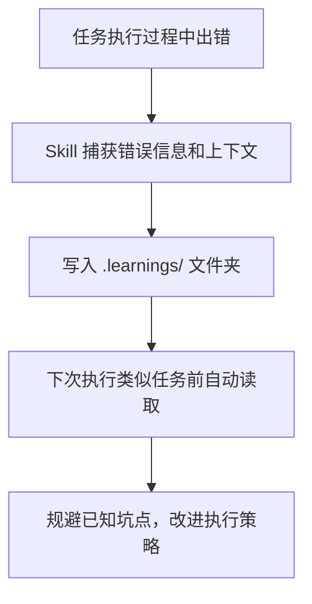

# Coze 零基础精通系列 19：OpenClaw Skill 实战手册 —— 国内可用 Top 10 精选

> **环境：** OpenClaw（已完成基础部署）

ClawHub 目前收录了 18,707 个 Skill，按安装量排名取前 30，过滤掉依赖 Google Workspace、WhatsApp 等国内访问受限服务的，剩下这 10 个——每一个都在 ClawHub 实测排名前列，每一个国内都能直接用。

---

## 先搞清楚：Skill 是什么

OpenClaw 的 Skill 不是插件，不是扩展包，是一份**行为说明书**。

每个 Skill 的核心是一个 `SKILL.md` 文件，用自然语言描述 Agent 在什么条件下应该做什么。OpenClaw 把这份文件当成上下文读进去，从中知道如何组合内置工具（`bash`、`browser`、`read`/`write` 等）来完成特定任务。

```
my-skill/
├── SKILL.md       # 触发条件 + 步骤说明（核心）
└── skill.json     # 元数据（名称、版本、依赖的工具）
```

安装只有两种方式：在对话里 `/install skill-name`，或者把 `.zip` 拖进对话窗口。

---

## 一、self-improving-agent — 137k 安装，让 OpenClaw 越用越懂你

by @pskoett

**最值得装的一个 Skill，没有之一。** 它做一件事：当 OpenClaw 出了错，或者你纠正了它，它会把这次经历记下来。下次遇到类似情况，它会主动参考这些记录。

没有任何外部依赖，不需要 API Key，纯本地运行。

**安装：**

```bash
/install self-improving-agent
```

装完就生效。不需要任何配置。

**它是怎么工作的：**



工作目录下会出现一个 `.learnings/` 文件夹，里面是普通 Markdown 文件，可以直接打开看，也可以手动编辑。

**实际效果：**

```text
你：帮我把这个目录下的所有 .log 文件压缩成 tar.gz

OpenClaw：[执行失败，发现 macOS 的 tar 语法和 Linux 不同]
已记录学习：macOS tar 不支持 --exclude-from 参数，需要用 -X 替代

--- 下次类似任务 ---

你：帮我打包这个项目，排除 node_modules

OpenClaw：（直接使用正确的 macOS 语法，不再出错）
tar -czf project.tar.gz -X .tarignore .
```

**值得提一下的 trade-off：** `.learnings/` 会随时间增长。如果你的任务类型特别杂，建议每隔一段时间清理一下过时的记录，不然 OpenClaw 反而会被大量不相关的历史干扰。

---

## 二、Find Skills — 136k 安装，在 18,707 个 Skill 里找到想要的那个

by @JimLiuxinghai（中国开发者）

**国内开发者作品，ClawHub 装机量前三。** 把 ClawHub 变成了一个可以用自然语言提问的搜索引擎。

ClawHub 现在有 18,000+ 个 Skill，其中大量是质量参差的实验品。Find Skills 帮你描述需求，自动搜索并推荐最合适的 Skill。

**安装：**

```bash
/install find-skills
```

**对话效果：**

```text
你：我想让 OpenClaw 帮我管理待办事项，有什么 Skill 推荐？

OpenClaw：（调用 Find Skills）
找到以下相关 Skill：

1. todo-manager by @example（2.1k installs）
   管理本地 Markdown 格式的 TODO 列表，支持优先级和截止日期

2. notion by @steipete（46.9k installs）
   通过 Notion API 管理页面和数据库，可用作 GTD 系统

3. obsidian by @steipete（41.7k installs）
   如果你用 Obsidian 管理任务，这个比专门的 TODO Skill 更灵活

推荐先试 obsidian，社区验证最多。安装命令：/install obsidian
```

这个 Skill 本质上也是一个 meta-skill——它的价值不在于它自己做了什么，而在于它帮你找到做事情的工具。装完几乎不占资源，但能大幅降低在 ClawHub 里瞎摸索的时间。

---

## 三、Agent Browser — 91k 安装，无头浏览器自动化

by @TheSethRose

**给 OpenClaw 一双能操作浏览器的手。** 基于 Rust 实现的快速无头浏览器，允许 OpenClaw 打开网页、等待渲染、抓取内容、截图、填表单、点击——专门为没有 API 的网站设计。

依赖 Node.js，安装走 npm，建议配 npm 国内镜像（`npx`用 cnpm 或者设置 registry）。

**安装：**

```bash
/install agent-browser

# 如果 npm 慢，先配镜像
npm config set registry https://registry.npmmirror.com
```

**对话效果：**

```text
你：帮我去 V2EX 的 Python 节点，
    抓取今天发的前 10 篇帖子标题和链接

OpenClaw：（用 Agent Browser 打开 https://www.v2ex.com/go/python）
找到今天的帖子：
1. 「如何用 asyncio 优雅地处理超时重试？」
   https://v2ex.com/t/1234567
2. 「分享一个 FastAPI + 依赖注入的项目结构」
   https://v2ex.com/t/1234568
... （共 10 条）

你：帮我监控一下公司内网这个页面，
    每隔 30 分钟检查一次，如果"审批状态"变成"已通过"就通知我

OpenClaw：已设置定时检查任务
下次检查：09:30
监控目标字段：审批状态
触发条件：内容等于"已通过"
```

**Agent Browser 和 Playwright 选哪个：** Agent Browser 更轻量、启动更快；Playwright 支持更复杂的脚本控制（多标签页、拦截请求）。日常用 Agent Browser，复杂场景用 Playwright。

---

## 四、Github — 85.8k 安装，代码仓库的自然语言接口

by @steipete

**开发者刚需。** 通过 `gh` CLI 与 GitHub 交互，管理 Issue、PR、Commit、Release，查代码历史，触发 Actions。

国内访问 GitHub 偶有不稳定，但 `gh` CLI 走的是 HTTPS，比浏览器稳定得多。

**安装：**

```bash
brew install gh
gh auth login  # 按提示走 OAuth 授权

/install github
```

**对话效果：**

```text
你：把我 my-app 仓库里所有 open 状态的 bug Issue 列出来，按 created_at 排序

OpenClaw：
仓库：yourname/my-app，open bug issues（共 7 条）：

#234 - Redis 连接池在高并发下偶发 timeout（2026-03-08）@zhangwei
#229 - 上传大文件时内存占用异常（2026-03-05）@lisi
#218 - 邮件发送在 BCC 超过 50 人时失败（2026-02-28）@yourname
...

你：把 #234 分配给我，加上 priority-high 标签，
    然后帮我起草一条回复说明正在排查

OpenClaw：
✅ Issue #234 已分配给 @yourname
✅ 标签已添加：priority-high

回复草稿：
感谢报告！这个问题我们已经能复现，目前初步判断是连接池配置问题。
正在跟进中，预计本周内有进展。

确认发送？(y/n)
```

**常见问题：** Token 失效时 `gh` 会报 `authentication required`。这时不是网络问题，重新跑 `gh auth login` 就好。建议在 GitHub 设置里把 token 有效期设为 1 年，省得频繁重新授权。

---

## 五、Proactive Agent — 73.9k 安装，从「等你发话」到「主动提醒」

by @halthelobster

**改变 OpenClaw 默认行为模式的 Skill。** 默认情况下，OpenClaw 是被动的——你说什么它做什么，做完等你说下一句。Proactive Agent 装完后，OpenClaw 会在合适时机主动补充信息、提前发现问题、做出建议，不用等你问。

同样是纯本地运行，无外部依赖。

**安装：**

```bash
/install proactive-agent
```

**装前 vs 装后的区别：**

```text
--- 没装 Proactive Agent ---

你：帮我查一下服务器 CPU 使用率

OpenClaw：当前 CPU 使用率 92%

--- 装了 Proactive Agent ---

你：帮我查一下服务器 CPU 使用率

OpenClaw：当前 CPU 使用率 92%，远超正常水位（建议阈值 75%）。
查了一下进程，node 进程 PID 4823 占了 67%，运行时长 14 小时—— 
这个进程通常不应该跑这么久，可能有内存泄漏或死循环。
要不要我帮你看一下它的日志？
```

**适合什么人：** 把 OpenClaw 当成日常工作搭档、希望它能帮自己发现遗漏的人。不适合那些只想要精准执行、不希望 Agent 多说话的人。后者可以不装。

---

## 六、Weather — 72.7k 安装，唯一不需要任何配置的 Skill

by @steipete

**零配置，装完直接用。** 没有 API Key，没有注册，背后调用的是 `wttr.in` 和 Open-Meteo 两个公开天气服务，国内通常可以直接访问。

**安装：**

```bash
/install weather
```

**对话效果：**

```text
你：深圳今天天气怎么样，要不要带伞？

OpenClaw：
深圳 · 2026-03-10（周二）
当前：多云，19°C，相对湿度 72%
今日：13~22°C，下午有小雨概率 40%
建议：傍晚出门的话带把折叠伞。

你：这周上海天气如何，我后天要过去出差

OpenClaw：
上海未来 3 天：
周二：阴，10~15°C，小雨
周三：小雨到中雨，9~13°C（你出差那天，建议穿厚一点）
周四：转多云，11~17°C

```

**适合和 Proactive Agent 搭配用：** 两个都装了以后，早上第一次跟 OpenClaw 打招呼，它会顺带告诉你今天要不要带伞。

---

## 七、Nano PDF — 46.2k 安装，用说话处理 PDF

by @steipete

**本地 PDF 编辑，不用上传到任何在线服务。** 依赖 `nano-pdf` CLI，支持合并、分割、删除页面、旋转、加密、提取文字。全程本地，文件不离机。

**安装：**

```bash
# 需要 Python + uv（建议配国内镜像加速）
pip install uv -i https://pypi.tuna.tsinghua.edu.cn/simple
uv tool install nano-pdf

/install nano-pdf
```

**对话效果：**

```text
你：把桌面上的 Q1-report.pdf 和 Q2-report.pdf 合并，
    命名为 H1-report.pdf，保存到同一个目录

OpenClaw：
✅ 已合并：
  Q1-report.pdf（47 页）+ Q2-report.pdf（52 页）→ H1-report.pdf（99 页）
保存路径：/Users/lucas/Desktop/H1-report.pdf

你：帮我把合同.pdf 加上密码保护，密码是 abc123，
    只允许查看，不允许打印和复制

OpenClaw：
✅ 已加密：合同.pdf → 合同_encrypted.pdf
权限设置：
  - 查看：允许
  - 打印：禁止
  - 复制内容：禁止
  - 编辑：禁止

你：把这份 200 页的报告里，第 1 页、第 5、第 10-15 页、最后一页提取出来，合成一份摘要版

OpenClaw：
✅ 已提取 8 页 → 报告_摘要版.pdf
提取页码：1, 5, 10, 11, 12, 13, 14, 15, 200
```

**实际场景：** 接收到需要签字的合同 PDF，不想用在线工具是因为文件里有敏感信息——Nano PDF 全程在本地，没有上传风险。

---

## 八、Obsidian — 41.7k 安装，知识库自动化

by @steipete

**国内 Obsidian 用户群基数非常大。** 装完这个 Skill 后，OpenClaw 能直接读写你本地的 Obsidian Vault——创建笔记、追加内容、搜索标签、生成双向链接，全靠自然语言驱动。

背后用的是 `obsidian-cli`，操作本地文件系统，无网络依赖。

**安装：**

```bash
brew install yakitrak/yakitrak/obsidian-cli

/install obsidian

# 配置 Vault 路径
你：配置 Obsidian Skill，Vault 路径是 /Users/lucas/Documents/MyVault
```

**对话效果：**

```text
你：帮我创建一篇今天的日记，
    标题格式用 2026-03-10，
    自动填入今天的天气（配合 Weather Skill）

OpenClaw：
✅ 已创建 /日记/2026-03-10.md
---
date: 2026-03-10
weather: 多云 19°C 下午小雨
---

（正文留空，等你补充）

你：搜索 Vault 里所有提到"OpenClaw"的笔记，
    列出标题和所在文件夹

OpenClaw：
找到 6 条：
- 工具笔记/OpenClaw_部署记录.md
- 工具笔记/OpenClaw_Skill_对比.md
- 2026-02-15.md（日记，提到了 OpenClaw 安装过程）
- 项目/AI工具调研.md
- 读书笔记/Building_Second_Brain.md
- 收件箱/待整理_20260301.md
```

**和 self-improving-agent 一起装：** OpenClaw 学到的经验不只是在 `.learnings/` 里，也可以同步到 Obsidian 作为可检索的知识笔记，形成真正的第二大脑闭环。

---

## 九、Notion — 46.9k 安装，把 Notion 变成 OpenClaw 的外脑

by @steipete

**Notion 在国内可以直连，无需代理。** 这个 Skill 通过 Notion 官方 API 操作你的 Workspace——读写页面、查数据库、创建任务、追加内容。

适合用 Notion 做项目管理、知识库、个人 OKR 的人。

**安装：**

```bash
/install notion

# 配置 Notion Integration Token
# 在 notion.so/my-integrations 创建 integration，复制 token
你：配置 Notion Skill，Token 是 secret_xxxx
```

**Notion Integration 授权步骤（一次性）：**
1. 打开 [notion.so/my-integrations](https://www.notion.so/my-integrations)
2. 点击「New integration」，给它起个名字（如 OpenClaw）
3. 复制 Internal Integration Token
4. 在你想让 OpenClaw 访问的 Notion 页面，点右上角「...」→「Connect to」→ 选刚才建的 integration

**对话效果：**

```text
你：帮我在 Notion 的"本周任务"数据库里
    加一条任务：完成 OpenClaw 配置
    截止日期：本周五，优先级：高

OpenClaw：
✅ 已创建任务
标题：完成 OpenClaw 配置
截止日期：2026-03-13
优先级：高
状态：未开始

你：帮我搜索 Notion 里所有提到"竞品分析"的页面，
    列出标题、所在数据库、最后修改时间

OpenClaw：
找到 4 条：
- 竞品分析 Q1（产品数据库，2026-02-28）
- 竞品分析模板（模板库，2026-01-15）
- 周报 - 竞品分析专项（周报数据库，2026-03-05）
- 竞品分析备忘（个人笔记，2026-03-09）
```

**和 Obsidian 比选哪个：** 用 Notion 做团队协作的选 Notion Skill，本地 Markdown 知识库选 Obsidian Skill。两个各有侧重，不互斥。

---

## 十、Video Frames — 22.5k 安装，用 ffmpeg 拆解任何视频

by @steipete

**完全本地处理，不上传任何内容。** 依赖 `ffmpeg`，让 OpenClaw 能从本地视频里提取帧图片、裁剪片段、生成缩略图。ffmpeg 是开源工具，国内直接 brew 安装。

适合做视频内容分析、素材整理、课程截图存档等场景。

**安装：**

```bash
brew install ffmpeg

/install video-frames
```

**对话效果：**

```text
你：帮我从这个课程视频里，
    每隔 5 分钟截一帧，保存到桌面的 frames 文件夹
    /Users/lucas/Downloads/react_tutorial.mp4

OpenClaw：
视频时长：1:23:47
按 5 分钟间隔，共截取 17 帧
✅ 已保存到 /Users/lucas/Desktop/frames/
  frame_00_00.png（第 0 分钟）
  frame_05_00.png（第 5 分钟）
  frame_10_00.png（第 10 分钟）
  ...（共 17 个文件）

你：帮我把这个会议录像的 10:30 到 15:45 这段裁出来，
    另存为 meeting_highlight.mp4

OpenClaw：
✅ 已裁剪：10:30 → 15:45（时长 5 分 15 秒）
保存路径：/Users/lucas/Downloads/meeting_highlight.mp4
文件大小：87MB

你：帮我给这个 2 小时的视频生成一张 4x4 的缩略图预览图

OpenClaw：
✅ 已生成 16 帧预览图（每 7.5 分钟一帧）
保存路径：/Users/lucas/Desktop/preview_grid.jpg
```

**好玩的组合用法：** 提取完帧之后，配合 OpenClaw 内置的视觉能力，让它分析每一帧里出现了什么——比如自动找出视频里所有出现代码的片段，或者识别会议视频里所有带文字的白板截图。

---

## Bonus：Peekaboo — 给 OpenClaw 一双能看见屏幕的眼睛

by @steipete（15.4k 安装，macOS 独占）

**装完后 OpenClaw 能主动截屏你的当前窗口。** 不用你把内容复制粘贴，直接说「帮我看看屏幕上这段代码」就行。

```text
你：帮我看看我现在屏幕上的代码，有什么问题

OpenClaw：（截屏当前活跃窗口）
看到了一个 Python 文件，第 23 行有个问题：
`for i in range(len(data))` 可以直接改成 `for item in data`
更 Pythonic，也不容易出 IndexError。

第 47 行的 `time.sleep(1)` 放在主线程里会卡住事件循环，
建议移到 threadpool 里跑。
```

仅 macOS 可用（依赖 `screencapture` 命令）。

---

## Skill 安全：只有一条规则要记

ClawHub 任何有 GitHub 账号的人都能发布 Skill。2026 年初，安全研究者发现了数千个伪装成生产力工具、实际执行恶意 bash 命令的 Skill。

ClawHub 页面上有 **Security Scan** 区域，显示 VirusTotal 和 OpenClaw 官方的扫描结果——装之前看一眼，**Benign + HIGH CONFIDENCE** 才装。

本文提到的所有 Skill 均通过了官方安全审查，来源可验证。

---

## 汇总

| # | Skill | 安装量 | 核心依赖 | 国内无障碍？ |
|---|---|---|---|---|
| 1 | **self-improving-agent** | 137k | 无 | ✅ 完全本地 |
| 2 | **Find Skills** | 136k | 无 | ✅ 完全本地 |
| 3 | **Agent Browser** | 91k | Node.js (npm 镜像) | ✅ |
| 4 | **Github** | 85.8k | `gh` CLI | ✅ |
| 5 | **Proactive Agent** | 73.9k | 无 | ✅ 完全本地 |
| 6 | **Weather** | 72.7k | curl + wttr.in | ✅ 无需配置 |
| 7 | **Nano PDF** | 46.2k | nano-pdf (PyPI 镜像) | ✅ |
| 8 | **Obsidian** | 41.7k | obsidian-cli | ✅ 完全本地 |
| 9 | **Notion** | 46.9k | Notion API Token | ✅ 国内直连 |
| 10 | **Video Frames** | 22.5k | ffmpeg | ✅ 完全本地 |
| Bonus | **Peekaboo** | 15.4k | macOS screencapture | ✅ macOS Only |

---

## 参考

- [ClawHub 官方 Skill 市场](https://clawhub.ai/skills?sort=installs&dir=desc)
- [OpenClaw 官方文档 — Skills](https://docs.openclaw.ai/tools/skills)
- [self-improving-agent GitHub](https://github.com/pskoett/self-improving-agent)
- [obsidian-cli（yakitrak）](https://github.com/yakitrak/obsidian-cli)
- [Notion API 官方文档](https://developers.notion.com)
- [ffmpeg 官网](https://ffmpeg.org)
