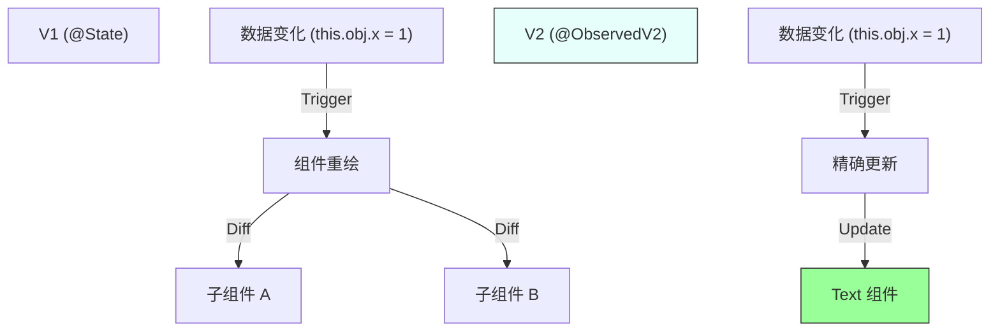
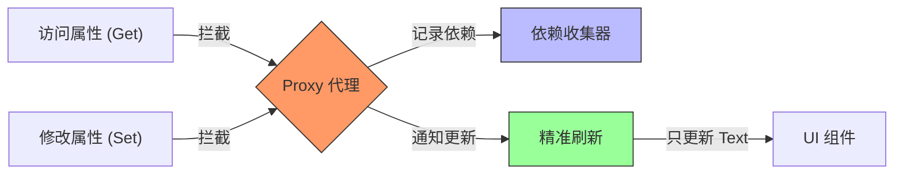
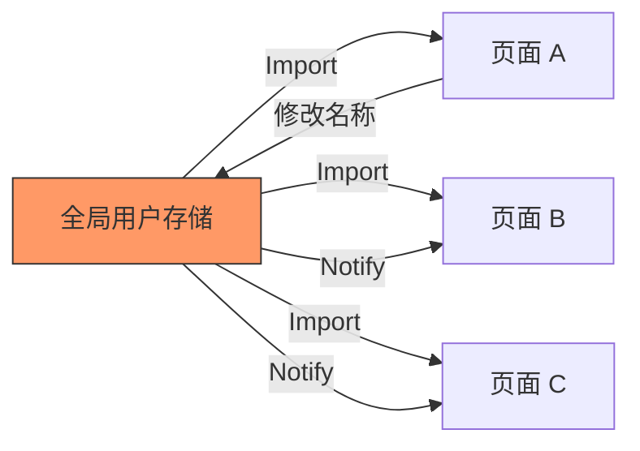
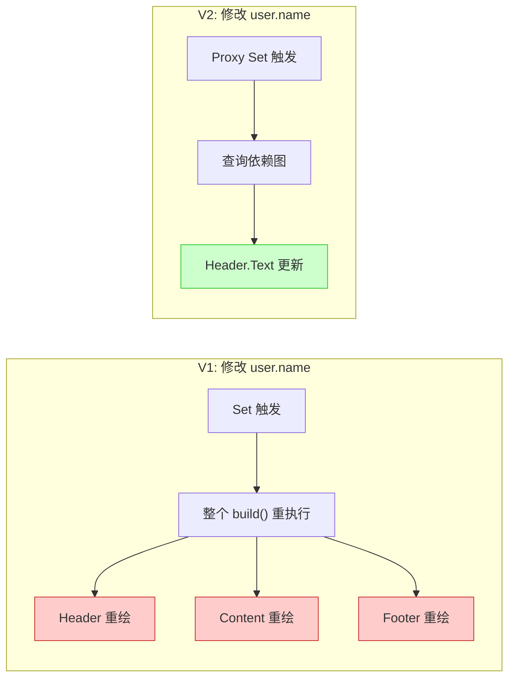

# 鸿蒙开发进阶（十）：状态管理 V2

> 🔗 **项目地址**：[https://github.com/briefness/HarmonyDemo](https://github.com/briefness/HarmonyDemo)

> **更新说明**：本文将对比 V1 与 V2 的区别，解析 **Proxy 代理模式** 和 **细粒度依赖收集** 原理。

## 一、理论基础：Proxy vs Getter/Setter

### 1.1 V1 (@State) 的限制
V1 使用 `Object.defineProperty` (类似 Vue 2) 或简单的 Setter 劫持。
*   **浅层监听**: 只能监听到 `this.obj = newObj`。
*   **数组缺陷**: 无法监听到 `arr[0] = 1` 的索引赋值。
*   **更新粒度**: 粗犷。一旦变化，整个组件关联的 `build()` 重新执行。


```mermaid
graph TD
    SubGraph_V1["V1 (@State)"]
    Data1["数据变化 (this.obj.x = 1)"] -->|Trigger| Comp1["组件重绘"]
    Comp1 -->|Diff| Child1["子组件 A"]
    Comp1 -->|Diff| Child2["子组件 B"]
    
    SubGraph_V2["V2 (@ObservedV2)"]
    Data2["数据变化 (this.obj.x = 1)"] -->|Trigger| Node1["精确更新"]
    Node1 -->|Update| TextNode["Text 组件"]
    
    style SubGraph_V2 fill:#e6fffa,stroke:#333
    style TextNode fill:#9f9,stroke:#333
```

### 1.2 V2 (@ObservedV2) 的机制
V2 基于 JS 引擎原生的 **Proxy** (类似 Vue 3)。


```mermaid
graph LR
    A["访问属性 (Get)"] -->|拦截| P{"Proxy 代理"}
    P -->|记录依赖| D["依赖收集器"]
    M["修改属性 (Set)"] -->|拦截| P
    P -->|通知更新| T["精准刷新"]
    T -->|只更新 Text| U["UI 组件"]

    style P fill:#f96,stroke:#333
    style D fill:#bbf,stroke:#333
    style T fill:#9f9,stroke:#333
```

1.  **代理拦截**:
    访问 `this.user.name` 时，Proxy 拦截 `get` 操作。
    修改 `this.user.name = 'X'` 时，Proxy 拦截 `set` 操作。

2.  **依赖收集 (Dependency Collection)**:
    在 `build()` 执行过程中，框架记录下："组件 A 的 Text B 读取了 `user.name`"。
    这建立了一个精确到 **属性级** 的依赖图。

3.  **精准刷新**:
    当 `user.name` 变化，框架只更新 Text B，**不**重新渲染整个组件 A。

## 二、核心特性

### 2.1 全深度监听 (Deep Observation)
```typescript
@ObservedV2 class A {
  @Trace b: B = new B();
}
@ObservedV2 class B {
  @Trace c: number = 0;
}
// UI
Text(this.a.b.c.toString()) // 自动从 c -> b -> a 建立依赖链
```

### 2.2 全数组支持
`@Trace` 装饰的数组，底层被替换为 Proxy 对象。
`this.arr[0] = 100` -> 触发 Proxy set -> 通知 UI 更新。

不仅是索引赋值，`push`、`splice`、`sort` 等数组方法也能正确触发更新。这在 V1 中需要用 `this.arr = [...this.arr]` 的方式绕过，V2 彻底解决了这个问题。

### 2.3 全局状态 (Global Store)
V2 对象天然脱离组件生命周期。
`export const globalUser = new User();`
多个页面 import 这个对象，改一处，全应用刷新。无需复杂的 `LocalStorage` 或 `AppStorage`。


```mermaid
graph LR
    Store["全局用户存储"] -->|Import| PageA["页面 A"]
    Store -->|Import| PageB["页面 B"]
    Store -->|Import| PageC["页面 C"]
    
    PageA -->|修改名称| Store
    Store -->|Notify| PageB
    Store -->|Notify| PageC
    
    style Store fill:#f96,stroke:#333
```

## 三、V1 到 V2 迁移对照表

| V1 装饰器 | V2 替代方案 | 说明 |
|-----------|------------|------|
| `@State` | `@Local` | 组件内部状态。V2 等价物命名为 `@Local` |
| `@Prop` | `@Param` | 父组件传入的单向数据。V2 中用 `@Param` |
| `@Link` | `@Param` + `@Event` | V2 拆分为"读"和"写"两个概念 |
| `@Provide` / `@Consume` | `@Provider` / `@Consumer` | 跨层级数据传递 |
| `@Observed` + `@ObjectLink` | `@ObservedV2` + `@Trace` | 嵌套对象监听。V2 自动深度追踪 |
| `@Watch` | `@Monitor` | 属性变化回调。V2 的 `@Monitor` 能获取新旧值 |
| — | `@Computed` | V2 新增：计算属性，类似 Vue 的 `computed` |

### 迁移示例

**V1 写法**（浅层监听 + 手动拷贝）：
```typescript
@Entry
@Component
struct TodoList {
  @State tasks: Task[] = [];
  
  addTask(title: string) {
    // V1 必须重新赋值整个数组才能触发更新
    this.tasks = [...this.tasks, new Task(title)];
  }
  
  toggleTask(index: number) {
    // V1 必须浅拷贝触发
    const newTasks = [...this.tasks];
    newTasks[index].done = !newTasks[index].done;
    this.tasks = newTasks;
  }
}
```

**V2 写法**（深度监听 + 直接操作）：
```typescript
@ObservedV2
class Task {
  @Trace title: string;
  @Trace done: boolean = false;
  constructor(title: string) { this.title = title; }
}

@ObservedV2
class TodoStore {
  @Trace tasks: Task[] = [];
  
  addTask(title: string) {
    // V2 直接 push，UI 自动更新
    this.tasks.push(new Task(title));
  }
  
  toggleTask(index: number) {
    // V2 直接修改属性，UI 自动更新
    this.tasks[index].done = !this.tasks[index].done;
  }
}

const store = new TodoStore();

@Entry
@ComponentV2
struct TodoList {
  store: TodoStore = store;
  
  build() {
    Column() {
      ForEach(this.store.tasks, (task: Task) => {
        Text(task.title)
          .decoration({ type: task.done ? TextDecorationType.LineThrough : TextDecorationType.None })
      })
    }
  }
}
```

代码量减少了，逻辑也更直观——不再需要研究"为什么改了数据 UI 没更新"这种问题。

## 四、@Monitor 与 @Computed

### @Monitor（属性变化监听）

V2 的 `@Monitor` 替代了 V1 的 `@Watch`，增加了新旧值对比能力：

```typescript
@ObservedV2
class Settings {
  @Trace theme: string = 'light';
  @Trace fontSize: number = 14;
}

@ComponentV2
struct SettingsPage {
  settings: Settings = new Settings();
  
  // 监听 theme 变化
  @Monitor('settings.theme')
  onThemeChange(monitor: IMonitor) {
    const oldTheme = monitor.value()?.before; // 旧值
    const newTheme = monitor.value()?.now;     // 新值
    console.log(`主题从 ${oldTheme} 变为 ${newTheme}`);
  }
}
```

### @Computed（计算属性）

V2 新增的 `@Computed` 类似 Vue 的 `computed`，值会被缓存，只有依赖变化时才重新计算：

```typescript
@ObservedV2
class CartStore {
  @Trace items: CartItem[] = [];
  
  @Computed
  get totalPrice(): number {
    return this.items.reduce((sum, item) => sum + item.price * item.quantity, 0);
  }
  
  @Computed
  get itemCount(): number {
    return this.items.length;
  }
}
```

## 五、性能对比

实际项目中，V2 的精准更新带来了可观的性能提升：


```mermaid
graph LR
    subgraph V1 ["V1: 修改 user.name"]
        V1_Trigger["Set 触发"] --> V1_Build["整个 build() 重执行"]
        V1_Build --> V1_Header["Header 重绘"]
        V1_Build --> V1_Content["Content 重绘"]
        V1_Build --> V1_Footer["Footer 重绘"]
    end
    
    subgraph V2 ["V2: 修改 user.name"]
        V2_Trigger["Proxy Set 触发"] --> V2_Collect["查询依赖图"]
        V2_Collect --> V2_Header["Header.Text 更新"]
    end
    
    style V1_Header fill:#fcc,stroke:#c33
    style V1_Content fill:#fcc,stroke:#c33
    style V1_Footer fill:#fcc,stroke:#c33
    style V2_Header fill:#cfc,stroke:#3c3
```

在包含 50+ 子组件的复杂页面中，V2 的更新耗时通常只有 V1 的十分之一到五分之一。

## 六、迁移建议

V2 是推荐的方案。具体建议：

1.  **新项目直接用 V2**。使用 `@ComponentV2`、`@ObservedV2`、`@Trace` 等新装饰器。
2.  **老项目渐进迁移**。V1 和 V2 的组件可以共存。先从数据模型层开始改造（`@Observed` → `@ObservedV2`），然后逐步迁移组件。
3.  **不要混用**。同一个组件内不要混用 V1 和 V2 的装饰器，会导致行为不可预测。
4.  **优先改造热点页面**。性能瓶颈最严重的页面（列表页、表单页）先迁移，收益最大。

下一篇，将探讨 **媒体 (Media)** 开发，了解视频播放背后的状态机。
