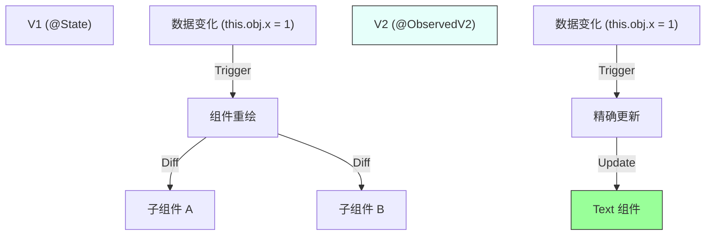
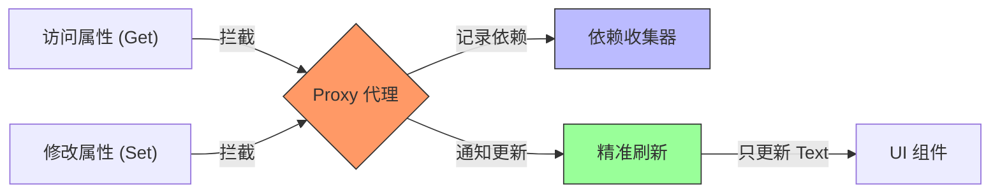
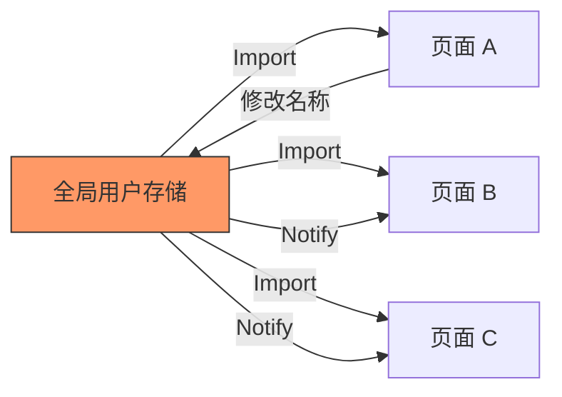

# 鸿蒙开发进阶（十）：状态管理 V2

> 🔗 **项目地址**：[https://github.com/briefness/HarmonyDemo](https://github.com/briefness/HarmonyDemo)

> **更新说明**：本文将对比 V1 与 V2 的区别，解析 **Proxy 代理模式** 和 **细粒度依赖收集** 原理。

## 一、理论基础：Proxy vs Getter/Setter

### 1.1 V1 (@State) 的限制
V1 使用 `Object.defineProperty` (类似 Vue 2) 或简单的 Setter 劫持。
*   **浅层监听**: 只能监听到 `this.obj = newObj`。
*   **数组缺陷**: 无法监听到 `arr[0] = 1` 的索引赋值。
*   **更新粒度**: 粗犷。一旦变化，整个组件关联的 `build()` 重新执行。



### 1.2 V2 (@ObservedV2) 的机制
V2 基于 JS 引擎原生的 **Proxy** (类似 Vue 3)。



1.  **代理拦截**:
    访问 `this.user.name` 时，Proxy 拦截 `get` 操作。
    修改 `this.user.name = 'X'` 时，Proxy 拦截 `set` 操作。

2.  **依赖收集 (Dependency Collection)**:
    在 `build()` 执行过程中，框架记录下：“组件 A 的 Text B 读取了 `user.name`”。
    这建立了一个精确到 **属性级** 的依赖图。

3.  **精准刷新**:
    当 `user.name` 变化，框架只更新 Text B，**不**重新渲染整个组件 A。

## 二、核心特性

### 2.1 全深度监听 (Deep Observation)
```typescript
@ObservedV2 class A {
  @Trace b: B = new B();
}
@ObservedV2 class B {
  @Trace c: number = 0;
}
// UI
Text(this.a.b.c.toString()) // 自动从 c -> b -> a 建立依赖链
```

### 2.2 全数组支持
`@Trace` 装饰的数组，底层被替换为 Proxy 对象。
`this.arr[0] = 100` -> 触发 Proxy set -> 通知 UI 更新。

### 2.3 全局状态 (Global Store)
V2 对象天然脱离组件生命周期。
`export const globalUser = new User();`
多个页面 import 这个对象，改一处，全应用刷新。无需复杂的 `LocalStorage` 或 `AppStorage`。



## 三、迁移建议

V2 是推荐的方案。
*   **代码更简洁**: 不需要 `this.x = JSON.parse(...)`。
*   **性能更出色**: 精准更新，减少无用渲染。

下一篇，将探讨 **媒体 (Media)** 开发，了解视频播放背后的状态机。


