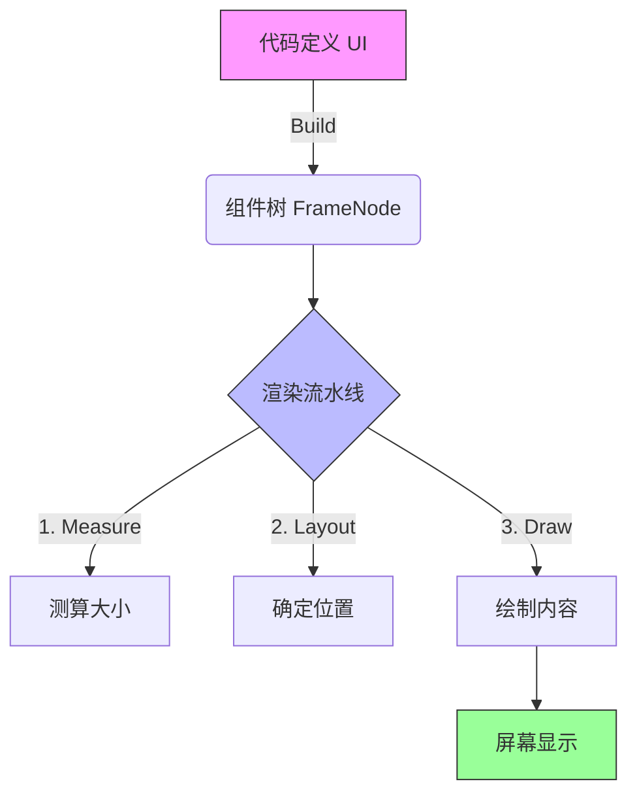
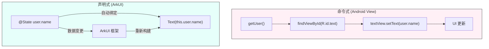

# 鸿蒙开发入门（二）：构建基础 UI

> 🔗 **项目地址**：[https://github.com/briefness/HarmonyDemo](https://github.com/briefness/HarmonyDemo)

上一篇介绍了环境搭建和 Hello World。本文将深入 ArkUI 核心，构建登录页面。
此外，还将解析 **ArkUI 渲染管线**，理解声明式 UI 的效率。

## 一、理论基础：ArkUI 渲染管线

写下 `Column()` 或 `Text()` 时，系统会经历三个阶段（类似 Android/iOS，但更轻量）：



1.  **Measure (测算)**:
    系统首先询问每个组件的大小。
    例如，Text 组件根据字数计算宽高。父容器（如 Column）根据子元素需求和自身约束，确定每个子元素大小。

2.  **Layout (布局)**:
    确定大小后，系统决定组件位置。
    例如，`Column` 从上往下排列子元素；`justifyContent(FlexAlign.Center)` 让子元素整体垂直居中。

3.  **Draw (绘制)**:
    最后，图形引擎将组件像素画到屏幕缓冲区 (Framebuffer)。

> **性能启示**: 尽量减少复杂嵌套（如 Row 套 Column 套 Row），能显著减少 Measure 和 Layout 耗时，是 UI 优化基本原则。

### 1.1 声明式 (Declarative) vs 命令式 (Imperative)

*   **命令式 (老式)**: `textView.setText("Hello")`。需手动获取对象并修改。状态多时易出错。
*   **声明式 (ArkUI)**: `Text(this.message)`。只需描述“UI 应该长什么样”，框架会根据状态 (`this.message`) 自动更新。专注于数据，剩下的交给框架。



### 1.2 布局系统详解 (Flex & Stack)
除了基础的线性布局 (`Column/Row`)，鸿蒙还提供了更灵活的布局方式：

*   **Flex (弹性布局)**: 虽然 `Column/Row` 是 Flex 的特化版本，但在复杂换行场景下，`Flex` 容器更强大。它支持 `wrap` (自动换行)。
*   **Stack (层叠布局)**: 允许子组件堆叠。通常用于“背景图 + 文字”或“头像 + 在线圆点”的场景。

> **布局原则**: 
> 1. 能由子组件内部决定大小的，尽量不要给固定宽高。
> 2. 也是最重要的：**避免过度嵌套**。如果发现写了5层容器，请考虑是否可以用 `RelativeContainer` 或 `Stack` 优化。


## 二、目标效果 & 核心组件

本节的目标是实现一个登录界面

涉及的新组件：
*   **`TextInput`**: 单行文本输入框。
*   **`Button`**: 按钮。
*   **`Image`**: 图片加载组件，支持本地资源 (Resource) 和网络图片 (string)。
*   **`Stack`**: 层叠容器，用于在输入框上叠加图标等场景。
*   **`margin`/`padding`**: 调整布局间距。

## 三、代码实现

```typescript
@Entry
@Component
struct LoginPage {
  // 状态变量：驱动 UI 更新的源头
  @State username: string = ''
  @State password: string = ''

  build() {
    // Column: 垂直方向布局容器
    Column() {
      // 1. 标题
      Text('Welcome Back')
        .fontSize(30)
        .fontWeight(FontWeight.Bold)
        .margin({ bottom: 20 })

      // 2. 用户名输入框
      TextInput({ placeholder: 'Username' })
        .width('90%')
        .height(50)
        .margin({ bottom: 10 })
        .onChange((value: string) => {
          this.username = value
        })

      // 3. 密码输入框
      TextInput({ placeholder: 'Password' })
        .width('90%')
        .height(50)
        .type(InputType.Password) // 核心：设置密码模式，输入变为圆点
        .margin({ bottom: 20 })
        .onChange((value: string) => {
          this.password = value
        })

      // 4. 登录按钮
      Button('Login')
        .width('90%')
        .height(50)
        .fontSize(18)
        .onClick(() => {
          console.info(`Login: ${this.username}, Password length: ${this.password.length}`)
        })
    }
    .width('100%')
    .height('100%')
    // 关键布局属性：让子元素在主轴（垂直方向）居中
    .justifyContent(FlexAlign.Center) 
  }
}
```

## 四、关键点深度解析

### 4.1 布局属性
*   **`justifyContent(FlexAlign.Center)`**: Flex 布局思维。Column 主轴垂直，因此垂直居中。
*   **百分比宽度**: `.width('90%')`。**响应式布局**的一种简易实践。无论屏幕多宽，组件始终占 90%，适配性优于固定像素 `300vp`。

### 4.2 事件闭包
```typescript
.onChange((value: string) => {
  this.username = value
})
```
这里利用箭头函数捕捉上下文。用户输入触发状态更新，进而刷新 UI。这是声明式 UI 的核心机制。

### 4.3 常见易错点 (Pitfalls)

1.  **单位选择: vp vs px**:
    *   **vp (Virtual Pixel)**: 虚拟像素。鸿蒙默认单位。**强烈建议使用 vp**。它会自动适配屏幕密度（PPI）。
    *   **px (Physical Pixel)**: 物理像素。只有在需要极高精度绘图（如 1px 分割线）时使用 `lpx`。
    
2.  **点击热区 (Hit Test)**:
    *   如果一个按钮只有文字大小，用户很难点中。
    *   **技巧**: 使用 `.padding()` 增加内部空间，而不是 `.margin()`。Padding 区域也是可以响应点击的，Margin 则不行。

3.  **TextInput 焦点丢失**:
    *   在条件渲染 (`if/else`) 切换时，如果组件树结构改变，输入框可能会失去焦点。建议使用 `visibility` 控制显隐来保持状态。

## 五、总结

通过本次实战，掌握了以下内容：
1.  **渲染管线**: Measure -> Layout -> Draw 的过程。
2.  **数据驱动**: 通过操作状态而非 UI 对象来更新界面。

**列表**在各类应用中无处不在。下一篇将学习处理动态数据，构建待办事项列表（ToDo List），并深入理解 **MVVM 模式**。
