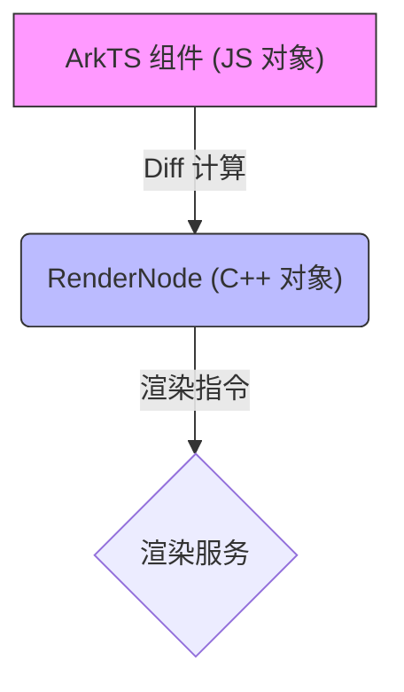
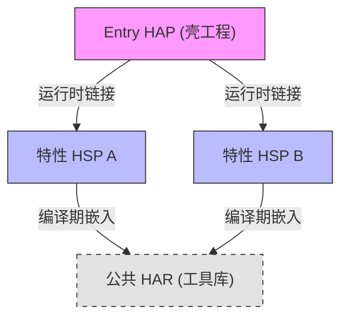

# 鸿蒙开发进阶（七）：组件化与动态样式 (AttributeModifier)

> 🔗 **项目地址**：[https://github.com/briefness/HarmonyDemo](https://github.com/briefness/HarmonyDemo)

> **更新说明**：本文将介绍 **AttributeModifier** 及其对 **RenderNode** 树的优化。

## 一、理论基础：RenderNode 与组件复用

### 1.1 声明式 UI 的开销
在声明式 UI 中，`if (show) { Text() }` 如果状态频繁切换，框架需要不断地创建和销毁 C++ 对象。

### 1.2 RenderNode 树
ArkUI 的组件（Text, Column）在 C++ 层对应着 **RenderNode**。



*   **Diff 算法**: 当状态改变时，框架会对比新旧 UI 树，计算最小更新路径。
*   **组件复用**: 对于 `LazyForEach` 等场景，框架会缓存 RenderNode，避免重复创建开销。

> **AttributeModifier 的诞生**:
> 为了避免在 JS 侧频繁设置属性导致频繁的 JS<->C++ 通信，HarmonyOS 引入了 RenderNode 级别的直接修改机制。

## 二、AttributeModifier

它实现了 **“样式与逻辑的分离”**。

```typescript
// 定义一个 Modifier，它直接持有 C++ 属性对象的引用
class CardModifier implements AttributeModifier<ColumnAttribute> {
  applyNormalAttribute(instance: ColumnAttribute): void {
     // 这段逻辑在底层执行效率极高
     if (this.isHighLight) { 
       instance.backgroundColor(Color.Blue)
     }
  }
}
```

### 2.1 核心优势
1.  **逻辑解耦**：build() 函数只负责结构，Modifier 负责样式。
2.  **性能更优**：减少了 JS 侧重新执行整个 build 闭包的消耗。

## 三、工程化架构 (Layered Architecture)

随着项目变大，代码组织变得至关重要。

### 3.1 架构模型 (HAP/HSP/HAR)
*   **Product (Entry HAP)**: 壳工程，负责组装。
*   **Feature (HSP 动态库)**: 业务模块。
    *   **HSP 优势**: 运行时共享。如果多个 HAP 引用同一个 HSP，内存中只有一份代码。
*   **Common (HAR 静态库)**: 工具库。
    *   **HAR 特性**: 编译期通过 **Rollup** 打包进引用方。



## 四、实战与监控

### 4.1 hiTraceMeter
如何证明你的优化有效？使用 `hiTraceMeter` 打点。

```typescript
import { hiTraceMeter } from '@kit.PerformanceAnalysisKit';

hiTraceMeter.startTrace("MyLayout", 1);
// ... build 逻辑
hiTraceMeter.finishTrace("MyLayout", 1);
```
在 DevEco 的 Profiler 中，可以看到这段代码消耗了多少微秒。

## 五、总结

组件化不仅是拆分文件，更是**状态与逻辑的治理**。
*   理解 **HAP/HSP/HAR** 的物理分包。
*   利用 **AttributeModifier** 提升渲染性能。

至此已完成了 UI 交互的学习。接下来，将深入**数据与通信**部分，探讨高性能网络请求与数据库实战。


