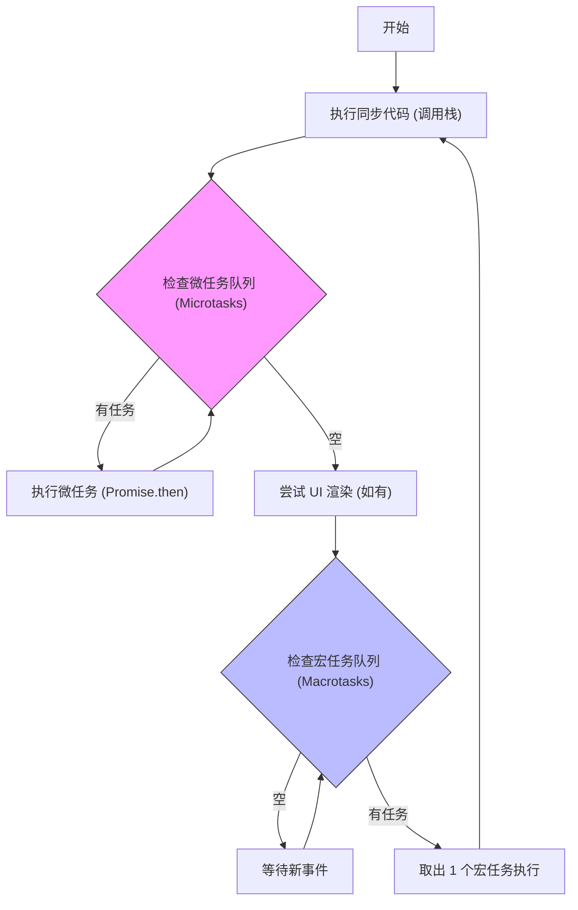

# 鸿蒙开发高级（十四）：并发与 Actor 模型 (Concurrency)

> 🔗 **项目地址**：[https://github.com/briefness/HarmonyDemo](https://github.com/briefness/HarmonyDemo)

> **更新说明**：本文将讲解 **Actor 内存隔离模型**、ArkTS **无锁**机制以及 **Event Loop** 调度。

## 一、理论基础：Actor 模型 vs 共享内存

### 1.1 传统多线程 (Shared Memory)
在 Java/C++ 中，线程 A 和线程 B 可以读写同一个全局变量。
*   **优点**: 方便。
*   **缺点**: **竞态条件 (Race Condition)**。为了防 bug，必须加锁 (Lock)。锁可能导致死锁 (Deadlock) 和性能下降。

### 1.2 Actor 模型 (HarmonyOS)
ArkTS 的每个线程（TaskPool 解构的 Task、Worker）都是一个独立的 **Actor**。
*   **内存隔离**: 线程 A 改了 `obj.x`，线程 B 里的 `obj.x` 不变。它们是两个完全不同的内存块。
*   **通信机制**: 只能通过序列化消息 (Message Passing) 或者转移所有权 (Transfer) 来交换数据。

**结论**: 这避免了死锁问题，简化了并发开发。

## 二、运行时机制：Event Loop

每个 Actor 内部都运行着一个 **Event Loop** (事件循环)，与浏览器/Node.js 类似。



### 2.1 宏任务 (Macrotask) vs 微任务 (Microtask)
*   **宏任务**: `setTimeout`, `setInterval`, `UI Rendering`, `postTask`。
*   **微任务**: `Promise.then`, `queueMicrotask`。

**执行顺序**:
1.  执行完当前的同步代码。
2.  清空**所有**微任务队列 (Promise)。
3.  取出**一个**宏任务执行。
4.  重复。

> **注意**: Promise.then 中的重计算会阻塞 UI（微任务优先级高于渲染）。

## 三、数据交互：Sendable 与 Transfer

### 3.1 Sendable 协议
为了解决“深拷贝太慢”的问题，ArkTS 引入了 `@Sendable`。
它允许对象在线程间**共享引用**，但必须满足严格的约束（如属性通过 `lock` 机制保护，或者不可变）。

### 3.2 ArrayBuffer 转移 (Transfer)
对于图片、视频流数据，可以使用 Transfer。
*   **原理**: 修改指针指向。
*   **后果**: 原线程失去对该内存块的访问权（变成 undefined）。
*   **速度**: O(1)，无论数据多大，瞬间完成。

## 四、常见误区

### 4.1 闭包捕获
```typescript
let outVar = 100;
taskpool.execute(() => {
  console.log(outVar); // ❌ 报错！子线程无法捕获主线程栈上的变量。
});
```
必须把 `outVar` 作为参数传进去。

## 五、总结

HarmonyOS 采用的并发模型具有独特优势。
*   **Actor**: 避免死锁。
*   **EventLoop**: 理解异步时序。
*   **Sendable**: 缓解隔离带来的性能影响。

下一篇，将探讨 **硬件与安全**，解析应用如何在沙箱中运行。
