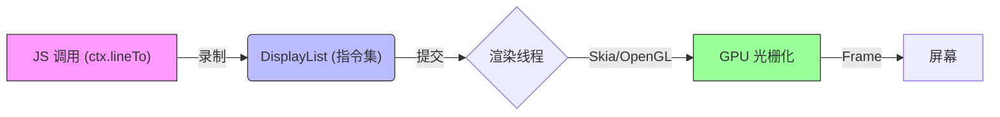
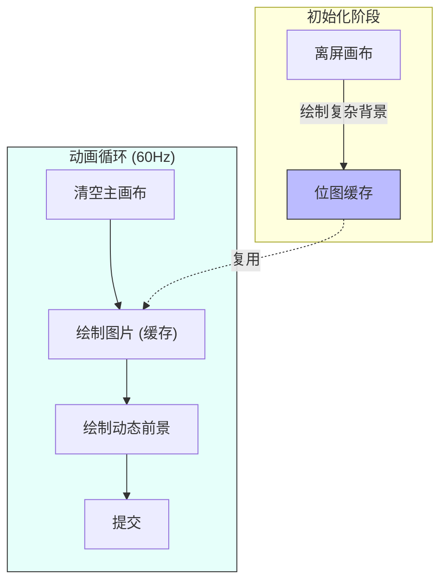

# 鸿蒙开发进阶（六）：自定义绘图 (Canvas)

> 🔗 **项目地址**：[https://github.com/briefness/HarmonyDemo](https://github.com/briefness/HarmonyDemo)

> 当标准组件无法满足需求时，可以使用 **Canvas**。

## 一、理论基础：图形引擎

HarmonyOS 的 2D 绘图引擎支持标准 Canvas API，底层的 **DisplayList** 机制提升了渲染效率。

### 1.1 DisplayList (显示列表)
当调用 `ctx.lineTo(...)` 时，系统没有立即操作像素内存（光栅化），而是在**录制指令**。这些指令被存储在 **DisplayList** 中。



当这一帧结束时，DisplayList 被发送给 **RenderThread** 或 GPU 回放。
**优势**：
1.  **非阻塞**: JS 线程录制指令速度快。
2.  **硬件加速**: 复杂的渐变、阴影可由 GPU Shader 处理。


### 1.2 为什么需要 RenderNode?
Canvas 是一块“画布”，但它仍然挂在 ArkUI 的组件树上。
如果要做**粒子爆炸效**、**游戏引擎适配**，或者需要**单帧控制上千个节点**，ArkUI 的组件 Diff 机制（即使是 Canvas）依然太重。

这是 **RenderNode** 登场的时刻。它直接在 C++ 层的 Render Tree 上挂载节点，绕过了 ArkUI 的 Diff 流程，性能极高。

---

## 二、进阶：RenderNode (自绘制节点)

RenderNode 是鸿蒙 API 11+ 提供的底层的自绘制能力。

### 2.1 核心流程

1.  **创建节点**: `new RenderNode()`
2.  **自定义绘制**: 继承 `NodeController`，重写 `makeNode`。
3.  **操作属性**: 直接修改 `renderNode.translation` 或 `opacity`，**无需状态变量更新**，下一帧自动生效。

### 2.2 实战代码

```typescript
import { RenderNode, NodeController, FrameNode } from '@kit.ArkUI';

class MyNodeController extends NodeController {
  private rootNode: RenderNode | null = null;

  makeNode(uiContext: UIContext): FrameNode | null {
    this.rootNode = new RenderNode();
    this.rootNode.frame = { x: 0, y: 0, width: 300, height: 300 };
    this.rootNode.backgroundColor = 0xFFFF0000; // 直接操作 C++ 属性
    
    // 挂载到 FrameNode (ArkUI 和 RenderNode 的桥梁)
    return new FrameNode(uiContext); 
  }

  updatePosition() {
    if (this.rootNode) {
      // 这里的移动也是直接作用于底层，不经过 ArkUI 布局系统
      this.rootNode.translation = { x: 100, y: 100 };
      // 必须显式标记刷新
      this.rootNode.invalidate(); 
    }
  }
}

@Entry
@Component
struct RenderNodeDemo {
  private controller = new MyNodeController();

  build() {
    Column() {
      // 占位容器
      NodeContainer(this.controller)
        .width(300)
        .height(300)
      
      Button('Move').onClick(() => {
        this.controller.updatePosition();
      })
    }
  }
}
```

## 三、Canvas 基础

HarmonyOS 的 Canvas API 与 Web Canvas (HTML5) 高度一致。

### 2.1 坐标系
*   **原点 (0,0)**: 左上角。
*   **X 轴**: 向右增加。
*   **Y 轴**: 向下增加。

## 四、实战案例：动态仪表盘

本节将绘制一个带渐变色的圆形进度条：

### 3.1 关键 API 解析
*   `ctx.arc(x, y, r, startAngle, endAngle)`: 画圆弧。注意角度使用 **弧度** (Radians)。
*   `ctx.createLinearGradient(...)`: 创建渐变笔刷。
*   `ctx.clearRect(...)`: **动画每一帧之前必须清空画布**。否则画面会重叠。

## 五、性能深度优化

Canvas 绘图强大，但滥用会导致掉帧。

### 4.1 避免在循环中创建对象
```typescript
// ❌ 错误示范：每一帧都 new 对象，导致 GC 频繁触发
function draw() {
  const grad = ctx.createLinearGradient(...); 
}

// ✅ 正确示范：复用对象
const grad = ctx.createLinearGradient(...);
function draw() {
  ctx.fillStyle = grad;
}
```

### 4.2 离屏渲染 (OffscreenCanvas)
如果背景复杂且静止：
1.  在 **OffscreenCanvas** 上绘制背景（缓存为 Bitmap）。
2.  在主循环中，使用 `ctx.drawImage(offscreen)` 贴图。
这是**空间换时间**的策略。



## 六、总结

Canvas 提供了强大的绘图能力，同时也要求理解图形管线。
*   DisplayList 机制提升了速度。
*   控制 GC 频率是性能优化的关键。

下一篇，将探讨**组件化**架构，介绍如何优雅地组织大型项目代码。


