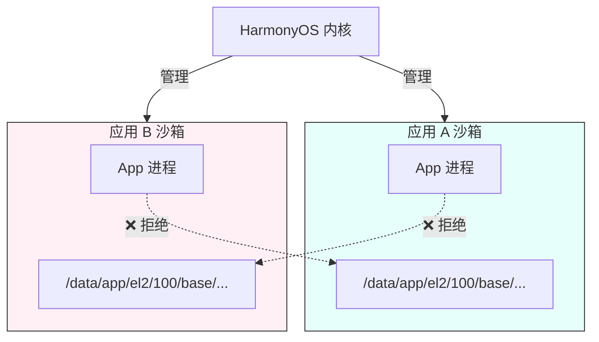
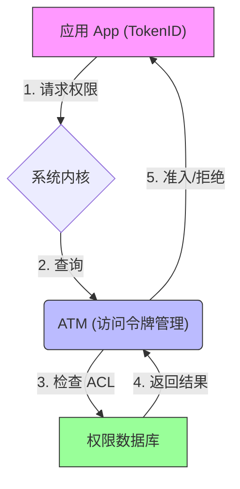
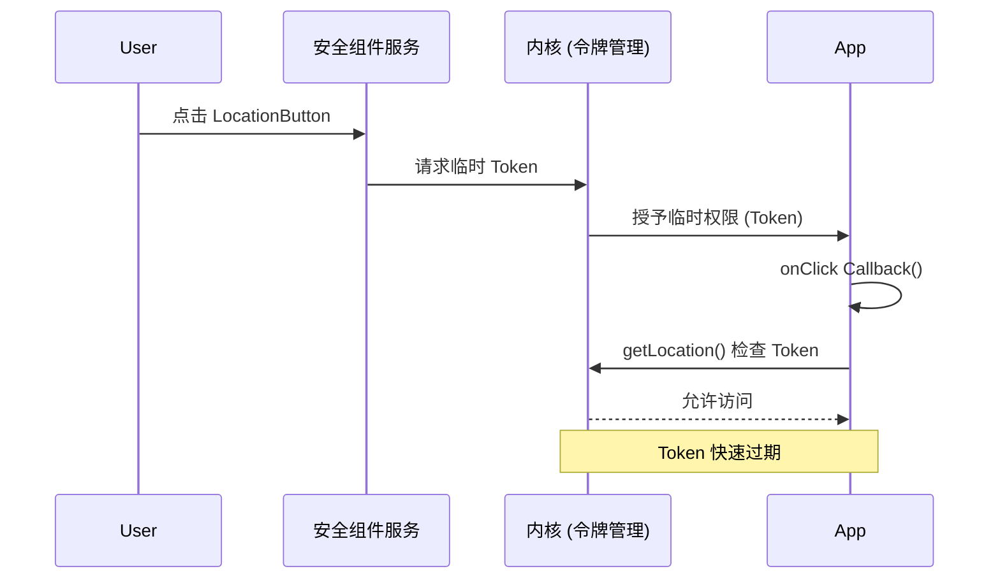

# 鸿蒙开发高级（十五）：硬件访问与沙箱机制 (Hardware & Sandbox)

> 🔗 **项目地址**：[https://github.com/briefness/HarmonyDemo](https://github.com/briefness/HarmonyDemo)

> **更新说明**：本文将介绍安全控件及 **应用沙箱 (App Sandbox)** 和 **Token 鉴权** 机制。

## 一、理论基础：应用沙箱 (Sandbox)

### 1.1 什么是沙箱？
在 HarmonyOS 中，每个应用都运行在自己独立的沙箱环境中。
*   **文件隔离**: App A 看到的 `/data/storage` 和 App B 看到的完全不同。其他应用的文件不可直接访问。
*   **进程隔离**: 前文提到的 Actor 模型，保证了内存隔离。

> **延伸阅读**：除了基础的硬件访问，HarmonyOS 还支持通过 **[智感握姿](./UniqueInteractions.md)** 感知用户的使用状态。



### 1.2 权限控制 (ACL & Token)
当应用申请权限时，系统是如何记录的？



*   **TokenID**: 每个应用安装时分配一个唯一的 TokenID。
*   **ATM (Access Token Manager)**: 系统核心服务。当调用 `Location` API 时，内核会拿着应用的 TokenID 去 ATM 查 ACL (Access Control List)。
    *   如果有权限 -> 放行。
    *   如果没有 -> 抛出 SecurityException。


## 二、关键资产存储 (Asset Store Kit)

> 💡 **实战红线**：永远不要把密码、Token、生物特征等敏感信息明文存放在 Preferences 或 Database 中。手机 root 后这些文件极易被导出。

HarmonyOS NEXT 提供了 **Asset Store Kit**，类似于 iOS 的 Keychain。它将数据加密存储在安全芯片（SE）或可信执行环境（TEE）中，连操作系统层都无法直接读取明文。

### 2.1 适用场景
*   用户登录后的 **Access Token / Refresh Token**。
*   支付密码。
*   加密解密的 **私钥**。

### 2.2 核心代码实现

```typescript
import { asset } from '@kit.AssetStoreKit';
import { util } from '@kit.ArkTS';

// 1. 存储敏感数据 (Add)
async function storeToken(token: string) {
  const attr: asset.AssetMap = new Map();
  // 关键：定义别名 (Alias)，后续查询用
  attr.set(asset.Tag.ALIAS, util.generateRandomBinary(16)); 
  attr.set(asset.Tag.SECRET, new Uint8Array(Buffer.from(token, 'utf-8').buffer));
  // 关键：设置访问控制，例如仅在用户解锁设备后可访问
  attr.set(asset.Tag.ACCESSIBILITY, asset.Accessibility.DEVICE_POWERED_ON);

  try {
    await asset.add(attr);
    console.info('Token secured in TEE.');
  } catch (error) {
    console.error(`Secure storage failed: ${error.code}`);
  }
}

// 2. 读取敏感数据 (Query)
async function getToken() {
  const query: asset.AssetMap = new Map();
  query.set(asset.Tag.ALIAS, ...); // 使用之前生成的 Alias
  query.set(asset.Tag.RETURN_TYPE, asset.ReturnType.ALL); // 请求返回明文

  const res = await asset.query(query);
  if (res.length > 0) {
    const token = util.TextDecoder.create('utf-8').decodeWithStream(res[0].get(asset.Tag.SECRET));
    return token;
  }
}
```

## 三、安全控件 (Security Component)

基于交互的授权模式。

### 2.1 核心原理
为什么点了 `LocationButton` 就能定位？
1.  **受信任的 UI**: 该按钮由系统进程渲染，应用无法伪造、无法完全遮挡。
2.  **临时授权**: 用户点击瞬间，系统通过内核向应用进程发放一个**临时 Token**。
3.  **时效性**: 这个 Token 仅在回调函数执行期间或短时间内有效。



### 2.2 实战：LocationButton
```typescript
LocationButton()
  .onClick((event, result) => {
    if (result === LocationButtonOnClickResult.SUCCESS) {
       // 此时 ATM 临时放开了权限检查
       this.getLocation();
    }
  })
```

## 四、隐私与 Picker

### 3.1 最小化授权
以前读取相册需要 `READ_IMAGE` 权限，这意味着应用能扫描所有照片。
现在使用 `PhotoViewPicker`：
1.  App 拉起系统图库（独立进程）。
2.  用户选择 1 张图。
3.  系统只把这 **1 张图的 Read 权限** 授予给 App。
这体现了 **“最小特权原则”**。

## 四、总结

HarmonyOS 的安全体系构建在：
1.  **沙箱**: 物理隔离，App 只能在自己的地盘活动。
2.  **Token**: 身份认证，内核级权限校验。
3.  **Asset Store**: 资产保险箱，敏感数据进 TEE。
4.  **安全控件**: 交互即授权，无需弹窗打扰用户。

至此，已完成了系统能力的学习。
下一阶段（也是最后阶段），将进入 **生态融合与工程化**，探讨原子化服务、性能调优和发布签名的流程。


