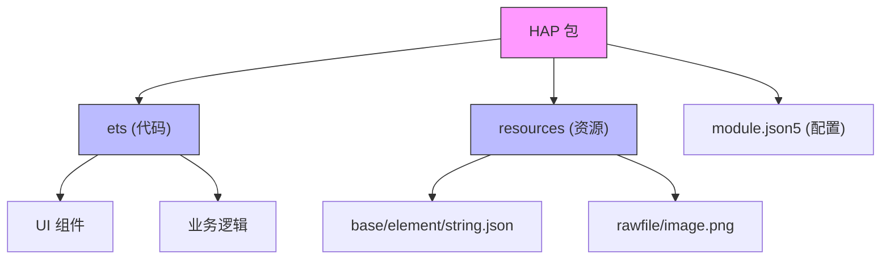
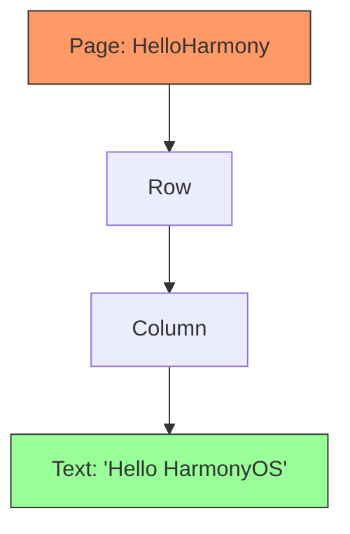
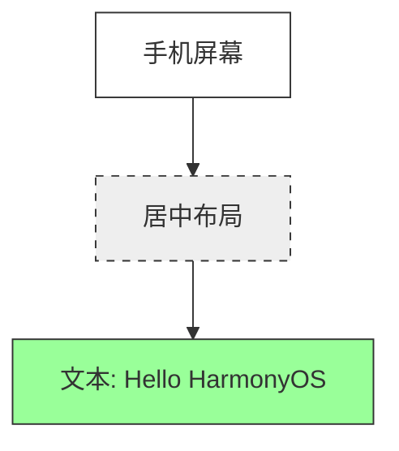

# 鸿蒙开发从入门到精通（一）：Hello HarmonyOS

> 🔗 **项目地址**：[https://github.com/briefness/HarmonyDemo](https://github.com/briefness/HarmonyDemo)

欢迎来到鸿蒙（HarmonyOS）开发的世界。鸿蒙Next（HarmonyOS NEXT）作为华为推出的全场景分布式操作系统，带来了统一的原生体验。本系列文章将带从零开始，一步步探索鸿蒙应用开发。

这是系列的第一篇，主要内容涵盖环境搭建，并编写第一个“Hello World”应用。除操作步骤外，还会探讨 **ArkTS 的编译原理**以及**HAP 包的结构**，旨在让读者知其然，更知其所以然。

## 一、准备工作

开始编码前，需要安装 **DevEco Studio**。这是华为官方基于 IntelliJ IDEA 构建的集成开发环境（IDE），提供了代码编辑、调试和预览功能。

请前往 [HarmonyOS 开发者官网](https://developer.huawei.com/consumer/cn/deveco-studio/) 下载并安装最新版本的 DevEco Studio。

## 二、深入理论：ArkTS 与编译原理

在编写代码之前，首先需要理解所使用的语言。
鸿蒙应用主要使用 **ArkTS** 开发。它和 TypeScript (TS) 有什么区别？

简单来说：**ArkTS 是 TS 的超集兼子集，专为高性能而生。**

### 2.1 ArkTS 编译流程 (Ark Compiler)

传统的 JS/TS 运行在 V8 引擎上，边解释边执行 (JIT)，虽然灵活但启动慢、耗内存。
ArkTS 采用了 **AOT (Ahead-Of-Time)** 编译技术。


1.  **源码阶段 (.ets)**: 开发者编写的 ArkTS 源码。
2.  **字节码阶段 (.abc)**: 编译期间，源码被编译成 **Ark Bytecode**。这是一个优化的二进制格式，去除了动态类型的开销。
3.  **机器码阶段 (Machine Code)**: 在设备安装或空闲时，Ark Compiler 进一步将字节码编译成设备 CPU 能直接执行的机器码。

> **核心优势**: 这种机制让鸿蒙应用的启动速度接近 C/C++ 原生应用，消除了传统 JS 虚拟机的“冷启动”延迟。

### 2.2 编译器工作流细节
Ark Compiler 分为两部分：
*   **前端 (Frontend)**: 在开发者的电脑上运行 (DevEco Studio)。将 `.ets` 转为 `.abc`。
*   **后端 (Backend)**: 在手机上运行。将 `.abc` 转为机器码。
这意味着，**类型检查** 主要发生在前端。如果代码里有 `any` 类型乱飞，虽然编译能过，但会丧失 AOT 的优化优势。

## 三、创建第一个项目

1. 打开 DevEco Studio，点击 **Create Project**。
2. 选择 **Empty Ability** 模板（最基础的空项目模板）。
3. 填写项目名称（例如 `HelloHarmony`），选择保存路径。
4. 点击 **Finish**，等待项目同步完成。

### 3.1 HAP 包结构解析

项目创建完成后，你会看到很多文件。最终打包出来的产物叫 **HAP (Harmony Ability Package)**。
可以把它理解为 Android 的 APK，但结构更原生：

*   **ets/**: 存放代码逻辑。
*   **resources/**: 存放图片、字符串、布局等资源文件（支持多语言、暗黑模式自动适配）。
*   **module.json5**: **核心**配置文件。声明了应用的权限、入口页面 (EntryAbility) 以及设备兼容性。



### 3.2 配置文件详解 (main_pages.json)
除了 `module.json5`，还有一个极易被忽略的文件：`main_pages.json`。
*   **位置**: `src/main/resources/base/profile/main_pages.json`
*   **作用**: 注册所有的页面路由。
*   **注意**: 即使你在 `ets` 文件夹下创建了 `.ets` 文件，如果没有在这里注册，`router.push` 是无法跳转的（这也是初学者最常遇到的 404 错误）。

## 四、编写代码：Hello HarmonyOS

找到项目中的 `entry/src/main/ets/pages/Index.ets` 文件。

### 4.1 代码实现

```typescript
// Index.ets
@Entry
@Component
struct HelloHarmony {
  // 定义一个状态变量，用来存储要显示的文本
  @State message: string = 'Hello HarmonyOS'

  build() {
    // Row 容器，使内容水平居中
    Row() {
      // Column 容器，使内容垂直居中
      Column() {
        // Text 组件，显示文本
        Text(this.message)
          .fontSize(50) // 设置字体大小
          .fontWeight(FontWeight.Bold) // 设置字体粗细
      }
      .width('100%') // Column 宽度占满父容器
    }
    .height('100%') // Row 高度占满整个屏幕
  }
}
```

### 4.2 代码解析

- **`@Entry`**: 标记这个组件是页面的入口，渲染树的根节点。
- **`@Component`**: 标记这是一个自定义组件。在底层，这对应一个 C++ 的 `RenderNode` 对象。
- **`@State`**: 装饰器。它不仅仅是变量，更通过 **Proxy** 劫持了 setter；当值变化时，会自动通知依赖该变量的 UI 组件刷新。
- **`build()`**: UI 描述方法。注意，这里写的**不是 HTML**，也不是 XML，而是一个**DSL (Domain Specific Language)**。编译器会将其转化为高效的 UI 树构建指令。



## 五、运行效果

点击 IDE 上方的运行按钮，选择模拟器或真机，将看到如下界面：


> *（运行效果示意图：屏幕中央显示 Hello HarmonyOS 字样）*

## 六、常见易错点 (Pitfalls)

1.  **文件名大小写**:
    *   鸿蒙文件系统（尤其是在 Windows 上开发时）可能不区分大小写，但**真机（Linux/Unix 内核）是严格区分的**。
    *   引用图片 `Image($r('app.media.Icon'))` 和 `icon.png` 必须严格一致。

2.  **DevEco 预览器与真机差异**:
    *   Previewer 显示正常不代表真机一定正常。Previewer 是基于 PC CPU 模拟的，而真机是 ARM 架构。涉及原生库 (C++) 调用时，必须上真机调试。

## 七、总结

本篇文章不仅编写了代码，还深入探讨了底层原理：
1.  **ArkTS 编译**: AOT 带来的性能飞跃。
2.  **HAP 结构**: 鸿蒙应用的物理形态。
3.  **声明式 UI**: 初步体验基于状态驱动的开发模式。

下一篇文章中，将学习构建更丰富的 UI，并深入探讨 **ArkUI 的渲染管线**。
