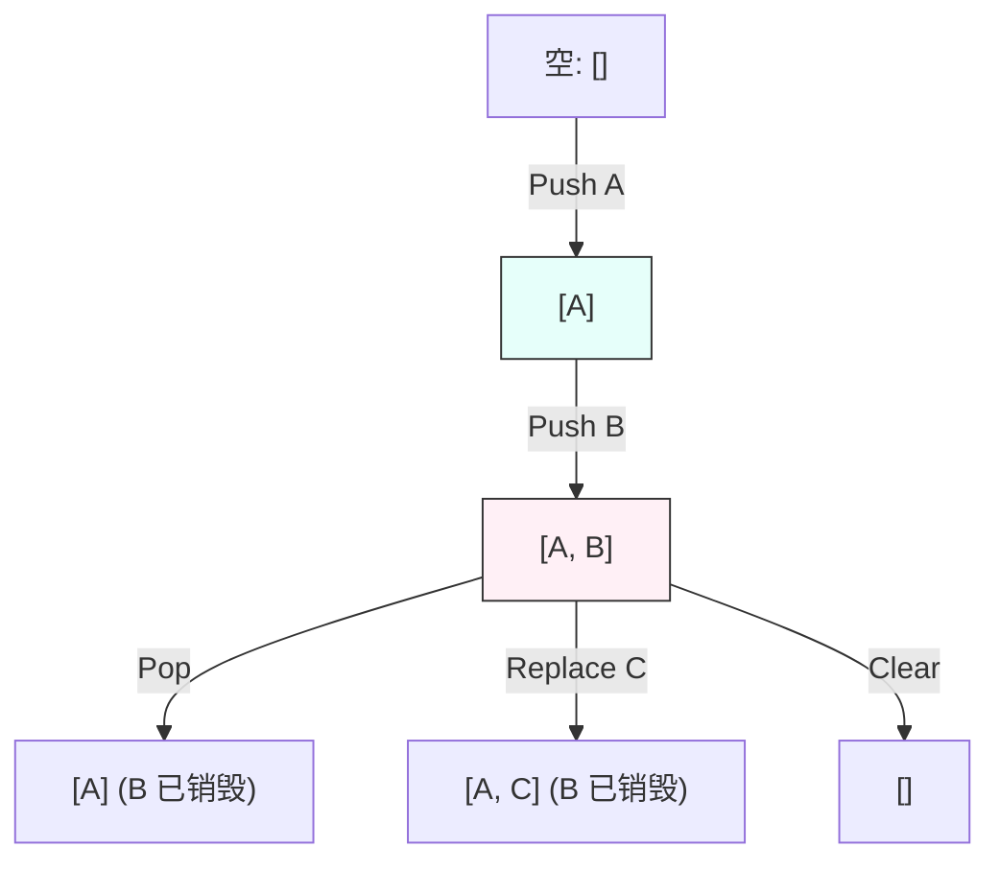
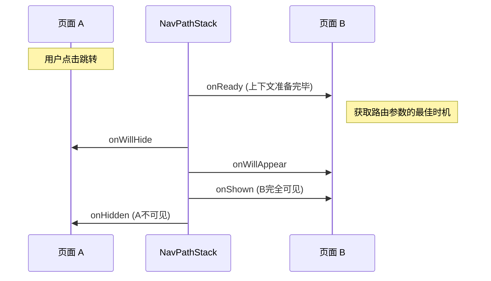

# 鸿蒙开发进阶（四）：页面导航与路由 (Navigation) 深度解析

> 🔗 **项目地址**：[https://github.com/briefness/HarmonyDemo](https://github.com/briefness/HarmonyDemo)

> **更新说明**：本文将介绍 API 使用，并解析 **NavPathStack 的结构** 及 **生命周期时序**。

在 HarmonyOS NEXT 中，**单 Ability 多 Page** 是官方推荐的架构。`Navigation` 组件就是这个架构的核心骨架。

## 一、核心理论：路由栈结构 (Stack Structure)

`Navigation` 本质上维护了一个 **栈 (Stack)** 数据结构。

### 1.1 压栈 (Push) 与 出栈 (Pop)
`NavPathStack` 内部维护了一个 `NavDestinationInfo` 数组。
*   **Push A**: `[A]`。屏幕显示 A。
*   **Push B**: `[A, B]`。屏幕显示 B，A 仍在内存中。
*   **Pop**: `[A]`。B 出栈并销毁，A 重新浮现。



> **注意**: 避免无限 Push 造成栈过深，导致内存溢出 (OOM)。
> **解决方案**: 合理使用 `replacePath`（替换栈顶）或 `removeByIndexes`（清理中间层）。

## 二、操作详解

| 操作 | API | 栈变化示例 | 场景 |
| :--- | :--- | :--- | :--- |
| **入栈** | `pushPath` | `[A] -> [A, B]` | 列表 -> 详情 |
| **替换** | `replacePath` | `[A] -> [B]` | 登录 -> 主页 (禁止返回) |
| **出栈** | `pop` | `[A, B] -> [A]` | 返回上一页 |
| **清空** | `clear` | `[A, B] -> []` | 注销登录 |

## 三、深度解析：生命周期时序 (Lifecycle Timing)

这是开发中需要注意的细节。`NavDestination` 的生命周期比 `@Entry` 更复杂。

### 3.1 时序图解
假设从页面 A 跳转到页面 B：



### 3.2 关键生命周期
1.  **`onReady(context)`**: **核心**。
    *   **触发时机**: `NavDestination` 组件挂载之前，但在 Context 创建之后。
    *   **用途**: 获取 `pathInfo.param`。

2.  **`onShown` vs `onAppear`**:
    *   `onAppear`: 组件**构建**时触发（只触发一次）。
    *   `onShown`: 页面**显示**时触发（每次返回都会触发）。
    *   **用途**: 如果需要“每次回到页面刷新数据”，使用 `onShown`。

3.  **`onHidden`**:
    *   **用途**: 停止视频播放、停止高频动画。

    *   **用途**: 停止视频播放、停止高频动画。

### 3.3 参数传递限制 (Parameter Limits)
在 `pushPath` 时传递的 `param` 参数，虽然支持 Object，但**不建议**传递过大的数据（如 Base64 图片字符串）。
*   **原因**: 序列化和反序列化大对象会阻塞 UI 线程，导致跳转卡顿。
*   **建议**: 传递 ID，在新页面根据 ID 从数据库或内存缓存中读取。

Navigation 同时也负责界面展示。

### 4.1 顶部菜单 (Menus)
通过 `.menus()` 属性，可以在右上角添加操作按钮（如“设置”、“保存”）。
```typescript
.menus([
  { value: 'Save', action: () => this.saveData() },
  { icon: 'settings.svg', action: () => this.gotoSettings() }
])
```

### 4.2 标题栏模式 (TitleMode)
*   **`Mini`**: 只有标题和返回键，紧凑。
*   **`Full`**: 大标题模式，类似 iOS 的设置页，向下拉动会缩放。

## 五、代码实战升级

在更新后的代码中，实现了一个更完整的流程：
1.  **首页 -> 详情页** (`push`)。
2.  **详情页 -> 完成并返回** (`pop` 带返回值)。
3.  **详情页 -> 设置页** (`replace`)：模拟场景转换。
4.  **设置页 -> 首页** (`clear`)：回到首页。

*(具体代码请见 `Code/Part4_Navigation/Index.ets`)*

### 5.1 拦截返回事件 (Interceptor)
很多时候需要拦截左上角的返回按钮（例如：表单未保存）。
可以使用 `NavDestination` 的 `.onBackPressed` 回调。

```typescript
NavDestination()
  .onBackPressed(() => {
    if (this.isFormDirty) {
      promptAction.showDialog({ title: '确认放弃修改？' })
        .then((resp) => {
          if (resp.index === 0) this.pageStack.pop();
        })
      return true; // 返回 true 表示"我已消费该事件"，系统不再自动返回
    }
    return false; // 返回 false 表示"我不处理"，交给系统处理（自动返回）
  })
```

## 六、常见易错点 (Pitfalls)

1.  **NavPathStack 的单例问题**:
    *   `NavPathStack` 对象必须在**父组件**（`Navigation` 所在组件）创建，并传递给子组件。如果在子组件里 `new NavPathStack()`，它将是一个空的、毫无作用的栈。

2.  **Navigation 包裹范围**:
    *   **原则**: 一个 App 通常只需要一个 `Navigation` 组件，作为根容器。不要在每个页面里都写 `Navigation`，嵌套使用会导致标题栏重复出现。

## 七、总结

`Navigation` 是 HarmonyOS 应用的骨架。
*   理解 **Stack** 模型，避免内存泄漏。
*   理解 **onReady/onShown** 时序，避免数据丢失。

下一篇，将让应用“动”起来，深入探讨 **动效与转场 (Animations)**。


