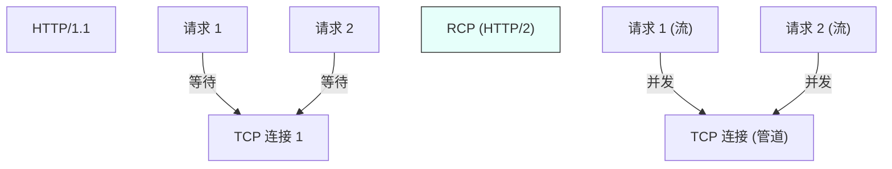
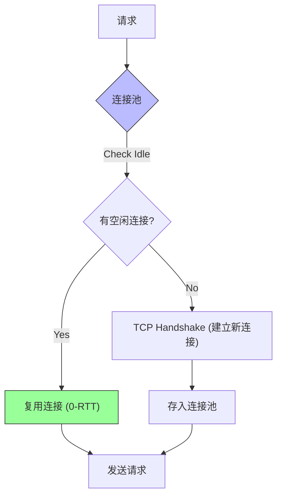
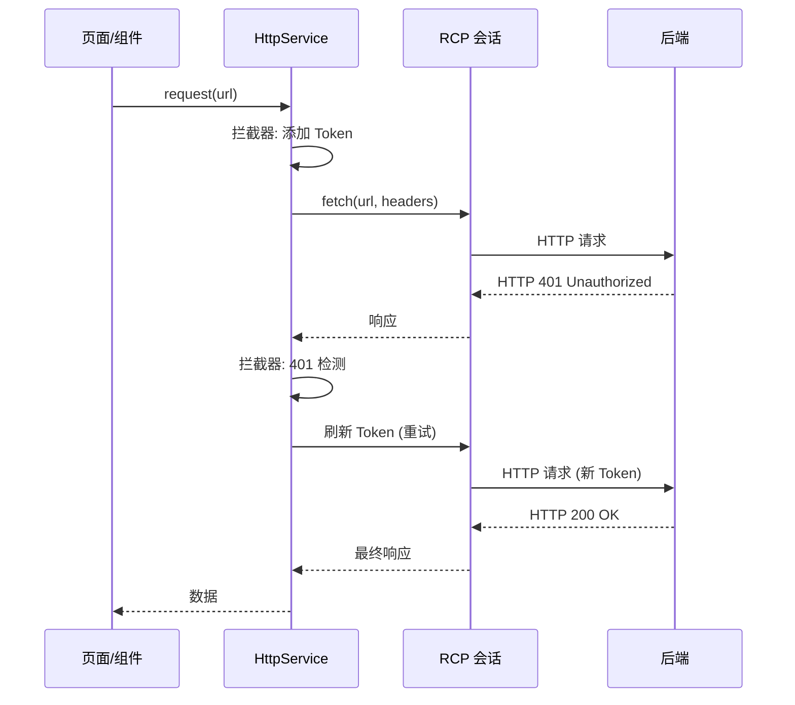

# 鸿蒙开发进阶（八）：高性能网络请求 (RCP) 与数据交互

> 🔗 **项目地址**：[https://github.com/briefness/HarmonyDemo](https://github.com/briefness/HarmonyDemo)

> **更新说明**：本文将介绍 RCP (Remote Communication Kit) 的 **HTTP/2 多路复用** 和 **连接池** 机制。

## 一、理论基础：为什么 RCP 比 http 模块快？

HarmonyOS NEXT 提供了两套方案：JsCore 实现的 `http` 和 C++ 内核实现的 `rcp`。

### 1.1 HTTP/2 多路复用 (Multiplexing)
传统的 HTTP/1.1 存在**队头阻塞 (Head-of-Line Blocking)**问题。浏览器限制同一个域名只能有少数 TCP 连接。



RCP 默认支持 **HTTP/2**：
*   **二进制分帧**: 数据不再是文本，而是二进制帧。
*   **多路复用**: 请求共享**同一个** TCP 连接，互不干扰。

### 1.2 连接池 (Connection Pooling)
RCP 内部维护了一个 TCP 连接池。
调用 `session.fetch()` 时：
1.  检查池内是否有连接到目标域名的闲置连接。
2.  有 -> 直接复用 (0-RTT)。
3.  无 -> 建立新连接并存入池。



**结论**: 高并发场景下，RCP 的吞吐量优于 http 模块。

## 二、核心架构：Session 与 Request

Session 持有连接池。
**应使用全局单例 Session**，避免为每个请求创建新的 Session。

```typescript
const session = rcp.createSession({
  headers: { 'Authorization': 'Bearer ...' },
  requestConfiguration: {
    transfer: { timeout: { connectMs: 5000 } }
  }
});
```

## 三、进阶技巧：拦截器 (Interceptors)

虽然 RCP 原生拦截器还在演进，但可以封装 Service 层来实现类似 Axios 的拦截。

```typescript
class HttpService {
  async request(url: string) {
    // 1. 请求拦截：注入 Token
    // 2. 响应拦截：统一处理 401
    if (resp.statusCode === 401) {
       // Refresh Token Logic...
    }
  }
}
```



## 四、线程模型

ArkTS 是单线程的，但 **RCP 的网络 I/O 是在独立的内核线程中执行的**。
这意味着，利用 RCP 下载大文件时，主线程几乎没有 CPU 负载，依然可以流畅响应用户操作。

## 五、总结

网络层是 App 的基础架构。
*   **协议**: 优先使用支持 HTTP/2 的服务端。
*   **架构**: 全局复用 Session。
*   **选型**: 推荐使用 `rcp` 替代 `http`。

下一篇，将深入 **本地持久化 (Persistence)**，探讨关系型数据库 RDB 如何高效管理数据。


